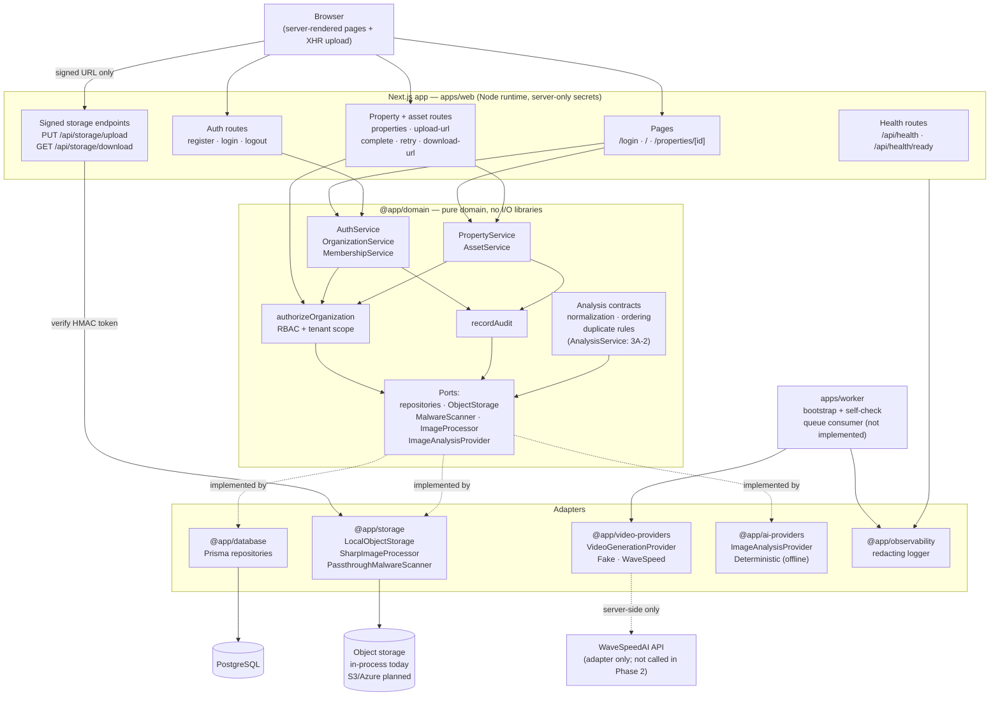

# Architecture Diagram

Version: 1.1 (as implemented through Phase 3A-1)
Status: Describes **implemented** behavior only. Components that do not exist yet
are marked `(not implemented)`.

See `docs/SystemArchitecture.md` for the target architecture and
`docs/decisions/` for the decisions behind this shape.

## Runtime architecture

## Key boundaries

- **Domain never imports an SDK.** `@app/domain` depends only on ports; Prisma,
  sharp, and provider SDKs live in adapter packages.
- **Secrets are server-only.** `DATABASE_URL`, `SESSION_SECRET`,
  `STORAGE_SIGNING_SECRET`, and `WAVESPEED_API_KEY` are read through the
  validated server env and are never referenced from client components. No
  `NEXT_PUBLIC_*` variable exists.
- **The browser never receives a storage key.** It receives only short-lived,
  single-purpose signed URLs.
- **Tenant scope is enforced twice**: repository lookups filter by
  `organizationId`, and `authorizeOrganization` requires a membership (plus a
  permission for writes).

## Phase status of each component

| Component | Status |
| --- | --- |
| `apps/web` pages, auth, property/asset, storage, health routes | Implemented |
| `@app/domain` identity + property/media services | Implemented |
| `@app/database` Prisma repositories | Implemented |
| `@app/storage` object storage, signing, image pipeline, scan hook | Implemented (in-process storage) |
| `@app/video-providers` Fake + WaveSpeed adapters | Implemented; WaveSpeed not invoked |
| `@app/domain` analysis contracts, normalization, ordering/duplicate rules | Implemented (Phase 3A-1) |
| `@app/ai-providers` `ImageAnalysisProvider` + deterministic offline adapter | Implemented (Phase 3A-1); **no real vision vendor** (ADR-0009) |
| `AnalysisService`, `AssetAnalysis` persistence | **Not implemented** (Phase 3A-2) |
| Analysis review UI | **Not implemented** (Phase 3B) |
| `@app/observability` redacting logger | Implemented |
| `apps/worker` queue consumer, generation orchestration | **Not implemented** (Phase 4) |
| `@app/queue` | **Not implemented** (placeholder) |
| FFmpeg composition, billing, Stripe | **Not implemented** (Phases 5–6) |
