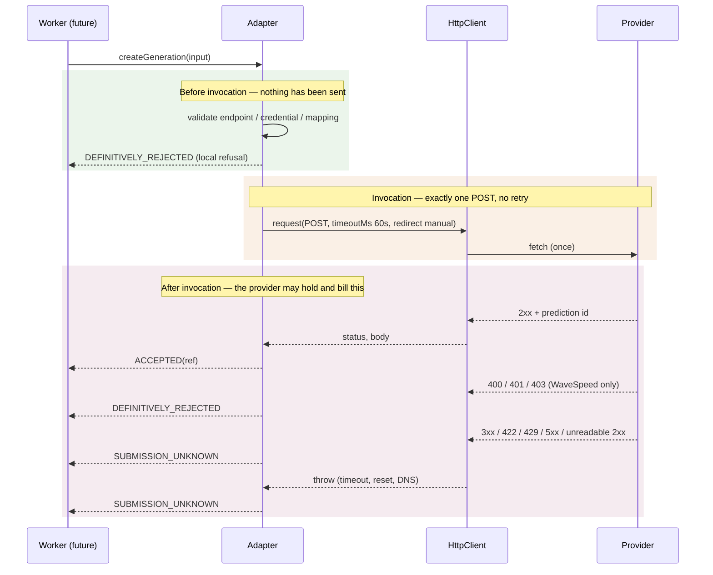

# Phase 4C-3B-2C — Completion report

Provider-neutral submission certainty, and a dormant fal / MiniMax H3 Max
submission adapter.

Base: `544e35afd9bb53ab8e6091f2a01a70c302807892`.
ADR: `docs/decisions/0035-provider-submission-certainty.md`.

## What changed, and why it mattered

`createGeneration` is the only call in this system that can cost money, and it
reported failure exactly like every other provider call: by throwing a
`ProviderErrorException` carrying a `retryable` flag.

That flag describes the transport. A 429 or a 503 is `retryable: true` because
the network may work later — which says nothing about whether the provider
received the request, queued it, and began billing. And `catch` is a
retry-shaped construct: the obvious handler for a thrown error is
`catch { retry() }`, and the obvious handler here charges the customer twice.

The concrete failure: a submission times out at 60 s. The request was
delivered; WaveSpeed is generating video and will bill for it. The timeout
normalizes to `TIMEOUT` / `retryable: true`, an exception propagates, a retry
policy re-POSTs, and one scene is billed twice — with two prediction ids, only
one of them tracked.

`createGeneration` now returns a `ProviderSubmissionOutcome` instead:
`ACCEPTED`, `DEFINITIVELY_REJECTED`, or `SUBMISSION_UNKNOWN`.

## Size

Measured against base `544e35a`.

| Scope | Insertions | Deletions | Total |
| --- | ---: | ---: | ---: |
| Production TypeScript | 863 | 75 | 938 |
| Tests | 974 | 45 | 1,019 |
| Migration SQL + Prisma schema | 0 | 0 | 0 |
| Documentation (`docs/`, `CHANGELOG.md`) | 638 | 73 | 711 |
| **Code + tests** | 1,837 | 120 | **1,957** |
| **Everything** | 2,475 | 193 | **2,668** |

**This is 157 over the ≤1,800 target and 243 under the >2,200 hard stop.** It is
reported, not excepted: the hard stop was not reached, so no exception is
requested.

### The authorized split was available and would have worked

Unlike 4C-3B-2B, the pre-authorized split is clean and both halves would have
been compliant. Measured on the finished work:

| Milestone | Contents | Code + tests |
| --- | ---: | ---: |
| 3B-2C-1 | outcome union, submission port, HTTP seam, WaveSpeed, Fake | ~1,138 |
| 3B-2C-2 | dormant fal adapter and its tests (`src/fal/` 797, plus its `index.ts` export block) | ~819 |

It was not taken, and the reason is a judgment the CTO should overrule if it
disagrees. **The fal adapter is this milestone's evidence, not its payload.** A
provider-neutral abstraction with one implementation is an assertion; ADR-0035
claims the vocabulary is not a WaveSpeed shape wearing a general name, and the
only thing that demonstrates that is a second adapter which **disagrees** with
WaveSpeed where it should — fal treats no remote status as definitive.
Shipping 3B-2C-1 alone would have merged the neutrality claim with nothing
testing it.

Splitting remains straightforward if the CTO prefers it: the fal work is
confined to `packages/video-providers/src/fal/` plus its export block in
`index.ts`, and nothing outside that directory references it.

## The contract

### Three arms, and the third is the default

- **`ACCEPTED`** — the provider took the request and named it. Trackable; never
  re-submit.
- **`DEFINITIVELY_REJECTED`** — the request provably did not reach a state where
  the provider could have begun or billed work.
- **`SUBMISSION_UNKNOWN`** — everything else.

An adapter must positively establish non-acceptance to say anything but
`SUBMISSION_UNKNOWN`. Programmer defects still throw; a `TypeError` is not
provider certainty.

### Certainty is not retryability

The union carries no `retryable` and no HTTP status of its own, both enforced at
compile time in `submission-contract.test.ts`. Both of these are valid:

```text
SUBMISSION_UNKNOWN + error.retryable === true    // the transport may work later
SUBMISSION_UNKNOWN + error.retryable === false   // and it may not
```

Neither authorizes a second create POST.

### Each adapter owns its own evidence

| | WaveSpeed | fal / H3 Max |
| --- | --- | --- |
| Definitive rejection | `400`, `401`, `403` | none |
| `422` | `SUBMISSION_UNKNOWN` (changed) | `SUBMISSION_UNKNOWN` |
| `429`, 5xx, 3xx | `SUBMISSION_UNKNOWN` | `SUBMISSION_UNKNOWN` |
| Unreadable 2xx | `SUBMISSION_UNKNOWN` | `SUBMISSION_UNKNOWN` |
| Transport failure / timeout | `SUBMISSION_UNKNOWN` | `SUBMISSION_UNKNOWN` |
| Local refusal before invocation | `DEFINITIVELY_REJECTED` | `DEFINITIVELY_REJECTED` |

**422 is no longer definitive for WaveSpeed.** "Unprocessable entity" describes
a request the server understood and declined to process *as given*, which on a
generation API can be a moderation or model-level refusal reached after
acceptance. Semantic rejection is not proof that nothing happened. The asymmetry
justifies the caution: an over-narrow allowlist parks a request a human can
re-submit; an over-broad one re-POSTs work already being billed.

**fal has no allowlist at all.** Its queue documents client and model errors —
422 among them — that can be raised after a request has been accepted and GPU
work has begun, and it publishes nothing establishing non-acceptance. Copying
WaveSpeed's rule would have been inventing a contract fal has not offered.

### The invocation boundary



Every adapter is written with that boundary as three commented sections. Above
`http.request`, a failure proves nothing was sent; from that line onward, it
does not.

### At most one outbound submission

Three mechanisms, not a comment:

- `FetchHttpClient` performs **exactly one `fetch` per request**, with no retry
  or backoff anywhere in the transport.
- Submission sends `redirect: "manual"`. A followed 3xx re-sends the body to a
  new URL — a second POST nobody authorized, to a host nobody chose. A 3xx falls
  through to `SUBMISSION_UNKNOWN`.
- Submission sends an explicit 60 s `timeoutMs`, separate from the client-wide
  30 s default, because abandoning a paid submission does not cancel it.

Every submission test asserts the outbound call count, not only the outcome.

## Dormancy of the fal adapter — verified

| Claim | Verification |
| --- | --- |
| `VIDEO_PROVIDER` refuses `fal` | `packages/shared/src/env.ts:57` — `z.enum(["fake", "wavespeed"])`, unchanged |
| No `FAL_API_KEY` in the environment schema | No occurrence outside one doc comment |
| No fal branch in the factory | `createVideoProvider` unchanged except the `HttpClient` import path |
| Zero production callers | Only references outside `src/fal/` are the re-export block in `index.ts` and the adapter's own test |
| No `@fal-ai/client` dependency | Absent from every `package.json` |
| Cannot be armed by configuration | The credential is constructor input; the adapter never reads `process.env` |

## Security

- The fal credential is used only in the `Authorization` header. It is never
  logged, returned in an error, or attached to a thrown value — **including on
  local refusal paths**, which is where a helpful diagnostic would most
  plausibly have quoted it. That path is now regression-tested with a real
  credential in scope.
- fal recognises this application's own errors nominally
  (`instanceof ProviderErrorException`), never structurally, so an arbitrary
  thrown value cannot choose its own `code` and `messageSanitized` (ADR-0031 §4).
- Every ADR-0031 WaveSpeed regression is preserved. The `createGeneration` cases
  now read the returned outcome instead of catching an exception, with every
  secrecy assertion unchanged and one added: the whole outcome is serialized and
  checked, so a future field on either failure arm carrying provider bytes fails
  the suite. `getStatus` and `cancelGeneration` still assert the thrown form, and
  a transport-failure case was added on the polling path so the exception-carried
  contract stays exercised rather than assumed.
- No error message contains a row id, `requestHash`, provider name, provider
  model id, model key, prompt, signed URL, or customer data.
- No `any`, no `@ts-ignore`, no cast used to bypass a type.

## Mutation ledger (§36)

Fifteen defects, each applied to the real source, gated, then restored
byte-identically (asserted by the harness, and confirmed by a clean
`git status` afterwards).

| ID | Mutation | Result | Detected by |
| --- | --- | --- | --- |
| M1 | 422 becomes a definitive rejection again | KILLED | 2 failing tests |
| M2 | 429 is treated as proof the request was not accepted | KILLED | 3 failing tests |
| M3 | an unreadable 2xx is called a rejection instead of unknown | KILLED | 4 failing tests |
| M4 | a WaveSpeed transport failure is called a rejection | KILLED | 3 failing tests |
| M5 | no WaveSpeed status is ever definitive | KILLED | 4 failing tests |
| M6 | the paid POST is retried once on a transport failure | KILLED | 3 failing tests |
| M7 | the WaveSpeed submission follows redirects | KILLED | 1 failing test |
| M8 | the WaveSpeed submission uses the client-wide default deadline | KILLED | 1 failing test |
| M9 | fal copies WaveSpeed's definitive-rejection allowlist | KILLED | 4 failing tests |
| M10 | a fal transport failure is called a rejection | KILLED | 3 failing tests |
| M11 | the fal credential reaches a returned error message | KILLED | 1 failing test |
| M12 | fal trusts a thrown value by its shape instead of its provenance | KILLED | 2 failing tests |
| M13 | fal accepts any truthy value as a queue request id | KILLED | 2 failing tests |
| M14 | the fal adapter accepts any endpoint it is handed | KILLED | 2 failing tests |
| M15 | the outcome union grows a `retryable` flag of its own | KILLED | 8 type errors |

**15/15 killed.** Two of them only after the evidence was fixed, and both gaps
were real:

- **M11 survived the first run**, and the first run's mutation was also
  mis-aimed — worth recording, because it flattered the suite twice over. Every
  credential-secrecy test ran on a path *after* the POST, so a local refusal
  could have quoted the credential straight back with nothing failing. The
  mutation as first written interpolated the credential into the
  *missing-credential* refusal, where the credential is whitespace by
  construction, so it was not a real defect and its survival proved nothing. The
  fix was both: a regression on the model-id refusal, which holds a real
  credential, and a mutation aimed there. It is now killed.
- **M12 survived** because fal's nominal-trust boundary had no test at all. The
  WaveSpeed look-alike regression exists; fal's did not, so `instanceof` could be
  swapped for a duck test silently. Added and killed.

## Verification

| Gate | Result |
| --- | --- |
| `pnpm typecheck` | Pass |
| `pnpm lint` | Pass |
| `pnpm test` | Pass — 71 files, 1,600 tests |
| `pnpm build` | Pass |
| `pnpm test:db` | Pass — 9 files, 220 tests |
| Prisma schema parity | `No difference detected.` |
| Schema / migration changes | **Zero** — `git diff` on `packages/database/prisma` is empty |

No provider was contacted. Every submission test injects a stub transport; no
real fal key, no real WaveSpeed key, no external HTTP, no SDK integration test.

## Required phase documentation

| Item | Status |
| --- | --- |
| Architecture diagram | Updated — `docs/architecture.md`: the adapter node and two status rows |
| Entity-relationship diagram | **Not applicable** — no schema change; ERD unchanged |
| Critical sequence diagram | Added above: the submission invocation boundary |
| OpenAPI / API change summary | **Not applicable** — no HTTP API, DTO or route changed; the changed contract is an internal TypeScript port with no production callers |
| Change log | Updated — `CHANGELOG.md` |
| Release notes | **Not applicable** — nothing customer-visible shipped; paid generation remains unreachable |
| Database migration notes | **Not applicable** — no migration |
| Phase completion report | This document |

## Known limitations

- **`SUBMISSION_UNKNOWN` is representable but not survivable.** Nothing persists
  it, reconciles it against the provider, or holds a credit reservation open
  while it is unresolved. The guarantee today is that the system cannot silently
  re-charge — not that it can recover. Recorded in `docs/decisions/TODO.md`.
- **Nothing calls `createGeneration`.** The certainty contract is enforced by
  the compiler and the tests, and by no runtime path, because there is no
  orchestration yet.
- **fal's classifier is conservative by necessity, not by verification.** It
  says `SUBMISSION_UNKNOWN` for everything remote because fal publishes nothing
  that establishes non-acceptance. If fal later documents such a status, the
  rule should be narrowed deliberately — and re-verified, not inferred.
- **The fal endpoint, field names and native token are taken from documentation,
  not from a live call.** §42 forbids one. They must be re-verified against the
  live contract before fal is ever enabled.
- **WaveSpeed's own allowlist is unverified against the live API** for the same
  reason. 400/401/403 is reasoned from HTTP semantics, not observed.

## Remaining work in this phase

Out of scope here and unstarted: submission audit persistence, the paid gate,
orchestration, polling and output ingestion, pricing hardening, and fal
enablement.
