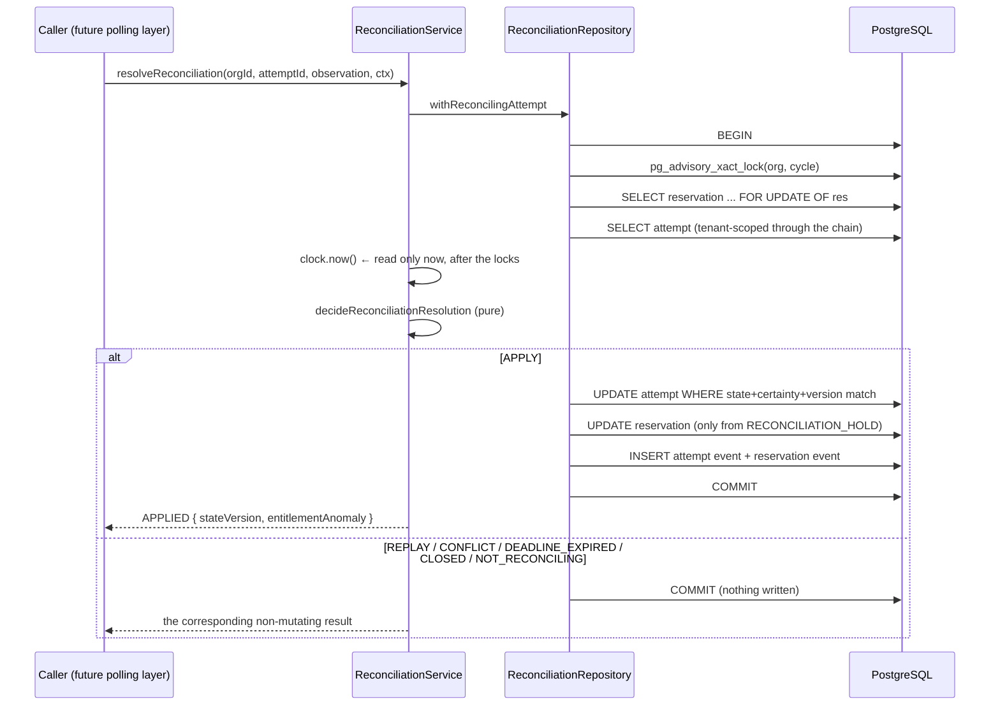
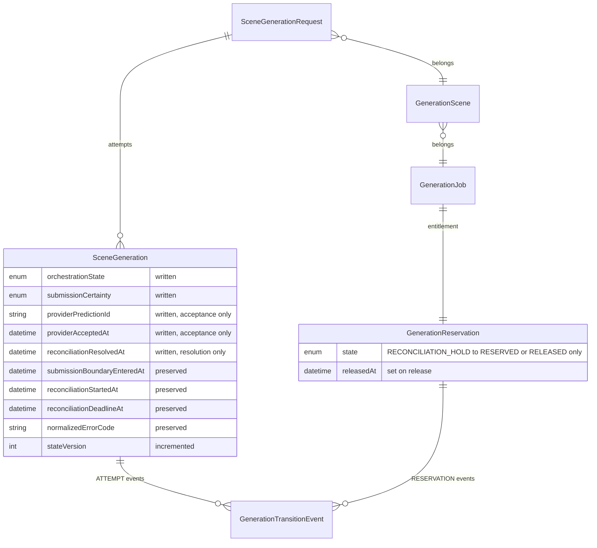

# Phase 4C-3B-2G-2 — Completion report

Reconciliation resolution and deadline exhaustion. Base:
`82df709dcd20b8ed1f4fda8ace22ece7b763b6a0`.

> **Revision 2 — CTO review corrections.** The first submission
> (`359f5545942c299216a53f9e2cb40a0faa7b7a64`) was not approved. Two blocking
> defects are corrected here, and both turned out to be **live, exploitable
> bugs rather than theoretical gaps** — each was reproduced against the rejected
> head before being fixed:
>
> | Superseded claim | Correction |
> | --- | --- |
> | The reconciliation write is tenant-scoped | It was scoped at the *read*, which `apply` does not require. A session opened for organization B could name organization A's attempt id and mutate that row, appending an event labelled with B. Reproduced: `apply` returned `APPLIED` and moved another tenant's attempt. Tenancy now sits inside the compare-and-set itself |
> | The observation validator checks the evidence | It trusted the TypeScript union at runtime. `retryable: "false"` is truthy, so it recorded `FAILED_RETRYABLE` and **restored the customer's reserved unit** on the strength of a string saying the opposite; a non-string `providerPredictionId` threw out of the validator instead of refusing; and every discriminant other than `ACCEPTED` was treated as a rejection |
>
> Both defects were also present in **merged Phase 2G-1**, identically, and are
> fixed here as well — the tenancy hole in
> `submission-outcome-repository.ts` was reproduced the same way and is the more
> severe of the two, since that repository is already reachable on `main`.
>
> The lesson both share: **a type is a promise about a value you constructed,
> and neither of these boundaries constructs its own input.**

Phase 4C-3B-2G-1 gave the platform a way to say "we do not know whether the
provider took this work" and stopped there. An attempt landed in
`RECONCILIATION_PENDING + SUBMISSION_UNKNOWN`, its customer's unit was suspended
in `RECONCILIATION_HOLD`, and a deadline was frozen from the submission boundary
— and nothing knew how any of that ended. Left alone it never would: the
entitlement stays hostage indefinitely and the uncertain charge sits in every
exposure calculation forever.

This phase supplies exactly the exit, and nothing more.

**No provider is contacted anywhere in this phase.** There is no HTTP client, no
polling, no webhook ingestion, no adapter, and no way to add a transport without
editing the port module. The evidence arrives as an argument. Whatever future
layer polls, receives a webhook, or takes an operator's determination normalizes
its findings before reaching this code — and that layer does not exist yet, which
is the correct order: the shape of the record is the constraint its producers
must satisfy, not the other way round.

## The lifecycle this phase closes

```text
        Phase 2F-1              Phase 2G-1                  Phase 2G-2
                                                    ┌──► PROCESSING
                                                    │    + ACCEPTED
 QUEUED ─────────► SUBMITTING ─────► RECONCILIATION ─┼──► FAILED_RETRYABLE
                                     _PENDING       │    FAILED_TERMINAL
                                     + SUBMISSION_   │    + DEFINITIVELY_REJECTED
                                       UNKNOWN      │
                                                    └──► RECONCILIATION_EXHAUSTED
                                                         + SUBMISSION_UNKNOWN
```

Three conclusions, and there is deliberately no fourth. In particular there is no
"still unknown" write: the row already says that, with a deadline, and
re-recording it would be a mutation that changes nothing while claiming progress
was made. A lookup that still cannot decide simply does not call the service.

## Sequence: resolving one uncertain attempt



## Entity relationships touched



No column was added, no enum member was added, and **no migration was required**.
Both Prisma diffs report `No difference detected`.

## What was built

### Domain — `packages/domain/src/reconciliation/`

| File | Responsibility |
| --- | --- |
| `observation.ts` | The closed two-arm evidence contract and its well-formedness check |
| `entitlement.ts` | What happens to the customer's unit, and how anomalous bookkeeping is labelled |
| `decide.ts` | Both pure evaluators — resolution and exhaustion |
| `ports.ts` | Repository, session and clock; the two closed result unions |
| `service.ts` | Lock/clock sequencing, the five event types, safe audit metadata |
| `maintenance.ts` | One batch pass over stale and due candidates |

### Persistence — `packages/database/src/reconciliation-repository.ts`

One transaction, in the lock order Phase 2F-1 fixed and 2G-1 joined:

```text
organization + billing-cycle advisory lock
  → GenerationReservation row FOR UPDATE (null when absent — an anomaly, not a block)
  → authoritative attempt read, tenant-scoped through its own chain
  → post-lock clock
  → pure decision
  → attempt compare-and-set on {state, certainty, version}
  → reservation mutation, only from RECONCILIATION_HOLD
  → append-only attempt + reservation events
  → COMMIT
```

Plus two bounded, lock-free candidate queries returning identifiers only.

### Modified, minimally

- `packages/domain/src/submission/outcome.ts` — exported
  `isStateCompatibleWithCertainty` so this phase's replay reuses Phase 2G-1's
  compatibility table rather than copying it. Two copies would drift and
  manufacture false conflicts.
- `packages/domain/src/orchestration/transition-metadata.ts` — three keys added
  to the existing allowlist: `reconciliationResolvedAt`, `retryable`,
  `diagnosticCode`.
- The two package barrels.

`classifyProviderCostExposure` and `isCoherentAttemptRecord` already covered
every pairing this phase produces and were **not modified** — verified by test
rather than assumed.

## One defect found and fixed during implementation

The first draft of `decideReconciliationResolution` treated *any* certainty other
than `SUBMISSION_UNKNOWN` as "already resolved" and sent it to the conflict
comparison. That meant an attempt still at `SUBMITTING + PRE_SUBMISSION` — one
that never became uncertain at all — was answered `CONFLICTING_RESOLUTION /
CERTAINTY_MISMATCH`.

`PRE_SUBMISSION` is the *absence* of a resolution, not a competing one. The
answer sent an operator hunting a second observer who does not exist, when the
truth was simply that the caller had named the wrong attempt. The branch is now
entered only for `ACCEPTED` and `DEFINITIVELY_REJECTED`, and such a row falls
through to `NOT_RECONCILING / ATTEMPT_NEVER_BECAME_UNCERTAIN`. Mutation M16
reintroduces the old condition and is killed.

## Verification

All commands run at the delivered head.

| Check | Result |
| --- | --- |
| `pnpm typecheck` | Pass — all 10 projects |
| `pnpm lint` | Pass — clean |
| `pnpm test` | **2603 passed**, 95 files |
| `pnpm test:db` (live PostgreSQL) | **538 passed**, 19 files |
| `pnpm build` | Pass — Next.js production build |
| Prisma schema → database | `No difference detected` |
| Prisma migrations → schema | `No difference detected` |
| Phase 2F-1 regression suite | Pass, unchanged |
| Phase 2G-1 regression suites | Pass, unchanged |

New tests added by this phase:

| Suite | Tests |
| --- | --- |
| `reconciliation/decide.test.ts` | 62 |
| `reconciliation/service.test.ts` | 50 |
| `reconciliation/entitlement.test.ts` | 23 |
| `reconciliation/observation.test.ts` | 65 |
| `reconciliation/maintenance.test.ts` | 16 |
| `reconciliation/exposure.test.ts` | 10 |
| `tests/integration/reconciliation.db.test.ts` | 56 |
| `submission/observation.test.ts` (2G-1 hardening) | 52 |
| **Total** | **288** |

Unit total rose to **2603** from 2315 (+288, 95 files from 88); database total
rose to **538** from 481 (+57, 19 files from 18). The Revision 2 corrections
account for +114 unit tests (the two validators' hostile-input suites) and +4
database tests (three cross-tenant boundary tests and one split-ownership test).
No pre-existing test was modified or removed.

## Mutation ledger

**Revision 2 total: 76 mutations, 74 killed, 2 survivors (both reported below).**
The original 54 are unchanged and all still die; 22 more cover the corrections.

### Correction mutations (22 — 20 killed)

| ID | Mutation | Result | Detected by |
| --- | --- | --- | --- |
| T01 | the 2G-2 attempt CAS drops its organization predicate | KILLED | db |
| T02 | the 2G-2 CAS keeps only the denormalized project, not the chain | KILLED | db |
| T03 | the 2G-2 post-update read drops its tenant scope | **SURVIVED** | — |
| T04 | the 2G-2 reservation move drops its tenant predicate | KILLED | typecheck |
| T05 | the merged 2G-1 attempt CAS drops its organization predicate | KILLED | db |
| T06 | the merged 2G-1 post-update read drops its tenant scope | **SURVIVED** | — |
| T07 | the merged 2G-1 reservation move drops its tenant predicate | KILLED | typecheck |
| V01 | the 2G-2 validator stops checking it has an object at all | KILLED | unit |
| V02 | the 2G-2 validator accepts an unrecognised discriminant | KILLED | unit |
| V03 | the 2G-2 validator sweeps an unknown kind into the rejection branch | KILLED | unit |
| V04 | the 2G-2 validator trusts retryable for truthiness | KILLED | unit |
| V05 | the 2G-2 validator stops checking retryable is a boolean | KILLED | unit |
| V06 | the 2G-2 validator stops checking the provider reference | KILLED | unit |
| V07 | the merged 2G-1 validator accepts an unrecognised discriminant | KILLED | unit |
| V08 | the merged 2G-1 validator stops checking retryable is a boolean | KILLED | unit |
| V09 | the merged 2G-1 validator stops checking it has an object | KILLED | unit |
| V10 | the merged 2G-1 validator stops checking the provider reference | KILLED | unit |
| V11 | a blank string counts as a name | KILLED | unit |
| V12 | a non-string reaches `trim()`, throwing out of the validator | KILLED | unit |
| V13 | arrays count as plain records | KILLED | unit |
| V14 | a missing diagnostic field counts as absent | KILLED | unit |
| V15 | truthiness replaces the boolean check outright | KILLED | unit |

Three of these initially survived and exposed real gaps in the test set, which
were closed rather than argued away:

- **V03** — sweeping an unknown `kind` into the rejection branch survived because
  every hostile case in the suite lacked a valid `retryable`, so it failed either
  way. The missing case is the dangerous one: `{ kind: "UNKNOWN", retryable:
  true, diagnosticCode: null }`, a well-formed rejection body under an
  unrecognised arm — exactly what a future provider adapter emitting a new kind
  would produce, and exactly what must not be recorded as a definitive rejection.
- **V13** — the array check survived because an ordinary array has no `kind` and
  is refused by the discriminant switch anyway. Killed by an array carrying a
  valid arm's properties, which a JS producer can build and JSON cannot.
- **T02** — the ownership-chain clause survived because in all test data the
  denormalized column and the chain agree. Killed by a row where they disagree,
  which is the corruption the second clause exists for.

### The two survivors, honestly

**T03 and T06** remove the tenant scope from the post-update read that fetches
the committed `stateVersion`. Both survive, and no test can kill them: that read
is only reached after a *tenant-scoped* compare-and-set returned a non-zero
count, which already proves the row is this organization's. The scope is
unreachable-redundant today and is kept because it stays correct if the CAS above
it is ever changed — the same defence-in-depth argument recorded for M40/M45/M51
below, with the difference that here there is no separate boundary to test it
through. Recorded rather than deleted or quietly omitted.

### Original phase mutations (54 — all killed)

54 mutations, each removing exactly one rule from an artefact that executes.
Detection order: reconciliation unit suites → the live-PostgreSQL suite →
`tsc` on `packages/domain` and `packages/database`. Every mutation is restored
byte-identically and the restore is asserted.

**54 of 54 killed. No survivors.** (Re-run at the Revision 2 head; M24 and
M25 were re-aimed at the rewritten validator lines.)

| ID | Mutation | Result | Detected by |
| --- | --- | --- | --- |
| M01 | the deadline becomes strict, so the exact instant may still resolve | KILLED | unit |
| M02 | exhaustion becomes strict, so the exact instant is not yet due | KILLED | unit |
| M03 | the deadline stops being enforced at all | KILLED | unit |
| M04 | the window is recomputed from the start instead of read from the row | KILLED | unit |
| M05 | exhaustion may run before its window closes | KILLED | unit |
| M06 | exhaustion stamps a resolution instant it never earned | KILLED | unit |
| M07 | exhaustion claims certainty it does not have | KILLED | unit |
| M08 | exhaustion invents a provider reference | KILLED | unit |
| M09 | an exhausted attempt can be reopened by late evidence | KILLED | unit |
| M10 | a second exhaustion applies again instead of reporting the first | KILLED | unit |
| M11 | replay compares the landing state instead of certainty compatibility | KILLED | unit |
| M12 | a different provider reference stops being a conflict | KILLED | unit |
| M13 | retryable-vs-terminal disagreement stops being a conflict | KILLED | unit |
| M14 | a certainty mismatch stops being a conflict | KILLED | unit |
| M15 | the deadline is consulted before replay, so a duplicate looks like a failure | KILLED | unit |
| M16 | PRE_SUBMISSION is treated as a competing resolution again | KILLED | unit |
| M17 | a row with no deadline gets one invented rather than failing closed | KILLED | unit |
| M18 | a row already carrying a provider reference is resolved on top of | KILLED | unit |
| M19 | an attempt that never became uncertain is resolved anyway | KILLED | unit |
| M20 | acceptance and resolution instants stop being the same instant | KILLED | unit |
| M21 | a rejection lands in one terminal state regardless of retryability | KILLED | unit |
| M22 | a rejection carries a provider reference it never received | KILLED | typecheck |
| M23 | an acceptance lands somewhere other than PROCESSING | KILLED | unit |
| M24 | a blank provider reference is accepted | KILLED | unit |
| M25 | an arbitrary diagnostic string is accepted | KILLED | unit |
| M26 | a malformed observation is checked after the row is inspected | KILLED | unit |
| M27 | a retryable rejection releases the unit instead of restoring it | KILLED | unit |
| M28 | exhaustion keeps the customer's hold instead of releasing it | KILLED | unit |
| M29 | a spent regeneration unit is moved as if it were a suspended hold | KILLED | unit |
| M30 | a spent INITIAL unit stops being an anomaly | KILLED | unit |
| M31 | a missing reservation stops being recorded | KILLED | unit |
| M32 | a RESERVED hold under reconciliation stops being flagged | KILLED | unit |
| M33 | the clock is read before the lock is taken | KILLED | unit |
| M34 | the caller's event label is trusted instead of the service's | KILLED | unit |
| M35 | the reservation event reuses the restore label for a release | KILLED | unit |
| M36 | acceptance and rejection share one attempt event label | KILLED | unit |
| M37 | the entitlement anomaly stops reaching the durable record | KILLED | unit |
| M38 | the exhaustion event claims a resolution instant | KILLED | unit |
| M39 | a lost compare-and-set is reported as applied | KILLED | unit |
| M40 | the CAS drops the state predicate and keeps only the version | KILLED | db |
| M41 | the CAS drops the version predicate | KILLED | typecheck |
| M42 | the write also rewrites the uncertainty history | KILLED | db |
| M43 | the cost-admission advisory lock is not taken | KILLED | typecheck |
| M44 | the reservation row is not locked for the transaction | KILLED | db |
| M45 | a terminal reservation is moved anyway | KILLED | db |
| M46 | the tenant scope is dropped from the attempt read | KILLED | db |
| M47 | candidate discovery loses its deterministic tiebreak | KILLED | db |
| M48 | candidate discovery stops honouring its bound | KILLED | db |
| M49 | candidate discovery returns attempts that already concluded | KILLED | db |
| M50 | candidate discovery includes windows that have not closed | KILLED | db |
| M51 | the incoherent-write guard is removed | KILLED | db |
| M52 | the batch exhausts before it sweeps, so fresh uncertainty can be closed at once | KILLED | unit |
| M53 | a declined candidate is counted as a success | KILLED | unit |
| M54 | the sweep invents a diagnostic nobody observed | KILLED | unit |

### Three mutations survived the first run, and what that exposed

M40, M45 and M51 all survived the initial ledger with **zero** failing tests.
All three are guards in the persistence layer, and the reason none of them fired
is the same: `apply` receives a `ReconciliationWrite` from its caller, and today
the only caller is the service, which builds that write from the same facts the
repository read under the same lock. Through that path the guards are
unreachable by construction:

- **M40** — the state predicate in the compare-and-set is redundant *given* that
  every writer in the codebase bumps `stateVersion`.
- **M45** — the repository's "only move a `RECONCILIATION_HOLD`" check duplicates
  a decision the domain already made from the same reservation state.
- **M51** — the coherence check duplicates an invariant the pure evaluator
  cannot violate.

The honest reading is not that the guards are dead code. It is that they are the
contract for the *next* caller, and the ledger had been driving only the current
one. Four tests were added that call `ReconciliationSession.apply` directly with
a hand-built write — the boundary those guards actually defend:

- a write whose state and certainty cannot both be true is refused before it can
  surface as an opaque database CHECK violation in production;
- a fabricated provider reference on a rejection is refused;
- a write asking to restore a spent unit does not move it, and appends no
  reservation event claiming it did;
- a write onto a row an operator moved out of band — state changed, version
  untouched — is refused as `LOST`, which is precisely the case the version
  predicate alone cannot catch.

All three mutations are killed by those tests. The point is recorded rather than
smoothed over: a mutation ledger that only exercises the current caller will
report defence-in-depth as dead code, and the fix is to test the boundary, not to
delete the guard.

## Revision 2 — the two corrected defects in detail

### 1. Tenancy was enforced at the read, not at the write

`ReconciliationSession.apply()` compare-and-set filtered on attempt id, state,
certainty and version. The organization was checked only by `loadFacts()` — and
`apply` never required `loadFacts` to have been called.

Reproduced against the rejected head: a session opened as organization B, naming
organization A's attempt id, with the version read out of band and no call to
`loadFacts`, returned `APPLIED`. It mutated another tenant's attempt and appended
a transition event attributed to B.

The fix puts tenancy inside the compare-and-set, in the same statement, which
also closes the check-then-act window between the read and the write. Two clauses
must both hold:

```ts
const attemptScope = (organizationId: string) => ({
  videoProject: { organizationId },                       // the denormalized column
  generationSceneRequest: {                               // the ownership chain
    generationScene: { generationJob: { videoProject: { organizationId } } },
  },
});
```

The first is what the standard orchestration attempt repository scopes on; the
second is the chain every read in this file traverses. Requiring both means a row
whose denormalized project disagrees with its chain — a bad backfill, a partial
restore, a manual edit — is frozen rather than writable by whichever tenant the
corruption happens to favour. The reservation mutation and the post-update read
carry the same scope.

**The identical hole exists in merged Phase 2G-1** and is fixed here too. Its
`submission-outcome-repository.ts` had the same unscoped CAS, unscoped
reservation move and unscoped final read, reachable the same way and reproduced
the same way. It is the more severe of the two, because that code is already on
`main`.

### 2. The validators trusted a type at a boundary that constructs nothing

`isWellFormedResolutionObservation` took a typed union and behaved as though the
type were a runtime fact. It is not: the producers that will call it — a polling
loop, a webhook handler, an operator tool — hand over decoded JSON or a queue
payload, and a type assertion on the way in proves nothing.

Three concrete failures, all reproduced:

| Input | Old behaviour |
| --- | --- |
| `{ kind: "DEFINITIVELY_REJECTED", retryable: "false", diagnosticCode: null }` | Passed validation. `"false"` is truthy, so it recorded `FAILED_RETRYABLE` **and restored the customer's reserved unit** — the opposite of what the value said |
| `{ kind: "ACCEPTED", providerPredictionId: 123 }` | Threw a `TypeError` out of `trim()`, so a validator answered with an exception instead of a refusal |
| `{ kind: "ANYTHING_ELSE", ... }` | Every discriminant other than `ACCEPTED` fell into the rejection branch, so an unrecognised arm could be recorded as a definitive rejection of a paid submission |

Both validators now take `unknown`, prove they have a non-array object, match the
discriminant exhaustively by name, and check every required field's type.
`isBoolean` rather than truthiness; catalog membership rather than a shape test;
`undefined` is not `null`, because a field a sender omitted has not been stated
to be absent. Unrecognised discriminants return `false` rather than being swept
into any arm. Nothing throws — malformed evidence is an answer
(`OBSERVATION_MALFORMED`, with nothing written), not an exception for a caller
to wrap.

The shared predicates live in `packages/domain/src/submission/untrusted.ts` and
are used by both phases: two definitions of "a valid diagnostic field" would
drift.

## Concurrency, proved against live PostgreSQL

| Race | Assertion |
| --- | --- |
| Two identical resolutions | Exactly one `APPLIED`, one `REPLAYED`; one attempt event, one reservation event |
| Resolution versus exhaustion | Exactly one lands; the row is never mixed — a resolved attempt never has a released hold, an exhausted one never has a reference |
| **Post-lock deadline race** | A resolver starts while the window is open, queues behind a Phase 2F-1 cost admission holding the same locks, and gets in after the window closed → `DEADLINE_EXPIRED`, zero mutation, hold untouched |
| Cross-phase serialization | A conclusion blocks behind a 2F-1 cost admission and lands afterwards |
| Reservation writer contention | A conclusion blocks behind a reservation writer, then records provider reality without resurrecting the terminal hold |
| Candidate discovery under load | Discovery takes no lock and returns while a conclusion holds one |

The post-lock deadline race is the one that justifies the whole time-authority
discipline. The clock read returns `INSIDE` before the resolver queues and
`AFTER` once it is in; the test asserts the resolver saw `INSIDE` beforehand and
still answered `DEADLINE_EXPIRED`, which is only possible if the judgement used
the post-lock read.

## Known limitations

1. **The service has no producer.** Nothing yet supplies a
   `ReconciliationResolutionObservation`. Both entry points are dormant domain
   services with no route, no worker loop and no scheduled caller. This is
   intentional and is the order the brief specifies.
2. **The batch runner is not scheduled.** `runOnce` exists; nothing calls it on a
   timer. Wiring it to a scheduler is a later decision with its own operational
   requirements.
3. **No stale-`SUBMITTING` threshold is shipped.** Phase 2G-1 deliberately
   removed the invented default and this phase does not reintroduce one; the
   discovery query consumes a caller-supplied cutoff. It remains a
   production-activation decision in `docs/decisions/TODO.md`.
4. **Cost exposure for an exhausted attempt stays `UNCERTAIN` forever.** There is
   no path that ever converts it, because none can honestly exist without
   provider-side actual-cost ingestion. A future accounting pass over the audit
   record is the right owner; this phase does not guess.
5. **`SYSTEM_RECOVERY` admission is not wired.** A retryable rejection restores
   the unit so a recovery attempt *can* stand on it; creating that attempt is not
   this phase's job and is not done automatically anywhere.

## Remaining work before this lifecycle is usable

- Provider polling / webhook ingestion that produces the evidence (later phase).
- A scheduler or worker loop that calls `runOnce`.
- `SYSTEM_RECOVERY` attempt admission after a retryable rejection.
- A production stale-`SUBMITTING` threshold, decided rather than invented.
- Actual-cost ingestion, which is what would let `UNCERTAIN` ever resolve.

## Explicitly not done

No paid provider activation. `FAL_KEY` is not enabled, the fal production factory
is not wired, the Veo production route is not opened, and the WaveSpeed paid
route stays closed. No Stripe, no charging, no output ingestion, no composition,
no upscale. No provider network call of any kind exists in this phase's
dependency graph, and a test enumerates the module's sources to keep it that way.
