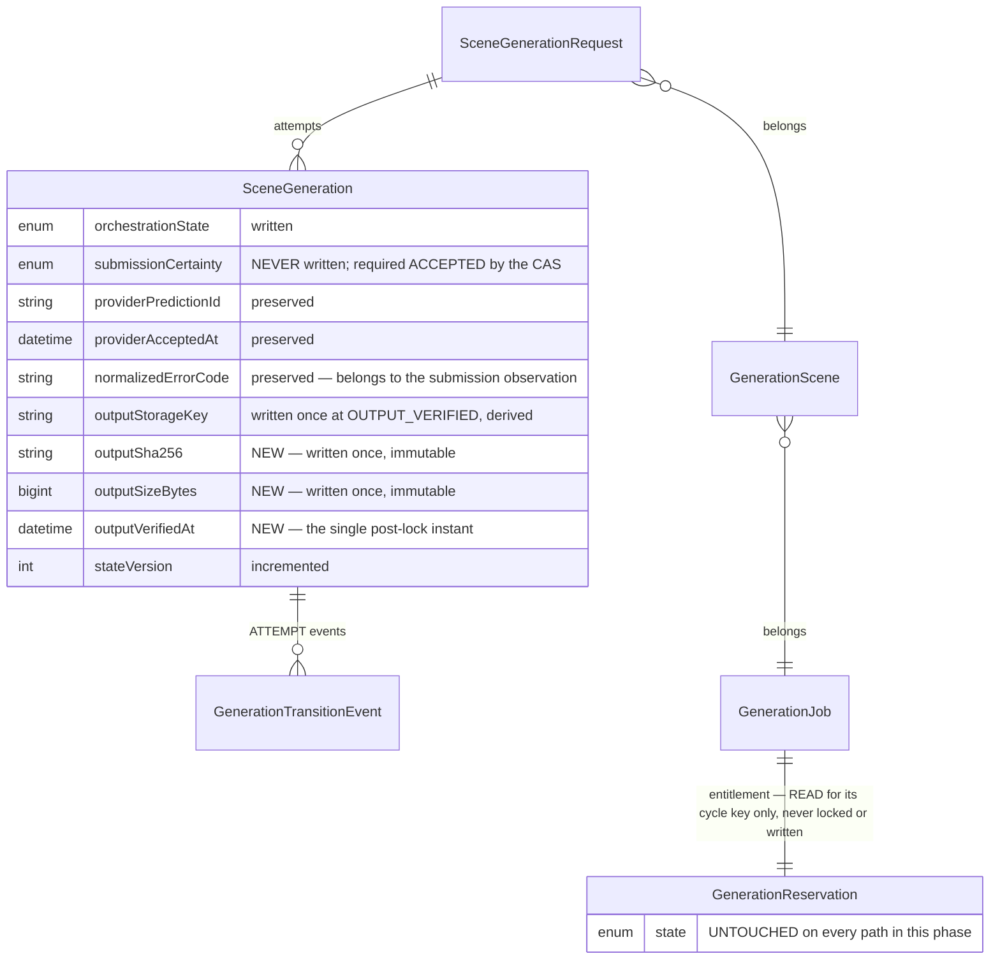

# Phase 4C-3B-2H-1 — Completion report

Provider completion and managed output persistence foundation. Base:
`8e1462df9dab8f9a994bf67dc7de53eb67ee46b6`.

Phase 4C-3B-2G-2 left an attempt able to reach `PROCESSING + ACCEPTED` — a
provider had admitted to taking the work, a prediction reference was on file, a
customer's unit was reserved against it — and completely unable to leave. The
provider would finish, or fail, or produce an output nobody copied, and the row
would say `PROCESSING` forever.

This phase records what happens afterwards, and nothing more.

**No provider is contacted and no object storage is written anywhere in this
phase.** There is no HTTP client in the dependency graph, no polling loop, no
webhook route, no storage client, no scheduler and no worker loop. Nothing is
downloaded, uploaded, composed, upscaled, delivered or charged. The completion
evidence and the integrity receipt arrive as arguments; the layer that will one
day produce them does not exist yet, which is the correct order — the shape of
the record is the constraint its producers must satisfy, not the reverse.

## The three collapses this phase exists to resist

Each is convenient, and each costs money or trust.

**"The provider finished" is not "we have the video."** A provider's output lives
at a temporary URL on someone else's infrastructure, typically for hours. An
attempt that records success and stops has recorded a fact that expires. Fold the
copy into the same transition and there is no state left in which to describe a
copy that failed — the row claims the platform holds an output it does not hold.

**"We have the video" is not "we have proved it is the video."** A transfer that
stops at 80% leaves a real key pointing at a real object of the wrong length, and
nothing in a storage API distinguishes that from success.

**A copy failing is not the provider failing.** The expensive one. The provider
has already run the GPU job and will bill for it. Recording an internal storage
fault as a provider failure puts the platform's own bug into the vendor's
reliability record and — because a failure is terminal — discards an output still
sitting there, retrievable, under a key the attempt could re-derive. The platform
would pay twice for one render and blame the vendor for its own defect.

## The lifecycle this phase adds

```text
      Phase 2G-1 / 2G-2                        Phase 2H-1
                                    ┌──► PROVIDER_SUCCEEDED + ACCEPTED
                                    │         │
 SUBMITTING ──► PROCESSING ─────────┼─►       ▼
                + ACCEPTED          │    OUTPUT_INGESTING  ──►  OUTPUT_VERIFIED
                                    │       (resumable)         (terminal here)
                                    ├──► FAILED_RETRYABLE + ACCEPTED
                                    └──► FAILED_TERMINAL  + ACCEPTED
```

Every edge is the committed attempt state machine's. Before implementing, all
five were verified present in `ATTEMPT_TRANSITIONS`, and `OUTPUT_VERIFIED: []`
was confirmed to have no outgoing edge — nothing was missing, so nothing was
reported and **no second private transition table exists**.

`OUTPUT_VERIFIED` is deliberately **not** delivery. The logical request is not
`DELIVERED`, the scene is not `READY`, the job is not `SCENES_READY`, and no
deliverable is reachable by a customer.

## Sequence: one attempt from provider completion to verified output

```mermaid
sequenceDiagram
    participant C as Caller (future polling / webhook layer)
    participant S as ProviderCompletionService
    participant R as CompletionRepository
    participant PG as PostgreSQL

    C->>S: recordProviderCompletion(orgId, attemptId, observation, ctx)
    S->>S: validate observation as unknown → MALFORMED refuses first
    S->>R: withCompletingAttempt
    R->>PG: BEGIN
    R->>PG: pg_advisory_xact_lock(org, cycle)
    R->>PG: SELECT attempt (tenant-scoped through the chain)
    S->>S: decideProviderCompletion (pure)
    R->>PG: UPDATE attempt WHERE id + tenant + state + certainty + version
    R->>PG: INSERT PROVIDER_COMPLETION_SUCCEEDED | _FAILED
    R->>PG: COMMIT
    S-->>C: APPLIED { stateVersion }

    C->>S: beginOutputIngestion(orgId, attemptId, ctx)
    S->>R: PROVIDER_SUCCEEDED → OUTPUT_INGESTING + OUTPUT_INGESTION_STARTED
    Note over C: the copy happens in a later phase; an interruption<br/>leaves the row at OUTPUT_INGESTING, resumable

    C->>S: finalizeOutputVerification(orgId, attemptId, receipt, ctx)
    S->>R: withCompletingAttempt
    R->>PG: BEGIN, advisory lock, authoritative read
    S->>S: clock.now()  ← read only now, after the lock and the facts
    S->>S: decideFinalizeOutputVerification (pure; derives the storage key)
    R->>PG: UPDATE attempt SET state + key + sha256 + size + verifiedAt
    R->>PG: INSERT OUTPUT_VERIFIED (digest and size; no location)
    R->>PG: COMMIT
    S-->>C: APPLIED { stateVersion }
```

## Entity relationships touched



## What was built

### Domain — `packages/domain/src/completion/`

| File | Responsibility |
| --- | --- |
| `observation.ts` | The closed two-arm completion contract and its `unknown`-input validator |
| `output.ts` | `Sha256Digest`, `SafePositiveByteCount`, the receipt, and `managedGenerationOutputKey` |
| `decide.ts` | Three pure evaluators: completion, begin-ingestion, finalize-verification |
| `ports.ts` | Repository, session and result contracts — the only place a transport could ever be added |
| `service.ts` | The three operations, event labelling, and the single post-lock clock read |
| `index.ts` | The module's public surface |

### Persistence — `packages/database/src/completion-repository.ts`

One transaction per operation: advisory lock, authoritative tenant-scoped read,
compare-and-set, append-only event, commit. It contains no provider client, no
HTTP, no object storage, no wall-clock read, and **no reservation handle** — the
absence of entitlement mutation is structural rather than conventional.

### Modified, minimally

| File | Change |
| --- | --- |
| `orchestration/transition-metadata.ts` | Three keys added to the allowlist: `outputSha256`, `outputSizeBytes`, `outputVerifiedAt`. `outputStorageKey` deliberately **not** added |
| `prisma/schema.prisma` | Three nullable columns on `SceneGeneration` |
| `domain/src/index.ts`, `database/src/index.ts` | Export the new module |

`classifyProviderCostExposure`, `isCoherentAttemptRecord` and the attempt state
machine were inspected before implementation and **not modified** — they already
covered every pairing and edge this phase produces. §43's required regressions
were added instead of changes.

## Database migration

`00000000000011_phase4c3b2h1_managed_output_integrity` — one focused migration.

**Why it was required.** `outputStorageKey` already existed, but a key alone
proves nothing: it says where the platform *believes* a copy lives, not that the
copy is complete, that it is the object the provider produced, or when anyone
checked. Three additive nullable columns make `OUTPUT_VERIFIED` auditable, and
with the key they form a self-contained integrity record — enough to re-verify
the object later without trusting any other system.

| Change | Kind |
| --- | --- |
| `ADD COLUMN "outputSha256" TEXT` | additive, nullable |
| `ADD COLUMN "outputSizeBytes" BIGINT` | additive, nullable |
| `ADD COLUMN "outputVerifiedAt" TIMESTAMP(3)` | additive, nullable |
| `scene_generations_verified_output_metadata_check` | all four facts on any `OUTPUT_VERIFIED` row |
| `scene_generations_output_sha256_format_check` | `NULL OR ~ '^[0-9a-f]{64}$'` |
| `scene_generations_output_size_positive_check` | `NULL OR > 0` |

No rename, no column drop, no backfill, no destructive change.

**The legacy exception, stated exactly.** Every constraint keys on
`orchestrationState`, which is NULL on every row admitted before Phase 4C-3B-2E,
and `IS DISTINCT FROM` is null-safe — so those rows satisfy the verified-metadata
constraint unconditionally and **no exception logic exists**. A legacy
`state = 'SUCCEEDED'` row is not reinterpreted as an orchestrated
`PROVIDER_SUCCEEDED`; inventing a digest, a size, a verification instant or an
orchestration state for it would forge an integrity record nobody produced.

`outputSizeBytes` is `BIGINT` rather than `INTEGER` because the domain admits any
positive safe integer, and `int4` would silently overflow at roughly 2 GiB on a
value the validator had just accepted.

Verified in both directions:

| Migration check | Result |
| --- | --- |
| Applied to an empty database | Pass |
| Applied to a database containing a legacy row | Pass — row survived with `state = SUCCEEDED`, `orchestrationState` NULL, `outputStorageKey` preserved, all three new columns NULL |
| Prisma schema → database | `No difference detected` |
| Prisma migrations → schema | `No difference detected` |

## API change summary

**None.** No route, no handler, no OpenAPI path, no request or response schema
changed. The three operations are dormant domain services with no route, no
worker loop and no scheduled caller. Nothing is customer-reachable.

## Verification

All commands run at the delivered head, against live PostgreSQL where applicable.

| Check | Result |
| --- | --- |
| `pnpm typecheck` | Pass — all 10 projects |
| `pnpm lint` | Pass — 0 problems |
| `pnpm test` | **2896 passed**, 100 files |
| `pnpm test:db` (live PostgreSQL) | **638 passed**, 20 files |
| `pnpm build` | Pass — Next.js production build |
| Prisma schema → database | `No difference detected` |
| Prisma migrations → schema | `No difference detected` |
| Phase 2F-1 regression suite | Pass, unchanged |
| Phase 2G-1 regression suites | Pass, unchanged |
| Phase 2G-2 regression suites | Pass, unchanged |

New tests added by this phase:

| Suite | Tests | Layer |
| --- | --- | --- |
| `completion/decide.test.ts` | 80 | unit |
| `completion/output.test.ts` | 52 | unit |
| `completion/observation.test.ts` | 46 | unit |
| `completion/service.test.ts` | 40 | unit |
| `completion/exposure.test.ts` | 19 | unit |
| **Unit total** | **237** | |
| `tests/integration/provider-completion.db.test.ts` | 71 | database |

Unit total rose to **2896** from 2659 (+237, 100 files from 95); database total
rose to **638** from 567 (+71, 20 files from 19).

**Twelve pre-existing database tests failed on first run** and were repaired
rather than accommodated. Four suites parked rows directly at `OUTPUT_VERIFIED`
without integrity facts, and the new CHECK correctly rejected them. The
constraint is the §24 invariant and was kept; the fixtures were completed at five
sites in `paid-submission-authorization.db.test.ts` (×4),
`reconciliation.db.test.ts`, `submission-outcome.db.test.ts` and
`generation-orchestration.db.test.ts`. No pre-existing assertion was weakened,
and no test was removed.

## Mutation ledger

**50 mutations. 48 killed. 2 survivors, both proved equivalent rather than
merely reported.**

| Group | Mutations | Killed |
| --- | --- | --- |
| Completion transitions and CAS | 7 | 7 |
| Replay and conflict | 5 | 5 |
| Preconditions | 2 | 2 |
| Observation validation | 4 | 4 |
| Ingestion | 3 | 3 |
| Storage key derivation | 3 | 3 |
| Receipt validation | 5 | 5 |
| Verified-output persistence and the CHECK | 5 | 5 |
| Finalization immutability | 4 | 4 |
| Time authority | 2 | 2 |
| Audit safety | 3 | 2 (+1 equivalent) |
| Candidate discovery | 3 | 3 |
| Entitlement | 1 | 1 |
| Ingestion-failure semantics | 2 | 1 (+1 equivalent) |
| Replacements for the two equivalents | 2 | 2 |
| **Total** | **50** | **48** |

### The full ledger

| ID | Mutation | Result | Detected by |
| --- | --- | --- | --- |
| H01 | a SUCCEEDED completion leaves PROCESSING unchanged | KILLED | 3 unit |
| H02 | a completion rewrites submission certainty to DEFINITIVELY_REJECTED | KILLED | 57 db |
| H03 | an accepted provider failure clears the provider reference | KILLED | 57 db |
| H04 | a retryable failure lands in FAILED_TERMINAL | KILLED | 6 unit |
| H05 | the completion CAS drops its tenant predicate | KILLED | 6 db |
| H06 | the CAS keeps only the denormalized project, not the chain | KILLED | 4 db |
| H07 | the CAS drops its expected-state predicate | KILLED | typecheck |
| H08 | a completion replay creates a second event | KILLED | 9 unit |
| H09 | a SUCCEEDED replay from OUTPUT_VERIFIED conflicts instead | KILLED | 9 unit |
| H10 | a SUCCEEDED replay from OUTPUT_INGESTING conflicts instead | KILLED | 5 unit |
| H11 | a retryability disagreement stops being a conflict | KILLED | 4 unit |
| H12 | a success overwrites a recorded failure | KILLED | 4 unit |
| H13 | a completion is accepted for an attempt the provider never accepted | KILLED | 7 unit |
| H14 | acceptance metadata is no longer required | KILLED | 4 unit |
| H15 | an unrecognised completion discriminant is swept into failure | KILLED | 19 unit |
| H16 | retryable stops being checked as a boolean | KILLED | 18 unit |
| H17 | the completion validator stops checking it has an object | KILLED | 12 unit |
| H18 | a malformed observation is checked after the row is inspected | KILLED | 17 unit |
| H19 | begin ingestion permits a provider-failed attempt | KILLED | 8 unit |
| H20 | begin ingestion can transition twice | KILLED | 6 unit |
| H21 | begin ingestion moves a verified output backwards | KILLED | 6 unit |
| H22 | the output storage key becomes caller-controlled | KILLED | 11 unit |
| H23 | the key stops depending on the attempt | KILLED | 3 unit |
| H24 | the key stops depending on the organization | KILLED | 7 unit |
| H25 | SHA-256 validation is skipped | KILLED | 18 unit |
| H26 | SHA-256 accepts uppercase | KILLED | 8 unit |
| H27 | output size validation is skipped | KILLED | 19 unit |
| H28 | a zero-byte output counts as verified | KILLED | 9 unit |
| H29 | the receipt validator is skipped entirely | KILLED | 17 unit |
| H30 | OUTPUT_VERIFIED persists without a storage key | KILLED | 28 db |
| H31 | OUTPUT_VERIFIED persists without a SHA-256 | KILLED | 28 db |
| H32 | OUTPUT_VERIFIED persists without a size | KILLED | 28 db |
| H33 | OUTPUT_VERIFIED persists without a verified timestamp | KILLED | 30 db |
| H34 | the verified-output CHECK constraint is removed | KILLED | 7 db |
| H35 | finalization overwrites an existing SHA-256 | KILLED | 16 unit |
| H36 | a conflicting digest returns replay | KILLED | 6 unit |
| H37 | a conflicting size returns replay | KILLED | 3 unit |
| H38 | a verified row missing integrity facts is completed rather than refused | KILLED | 6 unit |
| H39 | outputVerifiedAt comes from the repository wall clock | KILLED | 7 db |
| H40 | the verification clock is read before the lock and facts | KILLED | 4 unit |
| H41 | the raw storage key enters the audit record | **equivalent** | see below |
| H42 | the caller's event label is trusted instead of the service's | KILLED | 5 unit |
| H43 | success and failure share one event label | KILLED | 3 unit |
| H44 | the candidate limit is no longer validated | KILLED | 10 db |
| H45 | candidate discovery ignores the requested stage | KILLED | 4 db |
| H46 | candidate discovery returns unaccepted attempts | KILLED | 5 db |
| H47 | the customer reservation is consumed at OUTPUT_VERIFIED | KILLED | 9 db |
| H48 | an interrupted ingestion is mapped to a provider FAILED_RETRYABLE | **equivalent** | see below |
| H49 | the output location is added to the audit allowlist | KILLED | 3 unit |
| H50 | an ingesting attempt can be landed on a provider failure | KILLED | 6 unit |

### Three mutations survived the first run, and what that exposed

The first run killed 43 of 48 and left five survivors. Three were real coverage
gaps and are now closed; the tests that close them are described here because
each exposed something the implementation was relying on without proving.

**H06 — one tenant clause was doing no work.** The CAS carries two clauses, the
denormalized `videoProjectId` and the ownership chain, and every fixture had them
agree — so removing the chain changed no observable behaviour. Both clauses exist
precisely for the case where they *disagree*, and nothing constructed that case.
Two database tests now do: the chain is seeded under organization B and the
denormalized column is pointed at organization A's project. Organization A, the
tenant the weaker predicate would admit, is refused; **and so is organization B**,
whose chain does own the row. That asymmetry is the intended outcome — a row
nobody can move is a problem to investigate, whereas a row two tenants can move
is a breach.

**H13 — the certainty check's *position* was untested.** Removing it changed
nothing for a `PROCESSING` attempt, because `processingPrecondition` re-checks
certainty and produces the same answer. The check earns its place only for an
attempt already in a replay or failure state: a `DEFINITIVELY_REJECTED +
FAILED_TERMINAL` row would otherwise be answered `REPLAY`, reporting that a
provider *execution* failure is on file for an attempt the provider refused. Five
unit cases now drive exactly those pairings.

**H46 — the discovery filter was never exercised against an unaccepted row.** No
service produces `PROCESSING + SUBMISSION_UNKNOWN`, so nothing had one to offer
the query. Two database tests write the pairing directly. The filter is not about
state validity — the single-attempt service re-checks everything — but about what
a worker picks up: an unaccepted candidate is a worker about to ask a provider
about a job that may never have been sent, and the filter is what keeps the
completion path and the reconciliation path from reaching for the same row.

### The two survivors, honestly

Both are **equivalent mutants**, and both were replaced by a reachable mutation
that the new coverage kills. Neither is an untested behaviour.

**H41 — the storage key passed to the audit record.** The mutation hands
`outputStorageKey` to `sanitizeTransitionMetadata`, which drops unknown keys
silently. The key is not on the allowlist, so nothing reaches the database and no
test can observe a difference. The sanitizer is the control and it works. The
*reachable* defect is widening the allowlist, which nothing asserted against —
**H49** does exactly that and is killed by a new test that names
`ALLOWED_TRANSITION_METADATA_KEYS` directly rather than only its effect.

**H48 — an interrupted ingestion mapped to a provider failure.** The mutation
guards its branch on `outputStorageKey === "__never__"`, a sentinel no row can
hold, so it is unreachable by construction — a badly formed mutation on my part.
The reachable version has to defeat the `PROCESSING` precondition as well, which
is itself the finding: a failed landing from `OUTPUT_INGESTING` is not merely
unused, it is unreachable without breaking two separate guards. **H50** breaks
both and is killed by a new whole-surface test that sweeps every decision
reachable from `OUTPUT_INGESTING` across every observation and receipt shape and
asserts that `OUTPUT_VERIFIED` is the only landing any of them produces.

## Concurrency, proved against live PostgreSQL

Every race below is a real two-connection test, not a simulation.

| Race | Result |
| --- | --- |
| Two identical SUCCEEDED completions | one `APPLIED`, one `REPLAYED`, exactly one event |
| SUCCEEDED versus FAILED | one winner, the other `CONFLICTING_COMPLETION` |
| Two identical retryable failures | one `APPLIED`, one `REPLAYED` |
| Retryable versus terminal | one winner, the other a conflict |
| Two concurrent `beginOutputIngestion` | exactly one transition, exactly one event |
| Two identical finalizations | one `APPLIED`, one `REPLAYED`, metadata written once |
| Two conflicting receipts | one wins, the other `CONFLICTING_OUTPUT`, stored metadata never overwritten |

No expected race produces a rejected promise. A loser is an ordinary result the
caller reads, not an exception every caller must wrap.

## Known limitations

- **Nothing calls these operations.** All three are dormant domain services with
  no route, no worker loop and no scheduled caller. `findCompletionCandidates`
  is a query a future runner may use; this phase supplies no runner.
- **The evidence has no producer.** Nothing polls, receives a webhook, or takes
  an operator determination. Every observation and receipt in the test suite is
  an argument, and the producing layer is a later phase.
- **Nothing copies bytes.** `beginOutputIngestion` records that a copy is under
  way; the copy itself, and the hashing that produces a receipt, belong to the
  phase that adds a storage client.
- **`OUTPUT_VERIFIED` reaches no customer.** Delivery, review, approval,
  composition and download remain unimplemented and are review-gated by product
  rule.
- **No credit is settled.** Exactly-once settlement is a later phase; this one
  deliberately touches no reservation on any path.

## Remaining work before this lifecycle is usable

1. A copy path: fetch the provider output, write it to the derived key, hash and
   size it, and call `finalizeOutputVerification` with the receipt.
2. A producer for completion evidence — polling, webhook ingestion, or both —
   normalizing provider responses into the closed two-arm contract.
3. A runner over `findCompletionCandidates`, including the resumable-ingestion
   stage.
4. Delivery: request `DELIVERED`, scene `READY`, job `SCENES_READY`, behind human
   review.
5. Exactly-once credit settlement at delivery.

## Explicitly not done

Per the phase brief, and verified absent: no provider HTTP call, no polling, no
webhook route, no output download or streaming, no S3/R2/GCS upload, no
managed-storage network write, no real provider POST, no payment, no Stripe, no
charging, no composition, no upscale, no production scheduler or worker loop, no
`providerOutputUrl` / `providerTemporaryUrl` / `rawProviderResponse` /
`providerFileName` column, no `SceneGenerationRequest → DELIVERED`, no
`GenerationScene → READY`, no `GenerationJob → SCENES_READY`, no regeneration
right consumed, no reservation mutation of any kind, no `SYSTEM_RECOVERY`
attempt, and no paid provider activation.
