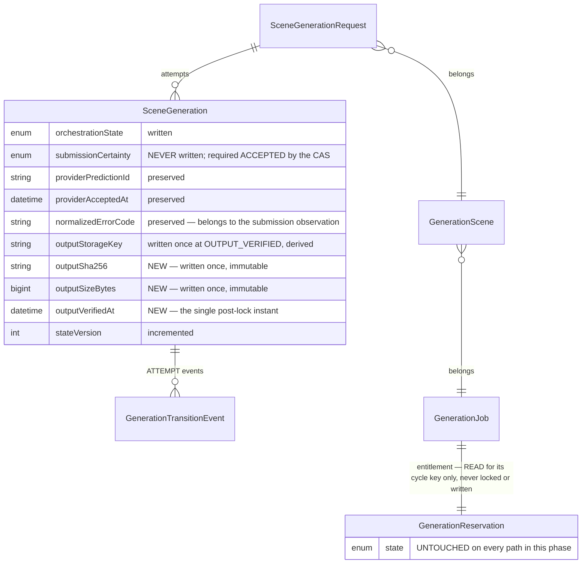

# Phase 4C-3B-2H-1 — Completion report

Provider completion and managed output persistence foundation. Base:
`8e1462df9dab8f9a994bf67dc7de53eb67ee46b6`.

> **Revision 2 — CTO review corrections.** The first submission
> (`cee92f38488709f2b18c3b766bd64123418e338a`) was not approved. The architecture
> was accepted; six blocking defects are corrected here.
>
> | Superseded claim | Correction |
> | --- | --- |
> | "Verified output metadata is immutable, enforced by CHECK" | The CHECK establishes completeness, format and range — never immutability, because it evaluates one row against one predicate with no memory of what the row said before. The real hole was the legacy `SceneGenerationRepository.update`, which could replace `outputStorageKey` on a verified row: key alone, no version bump, no event, no constraint violation. A key write now matches only `orchestrationState IS NULL` |
> | `BIGINT` is the right column type | Right at the bottom, wrong at the top. Above 2^53-1 a `BIGINT` read into a JavaScript number is silently lossy, so a stored 9007199254740993 would come back as ...992 and be compared against a receipt as though it had been written. The CHECK is now bounded at `Number.MAX_SAFE_INTEGER`, and the repository refuses to narrow an out-of-range value regardless |
> | "The storage key is derived, never supplied" | True of the service, false of the persistence boundary — which took `outputStorageKey` in its write and is reachable without the service. That parameter is gone; the repository derives the key itself from the transaction's own tenant and attempt |
> | The committed state machine is used | It was consulted by the domain and *assumed* by persistence. `CompletionWrite.orchestrationState` was the full `GenerationAttemptState`, so a session caller could write `OUTPUT_INGESTING` onto a `PROCESSING` row and skip `PROVIDER_SUCCEEDED`. The landing type is now closed and all three apply methods consult `canTransitionAttempt` before any SQL |
> | The runtime contracts are closed | The *types* were closed; the validators were not. `{ kind: "SUCCEEDED", providerOutputUrl: … }` and a receipt carrying `rawProviderResponse` both passed. Unknown own keys now make a value malformed rather than being silently dropped |
> | The managed key ends `output.mp4` | This phase proves a digest and a byte count, not a container, a codec or a MIME type — and has no format vocabulary to check one against. The key is now extensionless |
>
> What the first five share: **a guarantee stated at one boundary and relied on at
> another**. The service derived the key, so persistence was assumed not to need
> to; the domain checked the transition, so persistence was assumed not to need
> to; the CHECK made a verified row complete, so it was assumed to make it
> permanent. Each assumption held for the caller anyone had in mind, and for no
> other caller.

Phase 4C-3B-2G-2 left an attempt able to reach `PROCESSING + ACCEPTED` — a
provider had admitted to taking the work, a prediction reference was on file, a
customer's unit was reserved against it — and completely unable to leave. The
provider would finish, or fail, or produce an output nobody copied, and the row
would say `PROCESSING` forever.

This phase records what happens afterwards, and nothing more.

**No provider is contacted and no object storage is written anywhere in this
phase.** There is no HTTP client in the dependency graph, no polling loop, no
webhook route, no storage client, no scheduler and no worker loop. Nothing is
downloaded, uploaded, composed, upscaled, delivered or charged. The completion
evidence and the integrity receipt arrive as arguments; the layer that will one
day produce them does not exist yet, which is the correct order — the shape of
the record is the constraint its producers must satisfy, not the reverse.

## The three collapses this phase exists to resist

Each is convenient, and each costs money or trust.

**"The provider finished" is not "we have the video."** A provider's output lives
at a temporary URL on someone else's infrastructure, typically for hours. An
attempt that records success and stops has recorded a fact that expires. Fold the
copy into the same transition and there is no state left in which to describe a
copy that failed — the row claims the platform holds an output it does not hold.

**"We have the video" is not "we have proved it is the video."** A transfer that
stops at 80% leaves a real key pointing at a real object of the wrong length, and
nothing in a storage API distinguishes that from success.

**A copy failing is not the provider failing.** The expensive one. The provider
has already run the GPU job and will bill for it. Recording an internal storage
fault as a provider failure puts the platform's own bug into the vendor's
reliability record and — because a failure is terminal — discards an output still
sitting there, retrievable, under a key the attempt could re-derive. The platform
would pay twice for one render and blame the vendor for its own defect.

## The lifecycle this phase adds

```text
      Phase 2G-1 / 2G-2                        Phase 2H-1
                                    ┌──► PROVIDER_SUCCEEDED + ACCEPTED
                                    │         │
 SUBMITTING ──► PROCESSING ─────────┼─►       ▼
                + ACCEPTED          │    OUTPUT_INGESTING  ──►  OUTPUT_VERIFIED
                                    │       (resumable)         (terminal here)
                                    ├──► FAILED_RETRYABLE + ACCEPTED
                                    └──► FAILED_TERMINAL  + ACCEPTED
```

Every edge is the committed attempt state machine's. Before implementing, all
five were verified present in `ATTEMPT_TRANSITIONS`, and `OUTPUT_VERIFIED: []`
was confirmed to have no outgoing edge — nothing was missing, so nothing was
reported and **no second private transition table exists**.

`OUTPUT_VERIFIED` is deliberately **not** delivery. The logical request is not
`DELIVERED`, the scene is not `READY`, the job is not `SCENES_READY`, and no
deliverable is reachable by a customer.

## Sequence: one attempt from provider completion to verified output

```mermaid
sequenceDiagram
    participant C as Caller (future polling / webhook layer)
    participant S as ProviderCompletionService
    participant R as CompletionRepository
    participant PG as PostgreSQL

    C->>S: recordProviderCompletion(orgId, attemptId, observation, ctx)
    S->>S: validate observation as unknown → MALFORMED refuses first
    S->>R: withCompletingAttempt
    R->>PG: BEGIN
    R->>PG: pg_advisory_xact_lock(org, cycle)
    R->>PG: SELECT attempt (tenant-scoped through the chain)
    S->>S: decideProviderCompletion (pure)
    R->>PG: UPDATE attempt WHERE id + tenant + state + certainty + version
    R->>PG: INSERT PROVIDER_COMPLETION_SUCCEEDED | _FAILED
    R->>PG: COMMIT
    S-->>C: APPLIED { stateVersion }

    C->>S: beginOutputIngestion(orgId, attemptId, ctx)
    S->>R: PROVIDER_SUCCEEDED → OUTPUT_INGESTING + OUTPUT_INGESTION_STARTED
    Note over C: the copy happens in a later phase; an interruption<br/>leaves the row at OUTPUT_INGESTING, resumable

    C->>S: finalizeOutputVerification(orgId, attemptId, receipt, ctx)
    S->>R: withCompletingAttempt
    R->>PG: BEGIN, advisory lock, authoritative read
    S->>S: clock.now()  ← read only now, after the lock and the facts
    S->>S: decideFinalizeOutputVerification (pure; derives a key for comparison)
    R->>R: derive the canonical key from THIS transaction's org + attempt
    R->>R: re-prove the digest and the byte count
    R->>PG: UPDATE attempt SET state + derived key + sha256 + size + verifiedAt
    R->>PG: INSERT OUTPUT_VERIFIED (digest and size; no location)
    R->>PG: COMMIT
    S-->>C: APPLIED { stateVersion }
```

## Entity relationships touched



## What was built

### Domain — `packages/domain/src/completion/`

| File | Responsibility |
| --- | --- |
| `observation.ts` | The closed two-arm completion contract and its `unknown`-input validator |
| `output.ts` | `Sha256Digest`, `SafePositiveByteCount`, the receipt, and `managedGenerationOutputKey` |
| `decide.ts` | Three pure evaluators: completion, begin-ingestion, finalize-verification |
| `ports.ts` | Repository, session and result contracts — the only place a transport could ever be added |
| `service.ts` | The three operations, event labelling, and the single post-lock clock read |
| `index.ts` | The module's public surface |

### Persistence — `packages/database/src/completion-repository.ts`

One transaction per operation: advisory lock, authoritative tenant-scoped read,
compare-and-set, append-only event, commit. It contains no provider client, no
HTTP, no object storage, no wall-clock read, and **no reservation handle** — the
absence of entitlement mutation is structural rather than conventional.

Revision 2 made this boundary self-sufficient rather than dependent on its
caller. It now derives the managed storage key itself from the transaction's own
organization and attempt (it accepts no key parameter at all), re-proves the
digest and the byte count with the domain's own predicates before any SQL,
consults `canTransitionAttempt` on all three operations, and refuses to narrow a
persisted byte count outside the safe-integer range instead of silently losing
precision. Each of those is something the service already did correctly — and
each was reachable without the service.

### Modified, minimally

| File | Change |
| --- | --- |
| `orchestration/transition-metadata.ts` | Three keys added to the allowlist: `outputSha256`, `outputSizeBytes`, `outputVerifiedAt`. `outputStorageKey` deliberately **not** added |
| `submission/untrusted.ts` | `hasExactlyOwnKeys` — one shared exact-key rule for both closed runtime contracts |
| `database/src/generation-repositories.ts` | A legacy `outputStorageKey` write matches only rows with `orchestrationState IS NULL` |
| `prisma/schema.prisma` | Three nullable columns on `SceneGeneration` |
| `domain/src/index.ts`, `database/src/index.ts` | Export the new module |

`classifyProviderCostExposure`, `isCoherentAttemptRecord` and the attempt state
machine were inspected before implementation and **not modified** — they already
covered every pairing and edge this phase produces. §43's required regressions
were added instead of changes.

## Database migration

`00000000000011_phase4c3b2h1_managed_output_integrity` — one focused migration.

**Why it was required.** `outputStorageKey` already existed, but a key alone
proves nothing: it says where the platform *believes* a copy lives, not that the
copy is complete, that it is the object the provider produced, or when anyone
checked. Three additive nullable columns make `OUTPUT_VERIFIED` auditable, and
with the key they form a self-contained integrity record — enough to re-verify
the object later without trusting any other system.

| Change | Kind |
| --- | --- |
| `ADD COLUMN "outputSha256" TEXT` | additive, nullable |
| `ADD COLUMN "outputSizeBytes" BIGINT` | additive, nullable |
| `ADD COLUMN "outputVerifiedAt" TIMESTAMP(3)` | additive, nullable |
| `scene_generations_verified_output_metadata_check` | all four facts on any `OUTPUT_VERIFIED` row |
| `scene_generations_output_sha256_format_check` | `NULL OR ~ '^[0-9a-f]{64}$'` |
| `scene_generations_output_size_positive_check` | `NULL OR (> 0 AND <= 9007199254740991)` |

No rename, no column drop, no backfill, no destructive change.

**The legacy exception, stated exactly.** Every constraint keys on
`orchestrationState`, which is NULL on every row admitted before Phase 4C-3B-2E,
and `IS DISTINCT FROM` is null-safe — so those rows satisfy the verified-metadata
constraint unconditionally and **no exception logic exists**. A legacy
`state = 'SUCCEEDED'` row is not reinterpreted as an orchestrated
`PROVIDER_SUCCEEDED`; inventing a digest, a size, a verification instant or an
orchestration state for it would forge an integrity record nobody produced.

`outputSizeBytes` is `BIGINT` rather than `INTEGER` because the domain admits any
positive safe integer, and `int4` would silently overflow at roughly 2 GiB on a
value the validator had just accepted. The **upper** bound is
`Number.MAX_SAFE_INTEGER`, so the column's range and the application's range are
the same range: past 2^53-1 a `BIGINT` read into a JavaScript number is silently
lossy — a stored 9007199254740993 comes back as ...992, validates cleanly, and
would then be compared against a receipt as though it were what was written. The
repository refuses to narrow an out-of-range value regardless, because a
constraint added by a migration says nothing about a database that migration has
not reached.

### What the constraints establish, and what they do not

They establish **completeness**, **format** and **range**. They do **not**
establish immutability: a CHECK evaluates one row against one predicate and has
no memory of what the row said before, so a verified row whose key is replaced
with a different key still satisfies every one of them while pointing at bytes
nobody hashed.

Immutability is an **application** property, established by closing every
mutation path — the compare-and-set that can only match `OUTPUT_INGESTING`, a
finalize decision that replays or conflicts rather than writing twice, and the
legacy repository's key write now scoped to unorchestrated rows. No trigger was
added: the path was closeable in the application, where the rule stays visible to
the people who maintain it.

Verified in both directions:

| Migration check | Result |
| --- | --- |
| Applied to an empty database | Pass |
| Applied to a database containing a legacy row | Pass — row survived with `state = SUCCEEDED`, `orchestrationState` NULL, `outputStorageKey` preserved (including its historical `.mp4` suffix, deliberately not rewritten), all three new columns NULL |
| Prisma schema → database | `No difference detected` |
| Prisma migrations → schema | `No difference detected` |
| `outputSizeBytes = 1` | Accepted |
| `outputSizeBytes = 9007199254740991` (`Number.MAX_SAFE_INTEGER`) | Accepted |
| `outputSizeBytes = 9007199254740992` | Rejected by `scene_generations_output_size_positive_check` |
| `outputSizeBytes = 0` / negative | Rejected |

The migration was amended **in place** rather than corrected by a second
migration: it has never been merged, so there is no applied history to preserve.

## API change summary

**None.** No route, no handler, no OpenAPI path, no request or response schema
changed. The three operations are dormant domain services with no route, no
worker loop and no scheduled caller. Nothing is customer-reachable.

## Verification

All commands run at the delivered head, against live PostgreSQL where applicable.

| Check | Result |
| --- | --- |
| `pnpm typecheck` | Pass — all 10 projects |
| `pnpm lint` | Pass — 0 problems |
| `pnpm test` | **2944 passed**, 100 files |
| `pnpm test:db` (live PostgreSQL) | **662 passed**, 20 files |
| `pnpm build` | Pass — Next.js production build |
| Prisma schema → database | `No difference detected` |
| Prisma migrations → schema | `No difference detected` |
| Phase 2F-1 regression suite | Pass, unchanged |
| Phase 2G-1 regression suites | Pass, unchanged |
| Phase 2G-2 regression suites | Pass, unchanged |

New tests added by this phase:

| Suite | Tests | Layer |
| --- | --- | --- |
| `completion/decide.test.ts` | 83 | unit |
| `completion/output.test.ts` | 66 | unit |
| `completion/observation.test.ts` | 62 | unit |
| `completion/service.test.ts` | 55 | unit |
| `completion/exposure.test.ts` | 19 | unit |
| **Unit total** | **285** | |
| `tests/integration/provider-completion.db.test.ts` | 95 | database |

Unit total rose to **2944** from 2659 (+285, 100 files from 95); database total
rose to **662** from 567 (+95, 20 files from 19).

- Revision 1 added 237 unit and 71 database tests.
- Revision 2 added 48 unit and 24 database — the hostile extra-field suites for
  both closed contracts, the prototype and non-enumerable cases, the closed
  landing type's compile-time evidence, the persistence contract's
  no-storage-key evidence, the extensionless-key assertions, the legacy
  repository's output-key authority suite, the byte-count range suite, and the
  direct state-machine and key-derivation boundary suites.

**Twelve pre-existing database tests failed on the first revision's run** and
were repaired rather than accommodated. Four suites parked rows directly at
`OUTPUT_VERIFIED` without integrity facts, and the new CHECK correctly rejected
them. The constraint is the completeness invariant and was kept; the fixtures
were completed at five sites in `paid-submission-authorization.db.test.ts` (×4),
`reconciliation.db.test.ts`, `submission-outcome.db.test.ts` and
`generation-orchestration.db.test.ts`. No pre-existing assertion was weakened,
and no test was removed — in this revision or the last.

### The Revision 2 suites, and which of them fail against the rejected head

Verified by reverting the corresponding source file to
`cee92f38488709f2b18c3b766bd64123418e338a` and re-running:

| Suite | Discriminating result at the rejected head |
| --- | --- |
| *the legacy repository has no authority over managed output keys* | **4 fail** — `refuses a key write on an orchestrated PROVIDER_SUCCEEDED attempt`, `…on an orchestrated OUTPUT_INGESTING attempt`, `refuses to replace a verified output's key`, `appends no event and touches nothing else when it refuses` |
| *a persisted byte count stays inside the domain's range* | **2 fail** — `the database rejects one byte past the safe range`, `refuses to read back a size the constraint would not have allowed` |
| *the persistence boundary enforces the committed state machine* | new API; covered by ledger mutations H59–H61 |
| *the persistence boundary derives the output key itself* | new API; covered by ledger mutation H56 |
| exact-shape observation and receipt suites | covered by ledger mutations H62–H66 |
| extensionless key assertions | covered by ledger mutations H67–H68 |

One honest note on that table: `refuses to clear a verified output's key`
**passes** against the rejected head. Clearing the key sets it to NULL on an
`OUTPUT_VERIFIED` row, which the completeness CHECK already rejected. It was the
*replacement* case that the constraint could not see, and that is the one that
fails. The clear case is kept because it pins the behaviour, not because it
discriminates.

## Mutation ledger

**68 mutations. 66 killed. 2 survivors, both proved equivalent rather than
merely reported.**

| Group | Mutations | Killed |
| --- | --- | --- |
| Completion transitions and CAS | 7 | 7 |
| Replay and conflict | 5 | 5 |
| Preconditions | 2 | 2 |
| Observation validation | 4 | 4 |
| Ingestion | 3 | 3 |
| Storage key derivation | 3 | 3 |
| Receipt validation | 5 | 5 |
| Verified-output persistence and the CHECK | 5 | 5 |
| Finalization immutability | 4 | 4 |
| Time authority | 2 | 2 |
| Audit safety | 3 | 2 (+1 equivalent) |
| Candidate discovery | 3 | 3 |
| Entitlement | 1 | 1 |
| Ingestion-failure semantics | 2 | 1 (+1 equivalent) |
| Replacements for the two equivalents | 2 | 2 |
| **Revision 2** — legacy key authority | 3 | 3 |
| **Revision 2** — byte-count range | 2 | 2 |
| **Revision 2** — persistence-derived key and proved facts | 2 | 2 |
| **Revision 2** — the load-bearing state machine | 4 | 4 |
| **Revision 2** — closed runtime shapes | 5 | 5 |
| **Revision 2** — no media-format claim | 2 | 2 |
| **Total** | **68** | **66** |

### The Revision 2 mutations

| ID | Mutation | Result | Detected by |
| --- | --- | --- | --- |
| H51 | the legacy repository may overwrite an orchestrated storage key | KILLED | 8 db |
| H52 | the legacy repository may still clear an orchestrated storage key | KILLED | 4 db |
| H53 | the legacy repository loses its genuine legacy key write | KILLED | 10 db |
| H54 | the size CHECK loses its safe-integer upper bound | KILLED | 4 db |
| H55 | an out-of-range persisted size is narrowed instead of refused | KILLED | 4 db |
| H56 | persistence stops deriving the canonical key | KILLED | 10 db |
| H57 | persistence stops proving the integrity facts it was handed | KILLED | 4 db |
| H58 | the completion write type is widened back to every attempt state | KILLED | typecheck |
| H59 | the state-machine guard is removed from provider completion | KILLED | 7 db |
| H60 | the committed table drops `PROVIDER_SUCCEEDED → OUTPUT_INGESTING` | KILLED | 3 unit |
| H61 | the committed table drops `OUTPUT_INGESTING → OUTPUT_VERIFIED` | KILLED | 3 unit |
| H62 | a SUCCEEDED observation may carry extra fields | KILLED | 18 unit |
| H63 | a FAILED observation may carry extra fields | KILLED | 10 unit |
| H64 | a verification receipt may carry extra fields | KILLED | 22 unit |
| H65 | exact-key validation misses fields hidden from enumeration | KILLED | 6 unit |
| H66 | exact-key validation accepts a superset | KILLED | 42 unit |
| H67 | the managed key restores the `.mp4` extension | KILLED | 3 unit |
| H68 | the managed key gains some other unverified extension | KILLED | 3 unit |

Three of these are worth a sentence each.

**H58 is killed by the typechecker**, not by an assertion. Widening
`CompletionWrite.orchestrationState` back to `GenerationAttemptState` makes the
three `@ts-expect-error` directives in `decide.test.ts` unused, which is itself a
compile error. That is the strongest available evidence that the narrowing is
real: the invalid write is unspellable, not merely refused.

**H60 and H61 remove edges from the committed state machine rather than removing
a guard.** The guards for begin-ingestion and output-verification check edges
that always hold today, so deleting a guard changes nothing observable — deleting
the *edge* is what proves the dependency is load-bearing. Both are caught,
loudly, before any SQL.

**H52 survived the first Revision 2 run and exposed a real gap.** The refusal
tests all *set* a key; none cleared one. A mutation guarding only non-null writes
therefore looked equivalent — because on a verified row the completeness CHECK
rejects a clear anyway, and on a `PROVIDER_SUCCEEDED` row there was no key to
clear. A test now clears a key on an orchestrated, not-yet-verified row (one
whose key was planted directly, where the CHECK is silent), so the refusal has to
be the application's own. That is the rule the correction actually states: *any*
key write on an orchestrated row, not any non-null one.

### The two survivors, honestly

Both are **equivalent mutants**, unchanged from Revision 1, and both have a
reachable replacement that is killed.

**H41 — the storage key passed to the audit record.** The mutation hands
`outputStorageKey` to `sanitizeTransitionMetadata`, which drops unknown keys
silently. The key is not on the allowlist, so nothing reaches the database and no
test can observe a difference. The sanitizer is the control and it works. The
reachable defect is widening the allowlist: **H49** does exactly that and is
killed by a test that names `ALLOWED_TRANSITION_METADATA_KEYS` directly.

**H48 — an interrupted ingestion mapped to a provider failure.** The mutation
guards its branch on a sentinel no row can hold, so it is unreachable by
construction — a badly formed mutation. The reachable version has to defeat the
`PROCESSING` precondition as well, which is itself the finding: a failed landing
from `OUTPUT_INGESTING` is not merely unused, it is unreachable without breaking
two separate guards. **H50** breaks both and is killed.

No behavioural test was manufactured for either. An unreachable mutant is
evidence about the code's shape, and pretending otherwise to reach 100% would
make the ledger less informative, not more.

### Revision 1 mutations that changed anchor but not meaning

`H16`, `H23`, `H24`, `H30`–`H33`, `H36`, `H37`, `H39` and `H41` were re-aimed at
lines this revision rewrote (the exact-key checks, the extensionless key, and the
repository's new parameter names). The defects they express are unchanged, and
all of them are still killed.

### Revision 1's full ledger

Unchanged and re-run at this head; every entry below still holds.

| ID | Mutation | Result | Detected by |
| --- | --- | --- | --- |
| H01 | a SUCCEEDED completion leaves PROCESSING unchanged | KILLED | 5 unit |
| H02 | a completion rewrites submission certainty to DEFINITIVELY_REJECTED | KILLED | 71 db |
| H03 | an accepted provider failure clears the provider reference | KILLED | 71 db |
| H04 | a retryable failure lands in FAILED_TERMINAL | KILLED | 8 unit |
| H05 | the completion CAS drops its tenant predicate | KILLED | 8 db |
| H06 | the CAS keeps only the denormalized project, not the chain | KILLED | 6 db |
| H07 | the CAS drops its expected-state predicate | KILLED | typecheck |
| H08 | a completion replay creates a second event | KILLED | 9 unit |
| H09 | a SUCCEEDED replay from OUTPUT_VERIFIED conflicts instead | KILLED | 9 unit |
| H10 | a SUCCEEDED replay from OUTPUT_INGESTING conflicts instead | KILLED | 5 unit |
| H11 | a retryability disagreement stops being a conflict | KILLED | 4 unit |
| H12 | a success overwrites a recorded failure | KILLED | 4 unit |
| H13 | a completion is accepted for an attempt the provider never accepted | KILLED | 7 unit |
| H14 | acceptance metadata is no longer required | KILLED | 4 unit |
| H15 | an unrecognised completion discriminant is swept into failure | KILLED | 19 unit |
| H16 | retryable stops being checked as a boolean | KILLED | 16 unit |
| H17 | the completion validator stops checking it has an object | KILLED | 11 unit |
| H18 | a malformed observation is checked after the row is inspected | KILLED | 23 unit |
| H19 | begin ingestion permits a provider-failed attempt | KILLED | 8 unit |
| H20 | begin ingestion can transition twice | KILLED | 8 unit |
| H21 | begin ingestion moves a verified output backwards | KILLED | 6 unit |
| H22 | the output storage key becomes caller-controlled | KILLED | 13 unit |
| H23 | the key stops depending on the attempt | KILLED | 4 unit |
| H24 | the key stops depending on the organization | KILLED | 8 unit |
| H25 | SHA-256 validation is skipped | KILLED | 18 unit |
| H26 | SHA-256 accepts uppercase | KILLED | 8 unit |
| H27 | output size validation is skipped | KILLED | 19 unit |
| H28 | a zero-byte output counts as verified | KILLED | 9 unit |
| H29 | the receipt validator is skipped entirely | KILLED | 24 unit |
| H30 | OUTPUT_VERIFIED persists without a storage key | KILLED | 34 db |
| H31 | OUTPUT_VERIFIED persists without a SHA-256 | KILLED | 34 db |
| H32 | OUTPUT_VERIFIED persists without a size | KILLED | 34 db |
| H33 | OUTPUT_VERIFIED persists without a verified timestamp | KILLED | 36 db |
| H34 | the verified-output CHECK constraint is removed | KILLED | 9 db |
| H35 | finalization overwrites an existing SHA-256 | KILLED | 16 unit |
| H36 | a conflicting digest returns replay | KILLED | 6 unit |
| H37 | a conflicting size returns replay | KILLED | 3 unit |
| H38 | a verified row missing integrity facts is completed rather than refused | KILLED | 6 unit |
| H39 | outputVerifiedAt comes from the repository wall clock | KILLED | 7 db |
| H40 | the verification clock is read before the lock and facts | KILLED | 4 unit |
| H41 | the raw storage key enters the audit record | **equivalent** | see above |
| H42 | the caller's event label is trusted instead of the service's | KILLED | 5 unit |
| H43 | success and failure share one event label | KILLED | 3 unit |
| H44 | the candidate limit is no longer validated | KILLED | 10 db |
| H45 | candidate discovery ignores the requested stage | KILLED | 4 db |
| H46 | candidate discovery returns unaccepted attempts | KILLED | 5 db |
| H47 | the customer reservation is consumed at OUTPUT_VERIFIED | KILLED | 9 db |
| H48 | an interrupted ingestion is mapped to a provider FAILED_RETRYABLE | **equivalent** | see above |
| H49 | the output location is added to the audit allowlist | KILLED | 3 unit |
| H50 | an ingesting attempt can be landed on a provider failure | KILLED | 6 unit |

Revision 1's first run left five survivors, three of which were real coverage
gaps and are closed: one tenant clause was doing no work because every fixture
had both clauses agree; the certainty check's *position* was untested; and the
discovery filter had never met an unaccepted row. Those corrections are described
in the Revision 1 record below.

### Three Revision 1 mutations survived their first run, and what that exposed

**H06 — one tenant clause was doing no work.** The CAS carries two clauses, the
denormalized `videoProjectId` and the ownership chain, and every fixture had them
agree — so removing the chain changed no observable behaviour. Two database tests
now build the disagreement: the chain under organization B, the denormalized
column pointed at organization A's project. Organization A is refused; **and so is
organization B**, whose chain does own the row. A row nobody can move is a
problem to investigate; a row two tenants can move is a breach.

**H13 — the certainty check's *position* was untested.** Removing it changed
nothing for a `PROCESSING` attempt, because `processingPrecondition` re-checks
certainty. The check earns its place only for an attempt already in a replay or
failure state: a `DEFINITIVELY_REJECTED + FAILED_TERMINAL` row would otherwise be
answered `REPLAY`, reporting a provider *execution* failure for an attempt the
provider refused.

**H46 — the discovery filter was never exercised against an unaccepted row.** No
service produces `PROCESSING + SUBMISSION_UNKNOWN`, so nothing had one to offer
the query. Two database tests write the pairing directly.

## Concurrency, proved against live PostgreSQL

Every race below is a real two-connection test, not a simulation.

| Race | Result |
| --- | --- |
| Two identical SUCCEEDED completions | one `APPLIED`, one `REPLAYED`, exactly one event |
| SUCCEEDED versus FAILED | one winner, the other `CONFLICTING_COMPLETION` |
| Two identical retryable failures | one `APPLIED`, one `REPLAYED` |
| Retryable versus terminal | one winner, the other a conflict |
| Two concurrent `beginOutputIngestion` | exactly one transition, exactly one event |
| Two identical finalizations | one `APPLIED`, one `REPLAYED`, metadata written once |
| Two conflicting receipts | one wins, the other `CONFLICTING_OUTPUT`, stored metadata never overwritten |

No expected race produces a rejected promise. A loser is an ordinary result the
caller reads, not an exception every caller must wrap.

## Known limitations

- **Nothing calls these operations.** All three are dormant domain services with
  no route, no worker loop and no scheduled caller. `findCompletionCandidates`
  is a query a future runner may use; this phase supplies no runner.
- **The evidence has no producer.** Nothing polls, receives a webhook, or takes
  an operator determination. Every observation and receipt in the test suite is
  an argument, and the producing layer is a later phase.
- **Nothing copies bytes.** `beginOutputIngestion` records that a copy is under
  way; the copy itself, and the hashing that produces a receipt, belong to the
  phase that adds a storage client.
- **`OUTPUT_VERIFIED` reaches no customer.** Delivery, review, approval,
  composition and download remain unimplemented and are review-gated by product
  rule.
- **No credit is settled.** Exactly-once settlement is a later phase; this one
  deliberately touches no reservation on any path.

## Remaining work before this lifecycle is usable

1. A copy path: fetch the provider output, write it to the derived key, hash and
   size it, and call `finalizeOutputVerification` with the receipt.
2. A producer for completion evidence — polling, webhook ingestion, or both —
   normalizing provider responses into the closed two-arm contract.
3. A runner over `findCompletionCandidates`, including the resumable-ingestion
   stage.
4. Delivery: request `DELIVERED`, scene `READY`, job `SCENES_READY`, behind human
   review.
5. Exactly-once credit settlement at delivery.

## Explicitly not done

Per the phase brief, and verified absent: no provider HTTP call, no polling, no
webhook route, no output download or streaming, no S3/R2/GCS upload, no
managed-storage network write, no real provider POST, no payment, no Stripe, no
charging, no composition, no upscale, no production scheduler or worker loop, no
`providerOutputUrl` / `providerTemporaryUrl` / `rawProviderResponse` /
`providerFileName` column, no `SceneGenerationRequest → DELIVERED`, no
`GenerationScene → READY`, no `GenerationJob → SCENES_READY`, no regeneration
right consumed, no reservation mutation of any kind, no `SYSTEM_RECOVERY`
attempt, and no paid provider activation.

Added in Revision 2, and equally deliberate: **no database trigger.** Immutability
is enforced by closing application mutation paths, because the one that was open
could be closed there — where the rule stays visible to the people who maintain
it. A trigger would have made the documentation's wording stronger without making
the system safer. If a future mutation path cannot be closed in the application,
that is the decision to revisit.

Also not done: **no media-format vocabulary.** The managed key lost its `.mp4`
suffix rather than gaining a validated format. Attaching a format is a job for a
phase that verifies one; inventing a vocabulary here in order to have something
to attach would be the same mistake in a new place.
