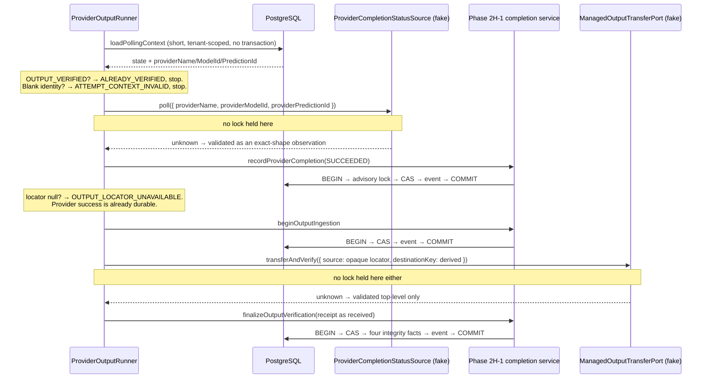

# Phase 4C-3B-2H-2 — Completion report

Dormant provider polling and managed output transfer orchestration. Base:
`ddd0df9eaa7b4903c2fb6bb2891cb866612d390d`.

Phase 4C-3B-2H-1 defined every state an accepted attempt can reach after the
provider takes it, and made each transition safe, tenant-scoped and replayable.
Nothing called it. The evidence arrived as an argument, and the layer that would
produce that evidence did not exist.

This phase writes the layer that decides *which call to make* — **without making
a single network request.**

**No provider is contacted, no bytes are downloaded and no object storage is
written.** There is no HTTP client in the dependency graph, no provider adapter,
no storage SDK, no credential, no scheduler and no production caller. Both entry
points are dormant: a static test walks every application, worker, database and
adapter source and asserts that nothing names them.

## Why build the decisions before the transport

The sequencing decisions here are the expensive ones to get wrong, and every one
of them is decidable without a network.

**Asking the wrong provider.** An attempt was admitted against a specific vendor
and model, and holds a prediction id only that vendor issued. Defaults change:
providers get switched, models retired, routing policies rewritten. A poller that
reads *today's* configuration asks the wrong vendor about an identifier it never
issued — a lookup that fails, or on a bad day one that succeeds against something
unrelated.

**Losing a paid render to a stale link.** A provider's output sits behind a signed
URL that expires. Waiting to record "the provider succeeded" until that URL is in
hand lets a transient acquisition problem suppress a money-relevant fact
indefinitely: the attempt stays `PROCESSING`, the Safety Guard counts it in-flight
forever, and an unfinished render looks identical to an unreachable one.

**Blaming the vendor for the platform's storage.** A copy that fails is not a
render that failed. Recording it as a provider failure puts an internal fault in
the vendor's reliability record and, because failure is terminal, discards a
render already paid for.

**Holding a lock across a vendor's response time.** The natural implementation
opens a transaction, reads the attempt, polls, and writes — putting a network
timeout inside a database lock, which stalls a tenant's whole pipeline behind the
slowest thing on the internet.

## The lifecycle this phase drives

```text
                     ┌── IN_PROGRESS ──────────────────────► STILL_PROCESSING (no write)
                     │
 PROCESSING ─ poll ──┼── FAILED ──► recordProviderCompletion ─► PROVIDER_COMPLETION_APPLIED
 + ACCEPTED          │
                     └── SUCCEEDED ─► recordProviderCompletion ─► COMMIT
                                        │
                                        ├── locator null ──────► OUTPUT_LOCATOR_UNAVAILABLE
                                        │                        (row is PROVIDER_SUCCEEDED)
                                        └── locator present ───► beginOutputIngestion ─► COMMIT
                                                                   │
                                                     APPLIED ──────┤────── ALREADY_INGESTING
                                                                   │              │
                                                                transfer     INGESTION_ALREADY_CLAIMED
                                                                   │
                                              VERIFIED ────────────┴──► finalizeOutputVerification
                                              RETRYABLE_FAILURE ──────► stays OUTPUT_INGESTING
                                              throw / malformed ──────► stays OUTPUT_INGESTING

 OUTPUT_INGESTING ─ poll ─ SUCCEEDED + locator ──► transfer directly (no re-claim)
 + ACCEPTED                                        ← the crash-recovery path

 OUTPUT_VERIFIED ────────────────────────────────► ALREADY_VERIFIED, zero I/O
```

Nothing here is a state machine of its own. Every durable transition is Phase
2H-1's, called through its service, which re-reads under lock and re-decides.
This module chooses which operation to call and in what order; it never writes a
row and cannot overrule a refusal.

## Sequence: one attempt, one pass



## What was built

### Domain — `packages/domain/src/provider-output/`

| File | Responsibility |
| --- | --- |
| `locator.ts` | `TransientProviderOutputLocator` — opaque, unreadable, redacted on every stringification path |
| `observation.ts` | The three-arm poll contract and its exact-own-key `unknown` validator |
| `transfer.ts` | The transfer port, its two-arm outcome, and the top-level validator |
| `ports.ts` | Polling context reader, lookup ref, status source, deps, and the closed result union |
| `runner.ts` | The one-attempt runner and the one-pass batch runner |
| `index.ts` | The module's public surface |

### Persistence — `packages/database/src/provider-output-repository.ts`

One short, tenant-scoped read outside any transaction, plus delegated discovery.
`findCompletionCandidates` is Phase 2H-1's, reused rather than reimplemented — a
second query would be a second place for the certainty filter and the 1..100
limit rule to drift apart.

### Modified

| File | Change |
| --- | --- |
| `domain/src/index.ts`, `database/src/index.ts` | Export the new module |
| `domain/src/completion/service.ts` | **Comment only**, authorized by the 2H-1 merge review (below) |

The one non-additive change is prose. Phase 2H-1's service comment said "no
reservation is read", which overstated its scope: the *service* reads none, but
the persistence layer reads a single column, `billingCycleKey`, solely to compute
the Phase 2F-1 advisory-lock key — taking no lock on the reservation row, writing
nothing to it, and never consulting its state or its units. The comment now says
that precisely. Behaviour is unchanged.

## Migration status

**None, and none was needed.** The §4 schema assumption was verified against the
frozen baseline before any implementation: `providerName` and `providerModelId`
are `NOT NULL` on `SceneGeneration`, and `providerPredictionId` is guaranteed
non-null whenever `submissionCertainty = 'ACCEPTED'` by an existing CHECK. All
three provider lookup facts are therefore reconstructable from persistence
already.

Nothing was added — no poll timestamp, no attempt counter, no temporary URL
column, no transfer counter, no lease, no worker owner, no provider status
payload. Both Prisma diffs report `No difference detected`.

## The contracts

### Polling context

```ts
interface ProviderPollingContext {
  organizationId; attemptId;
  orchestrationState: "PROCESSING" | "PROVIDER_SUCCEEDED" | "OUTPUT_INGESTING" | "OUTPUT_VERIFIED";
  submissionCertainty: "ACCEPTED";
  providerName; providerModelId; providerPredictionId;
}
```

Advisory, never authority. It says what was true at read time and authorizes
nothing; every write goes back through Phase 2H-1's compare-and-set. A
cross-tenant attempt id returns `null`, indistinguishable from a missing one.

### Lookup reference

```ts
interface ProviderStatusLookupRef { providerName; providerModelId; providerPredictionId; }
```

Three application-owned identifiers and nothing else. No organization, no attempt
id, no prompt, no source image, no request hash, no pricing — a vendor asked
"what became of prediction X" has no use for any of it, and every field that
travels is a field the far side can log.

### Poll observation

```text
IN_PROGRESS   exactly { kind }
SUCCEEDED     exactly { kind, outputLocator }   locator: null | opaque instance
FAILED        exactly { kind, retryable, diagnosticCode }
```

Validated as `unknown`: non-objects and arrays refused, discriminant matched by
name, `retryable` checked with `typeof`, diagnostics checked for catalog
membership, unknown own keys malformed. **A raw string URL is refused as a
locator** — accepting one would let vendor response text travel as an ordinary
value and reduce locator secrecy to a convention.

### Transfer outcome

```text
VERIFIED           exactly { kind, receipt }   receipt stays `unknown`
RETRYABLE_FAILURE  exactly { kind }
```

No `TERMINAL_FAILURE` arm: nothing here has evidence that a storage failure is
permanent, and the arm would invite an adapter to classify an outage as one —
abandoning a paid, still-retrievable render. The receipt is not inspected;
Phase 2H-1 stays the single authority on digests and byte counts.

## Verification

All commands run at the delivered head, against live PostgreSQL where applicable.

| Check | Result |
| --- | --- |
| `pnpm typecheck` | Pass — all 10 projects |
| `pnpm lint` | Pass — 0 problems |
| `pnpm test` | **3165 passed**, 105 files |
| `pnpm test:db` (live PostgreSQL) | **701 passed**, 21 files |
| `pnpm build` | Pass |
| Prisma schema → database | `No difference detected` |
| Prisma migrations → schema | `No difference detected` |
| Phase 2F-1 / 2G-1 / 2G-2 / 2H-1 regressions | Pass, unchanged |

New tests:

| Suite | Tests | Layer |
| --- | --- | --- |
| `provider-output/runner.test.ts` | 83 | unit |
| `provider-output/observation.test.ts` | 71 | unit |
| `provider-output/transfer.test.ts` | 32 | unit |
| `provider-output/locator.test.ts` | 20 | unit |
| `provider-output/dormancy.test.ts` | 15 | unit |
| **Unit total** | **221** | |
| `tests/integration/provider-output-orchestration.db.test.ts` | 39 | database |

Unit total rose to **3165** from 2944 (+221, 105 files from 100); database total
rose to **701** from 662 (+39, 21 files from 20). No pre-existing test was
modified, weakened or removed.

## The proofs that needed a real database

**No lock is held across external I/O.** While a fake blocks inside
`statusSource.poll`, an independent connection runs a real Phase 2H-1
`recordProviderCompletion` on the same attempt — taking the same
organization+cycle advisory lock — and it commits while the poll is still
outstanding. The same test exists for `transferAndVerify` with a competing
`finalizeOutputVerification`. Deterministic gates, not sleeps: the competing
write either commits or it does not.

That test is not decorative. Mutation **N29** makes the polling read leave a
*session-level* advisory lock held, and ten database tests fail — so the suite
genuinely detects a lock spanning a network call, rather than asserting a
property that happens to hold.

**Provider truth lands before acquisition.** `PROCESSING` + `SUCCEEDED` with a
null locator leaves the row at `PROVIDER_SUCCEEDED + ACCEPTED` and answers
`OUTPUT_LOCATOR_UNAVAILABLE` — not still `PROCESSING`.

**A transfer failure is not a provider failure.** `PROVIDER_SUCCEEDED` + poll
success + `RETRYABLE_FAILURE` leaves the row at `OUTPUT_INGESTING + ACCEPTED` —
not `PROVIDER_SUCCEEDED`, not `FAILED_RETRYABLE`, not `FAILED_TERMINAL` — with the
reservation untouched. A later run recovers it to `OUTPUT_VERIFIED`.

**Crash resume.** An attempt parked at `OUTPUT_INGESTING` is picked up, its
locator reacquired, transferred and finalized, with **no second
`OUTPUT_INGESTION_STARTED` event** and no provider submission.

**Concurrency.** Two runners on one `PROCESSING` attempt produce exactly one
provider-completion event, exactly one ingestion event and **exactly one
transfer** — the loser of the ingestion claim stops. Two runners on one
`OUTPUT_INGESTING` attempt both transfer (the accepted at-least-once case), one
finalization applies and the other replays, with one `OUTPUT_VERIFIED` event. When
two transfers disagree about the bytes, one wins and the other conflicts;
verified metadata is never overwritten.

**Locator secrecy against real rows.** After a full run, the attempt row, its
transition events and the organization's audit log are serialized and searched
for the actual signature string — not a placeholder. And no column in
`scene_generations` has a name containing `url`.

## Mutation ledger

**30 mutations. 30 killed. No survivors, and no test was written to manufacture
that number.**

| Group | Mutations | Killed |
| --- | --- | --- |
| Persisted provider identity is authoritative | 4 | 4 |
| A lookup failure is not a provider failure | 2 | 2 |
| Polling is observational | 2 | 2 |
| Provider truth before output acquisition | 2 | 2 |
| Ingestion ownership and resumability | 2 | 2 |
| A transfer failure is not a provider failure | 2 | 2 |
| Recorded provider reality is immutable | 2 | 2 |
| The locator is opaque | 4 | 4 |
| Closed runtime shapes | 3 | 3 |
| Discovery and the batch | 3 | 3 |
| Paid submission stays unreachable | 2 | 2 |
| No lock across external I/O | 1 | 1 |
| The shared exact-key helper | 1 | 1 |
| **Total** | **30** | **30** |

| ID | Mutation | Result | Detected by |
| --- | --- | --- | --- |
| N01 | today's provider default replaces the persisted providerName | KILLED | 2 db |
| N02 | today's model default replaces the persisted providerModelId | KILLED | 2 db |
| N03 | the prediction id stops coming from persistence | KILLED | 3 unit |
| N04 | blank persisted identity is polled anyway | KILLED | 5 unit |
| N05 | a status-source throw is recorded as a provider failure | KILLED | 5 unit |
| N06 | a malformed observation is acted on instead of refused | KILLED | 13 unit |
| N07 | an IN_PROGRESS poll writes to the attempt | KILLED | 6 unit |
| N08 | a verified attempt is polled anyway | KILLED | 2 unit |
| N09 | a success with no locator never reaches persistence | KILLED | 3 unit |
| N10 | ingestion begins before provider completion is persisted | KILLED | 5 unit |
| N11 | a runner transfers after losing the ingestion claim | KILLED | 2 unit |
| N12 | an OUTPUT_INGESTING attempt is treated as non-resumable | KILLED | 2 unit |
| N13 | a retryable transfer failure is recorded as a provider failure | KILLED | 2 unit |
| N14 | a transfer throw is recorded as a terminal provider failure | KILLED | 2 unit |
| N15 | a late FAILED poll overwrites a recorded provider success | KILLED | 2 db |
| N16 | an IN_PROGRESS poll rolls a recorded success backwards | KILLED | 3 unit |
| N17 | a raw string URL is accepted as a locator | KILLED | 8 unit |
| N18 | the locator's raw value is serialized | KILLED | 4 unit |
| N19 | the locator's raw value is exposed through toString | KILLED | 3 unit |
| N20 | the locator gains a public raw accessor | KILLED | 4 unit |
| N21 | a poll observation may carry extra provider fields | KILLED | 17 unit |
| N22 | a transfer outcome may carry extra storage fields | KILLED | 13 unit |
| N23 | a VERIFIED transfer outcome may carry a provider URL | KILLED | 13 unit |
| N24 | candidate discovery includes verified attempts | KILLED | 4 db |
| N25 | the batch limit is no longer validated | KILLED | 9 unit |
| N26 | the batch retries each candidate internally | KILLED | 4 unit |
| N27 | the paid submission port becomes nameable here | KILLED | 3 unit |
| N28 | cancellation becomes nameable here | KILLED | 3 unit |
| N29 | the polling read leaves a session advisory lock held | KILLED | 10 db |
| N30 | exact-key validation accepts a superset | KILLED | 50 unit |

Two are worth a sentence. **N29** is the one that gives the no-lock tests their
value: it holds a session-level advisory lock across the poll, and the suite
catches it — so those tests detect the defect rather than merely asserting the
property. **N27/N28** are killed by a static scan rather than a behavioural
assertion, which is the honest mechanism: paid submission and cancellation are
not *declined* here, they are unexpressible, and a scan is what proves a thing is
absent.

## Known limitations

- **Nothing calls either runner.** Both are dormant domain operations with no
  route, no worker loop and no scheduled caller — asserted by a static test over
  every application, worker, database and adapter source.
- **Neither port has a production implementation.** `ProviderCompletionStatusSource`
  and `ManagedOutputTransferPort` are interfaces returning `unknown`; every
  implementation in the repository is a test fake.
- **The locator cannot be dereferenced.** Deliberately: the extraction capability
  is a network capability and will be reviewed with the adapter that needs it. So
  this phase can carry a locator and prove it never leaks, but cannot fetch with
  it.
- **Transfer is at least once.** Two runners on an already-ingesting attempt may
  both copy. No paid generation is repeated; the duplicate is bandwidth.
- **`OUTPUT_VERIFIED` still reaches no customer.** Delivery, review, composition
  and download remain unimplemented and review-gated.

## Remaining work

1. **Concrete provider polling** — a `ProviderCompletionStatusSource`
   implementation (poll, webhook, or operator determination) routing on the
   persisted `providerName`, normalizing vendor responses into the three-arm
   contract, and constructing the opaque locator. The WaveSpeed `getStatus`
   mapping needs re-verification against the live contract before it becomes that
   implementation.
2. **Concrete managed-storage I/O** — a `ManagedOutputTransferPort` that
   dereferences the locator, streams to the derived key, hashes and sizes the
   bytes, and returns a receipt. It must be idempotent for identical content, to
   satisfy the at-least-once contract. This is also where the locator's
   extraction capability gets added and reviewed.
3. **Production wiring** — a caller for the batch runner, with a scheduling
   decision that is its own review.
4. **Scene delivery and job readiness** — request `DELIVERED`, scene `READY`, job
   `SCENES_READY`, behind mandatory human review.
5. **Paid activation** — provider credentials and enablement, the Safety Guard's
   live budget wiring, and exactly-once credit settlement at delivery.

## Explicitly not done

No HTTP GET or POST, no provider polling over a network, no submission, no
cancellation, no webhook handling, no output download, no S3/R2/GCS upload, no
managed-storage network access, no credentials, no `FAL_KEY` wiring, no fal or
Veo polling, no WaveSpeed paid orchestration polling, no AWS/Cloudflare/GCS
credentials, no scheduler, daemon, cron or interval, no payment integration, no
migration, no schema change, no poll-history table, no transfer-attempt table, no
transfer lease, no reservation mutation, no quota or regeneration-right
consumption, no `SYSTEM_RECOVERY` attempt, no Scene/Request/Job delivery
transition, and no paid provider activation.

### One deviation from the brief, stated plainly

§30 lists `OUTPUT_INGESTION_STARTED` among the one-attempt result kinds. It is
**not** in the delivered union. A run that starts ingestion always goes on to
attempt the transfer in the same run — §17 and §18 require exactly that ordering
— so every such run ends on an outcome describing what the transfer achieved:
`OUTPUT_VERIFIED`, `TRANSFER_RETRYABLE_FAILURE`, `TRANSFER_SOURCE_FAILED`,
`TRANSFER_OUTCOME_MALFORMED` or `OUTPUT_VERIFICATION_REPLAYED`. There is no path
that could return `OUTPUT_INGESTION_STARTED`, and shipping an arm nothing returns
would read as a reachable outcome and invite callers to handle a case that never
arrives. The fact it was meant to convey — that ingestion began — is observable
in the row and in the `OUTPUT_INGESTION_STARTED` transition event, both asserted
by the database suite. If the CTO wants the arm restored as a distinct outcome,
that implies deferring the transfer to a later run, which would contradict §17.
