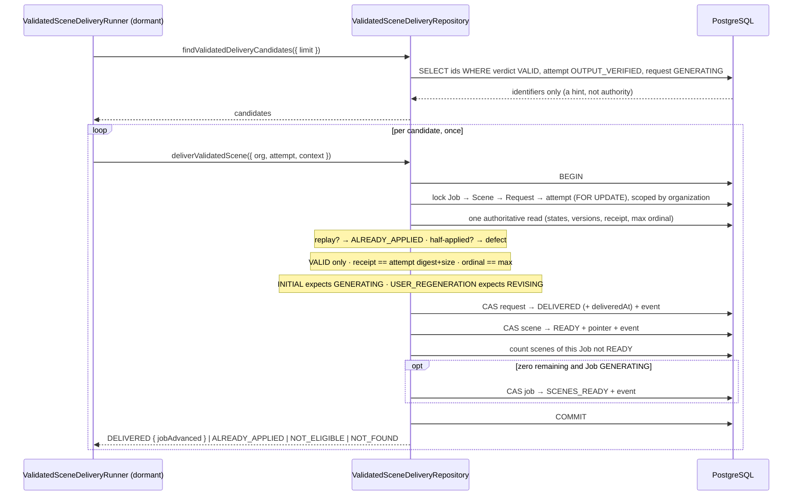

# Phase 4C-3B-2H-3B-6A — Atomic validated Scene delivery (Transaction F)

Decision record: `docs/decisions/0046-atomic-validated-scene-delivery.md`.

This phase gives a durable `VALID` media verdict its one consequence — the
customer-visible delivery of a Scene — and gives it as a single atomic business
fact. It gives it **only** that consequence.

Production delivery is **not** active. Nothing constructs the runner, schedules
it, or calls it.

## What this phase adds

- **Transaction F**, one repository operation
  (`createValidatedSceneDeliveryRepository(...).deliverValidatedScene`) that
  performs the whole delivery in one short database transaction.
- **A bounded candidate sweep** over durable `VALID` verdicts, returning
  identifiers only.
- **`ValidatedSceneDeliveryRunner`** (`@app/domain`) — a dormant runner over
  ports, with no scheduler.
- **A closed outcome vocabulary** — `DELIVERED`, `ALREADY_APPLIED`,
  `NOT_ELIGIBLE`, `NOT_FOUND` — and four fixed defect codes.

## The business fact

```text
SceneGenerationRequest   GENERATING -> DELIVERED   (+ deliveredAt)
GenerationScene          GENERATING|REVISING -> READY
GenerationScene.currentDeliveredRequestId = the delivered request
GenerationJob            GENERATING -> SCENES_READY, iff every Scene is READY
```

All of it, or none of it. The boundary offers no `markRequestDelivered`,
`markSceneReady` or `maybeMarkJobReady`: three calls are three crash boundaries,
and the states they would leave behind are exactly what this transaction exists
to make impossible.

### Sequence



## Lock order

```text
GenerationJob → GenerationScene → SceneGenerationRequest → attempt → validation
```

Fixed for every caller, so two concurrent deliveries cannot deadlock by
approaching the same rows from opposite ends. The **Job** lock is taken first
and held for the whole transaction, and that is what makes the readiness
decision correct: two Scenes of one Job finishing at the same instant serialize
on the Job row, so exactly one transaction can observe itself as the last Scene.

A live-PostgreSQL regression proves it. A third session takes `FOR UPDATE` on
the Job row and holds its transaction open; only once both workers are provably
blocked on that row is the holder released. The synchronisation is the lock, not
a timer — polling only *observes* that both backends are waiting, and the test
waits for the holder to own the row before either worker starts. With the Job
dropped from the lock clause the regression fails.

## Eligibility, and what is authority

The candidate sweep is a hint. It returns identifiers and nothing else, so it
cannot be mistaken for permission, and every condition is re-read and re-checked
inside the transaction under its own locks.

| Condition | Effect |
| --- | --- |
| Verdict is `VALID` with a verdict instant | required; anything else is `NOT_ELIGIBLE` |
| Attempt is `OUTPUT_VERIFIED` | required |
| Request is `GENERATING` | required, and in the compare-and-set `WHERE` |
| Verdict receipt == attempt digest and size | required; a mismatch is `RECEIPT_BINDING_CONFLICT` |
| Attempt ordinal == max ordinal on the request | required; otherwise `NOT_ELIGIBLE` |
| Scene state matches the request kind | `INITIAL` → `GENERATING`, `USER_REGENERATION` → `REVISING`; otherwise `SCENE_STATE_CONFLICT` |
| Existing pointer names a `DELIVERED` request of this Scene | otherwise `PARTIAL_DELIVERY_STATE` |

The `VALID` gate is a positive test, not a list of statuses to exclude: a
denylist silently admits whatever status is added next.

Latest-attempt authority is `MAX("attemptOrdinal")`, never `createdAt`. Two
attempts admitted in the same millisecond have no order under a timestamp, and
the ordinal is the durable unique fact the schema already enforces. A regression
gives the superseded attempt a *later* `createdAt` than the current one, so a
timestamp comparison delivers the wrong row.

## Idempotency and half-applied states

A replay of the exact same delivery is `ALREADY_APPLIED`. Nothing is written
again: no version moves, no `deliveredAt` is rewritten, no event is appended.
Only the complete shape counts as applied — request `DELIVERED`, Scene `READY`,
pointer naming this request.

Anything in between raises `PARTIAL_DELIVERY_STATE` and is never repaired,
because silently completing a half-applied delivery destroys the evidence of
whatever produced it. Three shapes are covered by regressions: a delivered
request with no pointer, a delivered request whose Scene never became ready, and
a `READY` Scene pointing at a request still generating.

Returning is committing inside an interactive transaction, so the two
compare-and-set guards that run *after* the first write raise a defect rather
than returning an outcome. Rolling back is the only safe answer once two
aggregates have already moved.

## Regeneration

`USER_REGENERATION` delivery moves the Scene `REVISING -> READY` and switches
the pointer. The superseded request row is left exactly as it is — `DELIVERED`,
with its own delivery instant and its own version — because it is history.

The regeneration right stays **derived**: the number used is the number of
`DELIVERED` `USER_REGENERATION` requests on the Scene. No counter was added and
no second source of truth exists.

`READY -> REVISING` is not this transaction's edge. A regeneration whose Scene
never entered `REVISING` is a `SCENE_STATE_CONFLICT`, not something to move into
place.

A pointer to another Scene's request is unstorable — the composite foreign key
`(currentDeliveredRequestId, id) -> (id, generationSceneId)` rejects it, and a
regression proves the database does the rejecting.

## Job readiness

Counted as "no Scene of this Job is in a state other than `READY`", after this
Scene became ready, under the Job lock. A `PENDING`, `REVISING`, failed or
cancelled Scene is not a ready Scene, and a regression covers that. Readiness is
scoped to the delivered Scene's Job; a second regression proves another Job is
never advanced.

The Job moves `GENERATING -> SCENES_READY` and never beyond.
`COMPOSITION_PENDING`, composition, the deliverable and quota `CONSUME` all
belong to later transactions, and a static test asserts the module names none of
them.

## Schema

**No schema change and no migration.** `deliveredAt`,
`currentDeliveredRequestId`, its composite foreign key and `stateVersion` on all
three aggregates already existed. No column, no second delivery status, no
duplicated media fact and no second pointer table was added, and migration 12
remains the newest. The entity-relationship diagram is unchanged for the same
reason: `docs/er-diagram.md` already carries every row this phase reads and
writes.

## State and money freeze

Untouched by this phase, and asserted rather than described:

- Reservations, quota, settlement and payment. A regression seeds a reservation
  and compares the whole row before and after a delivery.
- Attempts. No attempt row is created, updated or deleted; a regression compares
  every attempt and every validation row before and after.
- Media verdicts. `INVALID_MEDIA` and `INTEGRITY_MISMATCH` remain durable
  terminal verdicts with no downstream action.
- `SYSTEM_RECOVERY` admission, provider submission and provider retry policy.
- Composition, deliverable validation, `DELIVERABLE_READY` and upscale.

## Dormancy

Nothing in production constructs `ValidatedSceneDeliveryRunner`, constructs the
repository, calls `runOnce`, or calls either boundary method. The module
contains no scheduler, interval, cron, subprocess, network call, object-store
client or environment read, and introduces no credential into the environment
schema. Static tests assert each of those.

## Required phase documentation

| Item | Where | Note |
| --- | --- | --- |
| Architecture diagram | `docs/architecture.md` | One row added for the delivery transaction; the runtime diagram is unchanged because no process, boundary or dependency direction moved |
| Entity-relationship diagram | `docs/er-diagram.md` | **Not applicable — unchanged.** No schema change; every row this phase reads and writes is already in the diagram |
| Critical sequence diagram | this document, "Sequence" | Candidate sweep → locks → authority re-reads → the four writes → outcome |
| OpenAPI / API change summary | — | **Not applicable.** No HTTP route, request, response or error envelope changed; this phase adds no API surface at all |
| Change log | `CHANGELOG.md` | Phase 4C-3B-2H-3B-6A entry |
| Release notes | — | **Not applicable.** Nothing is user-visible: the capability is dormant, no endpoint changed, and no customer behaviour changes until a later reviewed phase turns delivery on |
| Database migration notes | `docs/migration-notes.md` | Records that no migration was added and which pre-existing columns and constraints Transaction F relies on |
| Phase completion report | this document | — |
| Decision record | `docs/decisions/0046-atomic-validated-scene-delivery.md` | ADR-0046 |
| Running progress log | `docs/progress.md` | Phase 4C-3B-2H-3B-6A entry |

## Verification

| Check | Result |
| --- | --- |
| `pnpm typecheck` | pass |
| `pnpm lint` | pass |
| `pnpm test` | **4236 passed**, 128 files (4209/126 before this phase, plus 27 in 2 new files) |
| `pnpm test:db` (live PostgreSQL) | **846 passed**, 25 files (806/24 before this phase, plus 40 in 1 new file) |
| `pnpm build` | pass |
| `prisma validate` / `prisma format` | pass, no diff |
| Migrations on an empty database | pass |
| Migration drift (`migrate diff --exit-code`) | no drift |

## Mutation ledger

M01–M79 carry forward. M80–M127 were added for this phase. The **complete**
ledger was run against the final tree — not a composite of one pass plus a
spot check — and reported **128 run, 128 killed, 0 survivors, 0
anchor-missing**. No mutation was re-aimed. Restoration was then proved by
SHA-256: every file in the change set matched its pre-ledger hash, and no
other tracked file was left modified.

| # | Defect | Killed by |
| --- | --- | --- |
| **M80** | The sweep offers any verdict, not only `VALID` | verdict-gate listing assertions |
| **M81** | The sweep ignores the verdict instant | dropped-constraint `validatedAt` regression |
| **M82** | The sweep offers attempts never `OUTPUT_VERIFIED` | attempt-state listing assertion |
| **M83** | The sweep offers requests that already moved on | request-state listing assertion |
| **M84** | The sweep returns the newest verdict first | sweep ordering test |
| **M85** | The sweep ignores the caller's bound | sweep bound test |
| **M86** | The sweep accepts an unusable bound | limit-refusal tests |
| **M87** | Delivery is not scoped to the organization | tenancy tests |
| **M88** | The Job row is not locked | concurrent last-Scene regression |
| **M89** | Nothing is locked at all | concurrent last-Scene regression |
| **M90** | The whole delivery runs outside a transaction | concurrent last-Scene regression |
| **M91** | A replay is reported as ineligible | idempotency tests |
| **M92** | A half-applied delivery is reported as ineligible | partial-state tests |
| **M93** | A delivered request with no pointer is not partial | partial-state tests |
| **M94** | A pointer written without a delivery is not partial | `READY`-Scene partial regression |
| **M95** | A delivered request whose Scene never became ready counts as applied | partial-state tests |
| **M96** | Any durable verdict delivers | verdict-gate tests |
| **M97** | A `VALID` row with no verdict instant delivers | dropped-constraint regression |
| **M98** | A never-`OUTPUT_VERIFIED` attempt delivers | attempt-state test |
| **M99** | A request that moved on is delivered anyway | request-state test |
| **M100** | The verdict is not checked against the verified digest | receipt-binding tests |
| **M101** | The verdict is not checked against the verified size | receipt-binding tests |
| **M102** | A receipt mismatch is an outcome, not a defect | receipt-binding tests |
| **M103** | A superseded attempt's verdict still delivers | latest-attempt tests |
| **M104** | Latest-attempt authority becomes creation time | ordinal-not-timestamp regression |
| **M105** | The expected Scene state ignores the request kind | regeneration tests |
| **M106** | The expected Scene state is inverted | regeneration tests |
| **M107** | A wrong Scene state is an outcome, not a defect | scene-state tests |
| **M108** | The previous delivered pointer is never inspected | pointer tests |
| **M109** | A pointer naming an undelivered request is accepted | pointer tests |
| **M110** | The request is delivered without recording when | delivered-fact test |
| **M111** | The Scene becomes ready without switching the pointer | delivered-fact test |
| **M112** | Job readiness counts only generating Scenes | outstanding-Scene regression |
| **M113** | Job readiness is counted across every Job | two-Job regression |
| **M114** | A Job that is not `GENERATING` is advanced | non-`GENERATING` Job test |
| **M115** | Every delivery claims it advanced the Job | multi-Scene test |
| **M116** | The request delivery is not recorded in history | event tests |
| **M117** | The Scene transition is not recorded in history | event tests |
| **M118** | The Job advance is not recorded in history | event tests |
| **M119** | History records the caller's reason code | event tests |
| **M120** | The Scene transition uses the request's event type | event tests |
| **M121** | History is written against an unproven organization | event tests |
| **M122** | The runner acts on a duplicated candidate twice | runner de-duplication test |
| **M123** | The runner clamps an unusable bound | runner bound test |
| **M124** | The runner counts an advance for every delivery | runner advance test |
| **M125** | The batch bound is clamped instead of refused | bound-validation tests |
| **M126** | A defect message carries an identifier | defect-message test |
| **M127** | The runner is wired into a production composition root | dormancy tests |

### Clauses deliberately absent from the ledger

Three guards are redundant defence that no test can kill, and they are listed
rather than quietly left in:

- `stateVersion` in each compare-and-set `WHERE`. The rows are already locked
  `FOR UPDATE` and re-read inside the transaction, so the optimistic guard can
  never miss. It is kept because it costs nothing and is the invariant the rest
  of the codebase states the same way.
- The `previous === null` branch of the pointer check. The composite foreign key
  makes a pointer to another Scene's request unstorable, so the lookup always
  finds a row. A regression proves the *database* rejects it.
- The two post-write compare-and-set guards. They are unreachable under the
  locks; they raise rather than return so that an impossible state rolls back
  instead of committing half a delivery.

## Not done, on purpose

- No `SYSTEM_RECOVERY` creation on `INVALID_MEDIA` or `INTEGRITY_MISMATCH`, and
  no recovery admission of any kind.
- No provider retry policy, no provider submission, no paid provider execution.
- No production scheduler, cron or worker; no production wiring of any kind.
- No `SCENES_READY -> COMPOSITION_PENDING`, no composition, no deliverable
  validation, no `DELIVERABLE_READY`.
- No quota `CONSUME`, no quota `RELEASE` from a media verdict, no reservation
  settlement, no payment, no upscale.
- No schema change and no migration.
