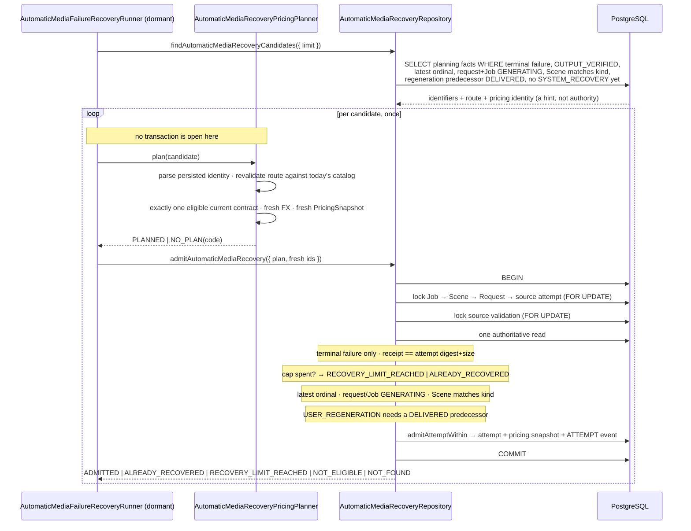

# Phase 4C-3B-2H-3B-6B — Bounded automatic media-failure `SYSTEM_RECOVERY` admission

Decision record: `docs/decisions/0047-bounded-media-failure-system-recovery.md`.

Phase 6A consumed a `VALID` media verdict and delivered a Scene. This phase owns
the opposite path: a durable terminal media failure — `INVALID_MEDIA` or
`INTEGRITY_MISMATCH` — may cause the platform to admit **one** bounded,
automatic `SYSTEM_RECOVERY` provider attempt under the **same**
`SceneGenerationRequest`.

Production recovery is **not** active. Nothing constructs the runner, schedules
it, or calls it, and no provider is called.

## What this phase adds

- **`AutomaticMediaRecoveryPricingPlanner`** — same-route revalidation and a
  fresh pricing decision, run entirely outside any database transaction.
- **`admitAutomaticMediaRecovery`** — one short transaction that re-checks every
  authority under its own locks and delegates attempt creation to the shared
  admission helper.
- **`AutomaticMediaFailureRecoveryRunner`** — a dormant runner, no scheduler.
- **`parseProviderPricingIdentity`** — the canonical reader for the untrusted
  `identityJson` column.
- **`admitAttemptWithin`** — generic attempt admission's within-transaction half,
  extracted rather than duplicated.

## The business fact

```text
source attempt        OUTPUT_VERIFIED + terminal media verdict
                      ↓
new attempt           SYSTEM_RECOVERY, ordinal = previous max + 1
                      QUEUED / PRE_SUBMISSION, same request
new pricing snapshot  fresh decision at the planning instant, fresh FX
one ATTEMPT event     reason code names which failure caused it
```

Nothing else moves. The request stays `GENERATING` with no `deliveredAt`, the
Scene keeps its state and its delivered pointer, the Job stays `GENERATING`, and
the reservation is untouched.

### Sequence



## The cap

`MAX_AUTOMATIC_MEDIA_RECOVERY_ATTEMPTS_PER_REQUEST = 1`, counted conservatively
over **every** existing `SYSTEM_RECOVERY` attempt under the request. Nothing
durably records which actor admitted a recovery; guessing permissively is what
produces a spending loop, and guessing restrictively costs one refused automatic
retry an operator can still handle deliberately.

**It is not a global `SYSTEM_RECOVERY` cap.**
`tests/integration/generic-system-recovery-not-capped.db.test.ts` drives one
request through `PRIMARY` ordinal 1, `SYSTEM_RECOVERY` ordinal 2 and
`SYSTEM_RECOVERY` ordinal 3 via the generic API, asserts a live sibling still
blocks admission in between, and asserts the automatic policy refuses at one in
the same test. It exists to fail if anyone ever moves this cap into
Transaction C.

## Eligibility

| Condition | Effect | Also filtered in the sweep |
| --- | --- | --- |
| Verdict is `INVALID_MEDIA` or `INTEGRITY_MISMATCH`, with a verdict instant | required | yes |
| Source attempt is `OUTPUT_VERIFIED` and V2-complete | required | yes |
| Source attempt is the latest by `attemptOrdinal` | required | yes |
| Request is `GENERATING` | required | yes |
| Job is `GENERATING` | required | yes |
| Scene matches the request kind (`INITIAL`→`GENERATING`, `USER_REGENERATION`→`REVISING`) | required | yes |
| `USER_REGENERATION` has a `DELIVERED` predecessor on the same Scene | required | yes |
| No `SYSTEM_RECOVERY` attempt exists yet | required | yes |
| Verdict receipt == source digest and size | required; a mismatch is `SOURCE_RECEIPT_BINDING_CONFLICT` | no |

Every condition that can never become true again is mirrored in discovery, so a
permanently ineligible row cannot occupy the oldest-first bounded sweep. A
request whose one recovery is already spent is the most important of these.

### A structural note on "superseded"

In this module, *"the source is superseded"* and *"the cap is spent"* are the
same condition: every newer attempt on a request is necessarily a
`SYSTEM_RECOVERY`, because one `PRIMARY` per request is a unique index. So a
source that is no longer latest always has a recovery sibling, and the correct
answer is idempotent recognition (`ALREADY_RECOVERED`) rather than an
eligibility failure. The standalone latest-attempt guard after the cap branch is
therefore redundant defence — see the ledger notes.

## Same route, exactly

Copied from the source attempt and never re-derived: `providerName`,
`providerModelId`, `requestModelKey`, `requestRenderedPrompt`,
`requestNativeGenerationResolution`, `requestResolutionNormalization`,
`requestNativeMeetsTarget`.

Today's model catalog must still deliver that exact route — the entry must
exist, be `SELECTABLE`, carry the same provider and provider model id, support
the Job's target, and `planGenerationResolution` must return the same three
values. Otherwise `NO_SAFE_CURRENT_ROUTE`.

The request hash is re-derived through `computeGenerationRequestHash` and
asserted equal to the source's, rather than copied.

## Historical identity, current money

Nothing from the old pricing row is copied. The persisted identity is parsed
canonically, checked against the attempt's own route, and used only to find the
route. A currently eligible contract is then resolved by the five commercial
dimensions — `pricingVersion` and `durationBillingRuleId` may legitimately have
moved on — and exactly one must match: zero is `NO_SAFE_CURRENT_PRICING`, more
than one is `AMBIGUOUS_CURRENT_PRICING`.

A valid fresh `FxSnapshot` is required, because the paid authorization path
refuses a snapshot with no FX; planning a recovery that could never be armed
would queue work nothing can execute.

## Locks

```text
GenerationJob → GenerationScene → SceneGenerationRequest → source attempt → validation
```

The same high-level order Transaction F uses, so the two cannot form a deadlock
cycle. The request lock is what `admitAttemptWithin` assumes and what makes the
sibling count and the cap safe. The validation lock is taken last and returns
nothing deliberately — whether a row exists stays the authoritative read's
question.

A deterministic live-PostgreSQL regression holds a third session on the request
row until both workers are provably blocked, then releases it: exactly one
`ADMITTED`, one `ALREADY_RECOVERED`, one new attempt, one pricing snapshot, one
ordinal step, one event.

## Planning is outside the transaction

The runner plans to completion before admission opens a transaction. A unit test
asserts the interleaving (`plan-start`, `plan-end`, `admit` per candidate); a DB
test issues an independent query from inside the planner to show no transaction
is open. No boundary method accepts a callback.

## Failures never carry external text

A thrown planner becomes one fixed `INTERNAL_ERROR` with no cause, no details
and no original message. The runner also *parses* the planner's return — unknown
kind, missing or null snapshot, missing rate, raw refusal code — and normalizes
each to the same error, so nothing surfaces later as a `TypeError` quoting
whatever the planner held. Tests drive a sentinel through both paths and assert
its absence from `message`, `cause`, `details`, every own property and the
serialized error.

## Schema

**No schema change and no migration.** The existence of the newer
`SYSTEM_RECOVERY` attempt is the durable idempotency marker; no
`recoveryHandledAt`, no `recoverySourceValidationId`, no `mediaRecoveryStatus`,
no counter column. Migration 12 remains the newest, pinned by a static test.

## Public surface

`packages/database/src/index.ts` now lists its orchestration exports explicitly
instead of `export *`, so `admitAttemptWithin` — which assumes a lock it does not
take — is unreachable from `@app/database`. Every previously public export is
preserved, including `armProviderBoundaryWithin`, whose precedent is untouched.
`tests/database-public-surface.test.ts` asserts the absence, the surviving
exports, the removal of the wildcard, and the bounded set of production callers.

## Freeze

Asserted rather than described:

- No new `SceneGenerationRequest`; `usedUserRegenerationCount` identical before
  and after.
- Scene state, delivered pointer, Job state and the reservation row compared
  whole before and after.
- The source attempt and its validation compared whole — both are historical
  evidence.
- Zero `RESERVATION` and zero `DELIVERABLE` events.
- No provider call, no paid-submission authorization, no HTTP, no credential.

## Verification

| Check | Result |
| --- | --- |
| `pnpm typecheck` | pass |
| `pnpm lint` | pass |
| `pnpm test` | **4313 passed**, 132 files (4239/128 before this phase, plus 74 in 4 new files) |
| `pnpm test:db` (live PostgreSQL) | **888 passed**, 27 files (852/25 before this phase, plus 36 in 2 new files) |
| `pnpm build` | pass |
| `prisma validate` / `format` | pass, no schema diff |
| Migrations on a fresh empty database | pass |
| Migration drift | `No difference detected` |

## Mutation ledger

M01–M131 carry forward. **M132–M164** were added for this phase. The complete
ledger was run against the final tree and reported **165 run, 165 killed, 0
survivors, 0 anchor-missing**. Restoration was then proved by SHA-256 against a
pre-run snapshot, with `git status` showing only the change set and
`git diff --check` clean.

| # | Defect | Killed by |
| --- | --- | --- |
| **M132** | Discovery offers any media verdict, not only the two terminal failures | verdict-gate listing assertions |
| **M133** | The transactional terminal-failure gate is removed, so `VALID` recovers | direct-admission verdict tests |
| **M134** | Latest-attempt authority no longer separates a spent cap from a replay | `RECOVERY_LIMIT_REACHED` regression |
| **M135** | The automatic recovery cap is removed | spent-cap and replay regressions |
| **M136** | Discovery stops excluding requests whose recovery is spent | starvation regression |
| **M137** | The source receipt binding is not checked | receipt-binding regression |
| **M138** | A request that is no longer `GENERATING` still admits an attempt | request-state regressions |
| **M139** | A Job that is no longer `GENERATING` still recovers | Job-state regression |
| **M140** | The Scene state need not match the request kind | Scene-state regressions |
| **M141** | A regeneration with no delivered predecessor still recovers | predecessor regressions |
| **M142–M147** | Provider, provider model id, model key, native resolution, normalization or `nativeMeetsTarget` not preserved | same-route proof |
| **M148** | The customer's exact rendered prompt is not retried | rendered-prompt proof |
| **M149** | The declared validation-row lock is never taken | static lock-order proof |
| **M150–M152** | Discovery stops filtering Jobs, requests, or Scene state and predecessor | the corresponding listing assertions |
| **M153** | The model catalog is no longer asked whether the route is still safe | route revalidation tests |
| **M154** | Current pricing eligibility is ignored | expired / not-yet-effective / unverified tests |
| **M155** | An ambiguous route silently takes the first contract | ambiguity refusal test |
| **M156** | The fresh FX requirement is dropped | FX proof |
| **M157** | The retry is priced at the contract's start, not the planning instant | fresh-pricing proof |
| **M158** | A fixed risk profile replaces the Job's tier | Job-tier proof |
| **M159** | A fixed duration replaces the Scene's | Scene-duration proof |
| **M160** | The persisted identity is not checked against the attempt's route | identity/route agreement test |
| **M161** | A thrown planner error is re-attached as the fixed error's cause | sentinel sanitization tests |
| **M162** | A malformed planner result is trusted instead of parsed | malformed-plan sanitization tests |
| **M163** | The runner acts on a duplicated candidate twice | runner de-duplication test |
| **M164** | The within-transaction admission helper becomes public again | public-surface regression |

### Three re-aims, stated explicitly

Each came from a structural finding rather than a missing test, and the semantic
defect is unchanged in all three.

- **M132.** The terminal-failure gate is duplicated — the SQL predicate *and*
  the `isMediaFailureKind` narrowing that maps a row to a candidate — so
  removing either alone is invisible. The mutation now removes both, which is
  what "discovery offers any media verdict" actually requires.
- **M134.** In this module *"the source is superseded"* and *"the cap is spent"*
  are the same condition, because one `PRIMARY` per request is a unique index
  and every newer attempt is therefore a `SYSTEM_RECOVERY`. The cap branch
  reaches that state first, so the standalone latest-attempt guard is
  unreachable. The mutation was re-aimed at the ordinal comparison that *is*
  reachable: the one separating `RECOVERY_LIMIT_REACHED` from
  `ALREADY_RECOVERED`.
- **M138.** Recovery's own request-state guard is redundant with Transaction C's
  `REQUEST_NOT_ADMITTING` rule, which produces the identical outcome. The
  mutation was re-aimed at that rule, where the authority actually lives.

### Clauses deliberately absent from the ledger

Two guards are redundant defence that no mutation can kill. They are listed
rather than quietly left in, and both are kept because each would matter if a
neighbouring rule changed:

- the standalone latest-attempt guard after the cap branch — unreachable while
  attempt-kind derivation makes every later attempt a `SYSTEM_RECOVERY`;
- recovery's request-state check — subsumed by Transaction C's own admission
  rule.

## Not done, on purpose

- No terminalization when the cap is spent. `RECOVERY_LIMIT_REACHED` is an
  operational outcome: the request is not failed, the Scene is not failed, the
  Job is not failed, the reservation is not released. **Phase 6C owns that and
  is mandatory before production activation.**
- No fallback provider, no provider ranking, no prompt re-rendering.
- No production scheduler, cron or worker; no runner construction anywhere.
- No FX network integration and no rate provider wiring.
- No provider call, no paid authorization, no quota movement.
- No schema change and no migration.
