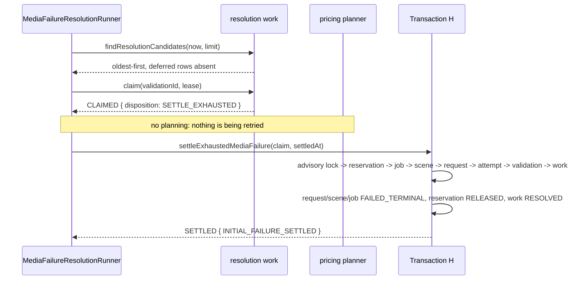

# Phase 4C-3B-2H-3B-6C — Durable media-failure resolution and customer-safe settlement

Decision record: `docs/decisions/0048-durable-media-failure-resolution-and-settlement.md`.

Phase 6B admitted one automatic recovery for a terminal media failure and
stopped. This phase closes what stopping there left open: a planning refusal
that was treated as an answer, and an exhausted recovery that settled nothing.

Production resolution is **not** active. Nothing constructs the coordinator,
schedules it, or calls it, and no provider is called.

## What this phase adds

- **`ManagedOutputMediaFailureResolution`** (migration 13) — durable work per
  terminal media verdict, with a lease, a retry instant and a closed refusal
  vocabulary.
- **`MediaFailureResolutionRunner`** — the single dormant coordinator.
- **Transaction H** (`settleExhaustedMediaFailure`) — every customer consequence
  of an exhausted failure in one commit.
- **Atomic revision start** — `admitUserRegeneration` now moves the Scene and the
  Job as well as creating the request.
- **`cost-admission-lock.ts`** — one advisory-lock key formula instead of four.

## The business fact

```text
terminal media verdict (INVALID_MEDIA | INTEGRITY_MISMATCH)
  └─ durable resolution work, discovered lazily
       ├─ PRIMARY, no recovery      -> plan -> admit ONE SYSTEM_RECOVERY
       ├─ PRIMARY, recovery exists  -> reconcile to that exact attempt
       ├─ the recovery's own failure-> Transaction H
       └─ nothing owed              -> OBSOLETE

planning refused            -> PENDING + nextAttemptAt, invisible until due
```

### Sequence — an exhausted INITIAL failure



## Fairness: why deferral, not a scan

A refusal is recorded on the work row with a future `nextAttemptAt`, and
discovery excludes `PENDING` work that is not yet due. An unplannable candidate
therefore stops *being* a candidate for a retry delay.

`tests/integration/media-failure-resolution.db.test.ts` proves it end to end:
three unplannable candidates with a batch limit of three fill the first pass and
all defer; the actionable candidate behind them — never even offered in pass one
— is the only thing the second pass sees; and the deferred three return once
they are due.

## Settlement

| | INITIAL | USER_REGENERATION |
| --- | --- | --- |
| Request | `GENERATING -> FAILED_TERMINAL`, `failedAt` set | same |
| Scene | `GENERATING -> FAILED_TERMINAL` | `REVISING -> READY`, pointer unchanged |
| Job | `GENERATING -> FAILED_TERMINAL` | `GENERATING -> DELIVERABLE_READY`, pointer unchanged |
| Reservation | `RESERVED`/`RECONCILIATION_HOLD -> RELEASED` | `CONSUMED`, untouched |
| Work | `RESOLVED / INITIAL_FAILURE_SETTLED` | `RESOLVED / USER_REGENERATION_ROLLED_BACK` |
| Unit | never consumed | never refunded |

`failedAt`, `releasedAt` and `resolvedAt` are the **same instant**, because this
is one business fact rather than several events that happened to be close
together.

Settlement is authorized only by the *recovery's own* failure — latest attempt,
`attemptKind = SYSTEM_RECOVERY`, `OUTPUT_VERIFIED`, terminal verdict,
receipt-bound, `systemRecoveryCount >= 1`. A `PRIMARY` failure that merely has a
recovery sibling is already answered, and terminalizing from it would fail a
customer whose retry is still in flight.

## Locks

```text
cost-admission advisory lock
  -> GenerationReservation   FOR UPDATE
  -> GenerationJob           FOR UPDATE
  -> GenerationScene         FOR UPDATE
  -> SceneGenerationRequest  FOR UPDATE
  -> SceneGeneration         FOR UPDATE
  -> ManagedOutputMediaValidation FOR UPDATE
  -> resolution work row     FOR UPDATE
```

The advisory lock is first and the reservation second, matching the paid
submission gate exactly. That ordering is the point: settlement releases a
reservation, which is the mutation the gate protects itself against.

`tests/integration/media-failure-settlement-races.db.test.ts` holds that exact
advisory lock from a third connection, waits until both an authorization and a
settlement are genuinely blocked on it (`pg_stat_activity`, not a sleep), then
releases it and asserts the invariant: no still-queued attempt crosses the
submission boundary after the hold behind it was released. A companion test
proves the gate refuses outright once the hold is gone.

## Revision start

```text
lock Job -> lock Scene
  Job DELIVERABLE_READY + deliverable version, Reservation CONSUMED
  Scene READY + a DELIVERED predecessor of its own
  no active USER_REGENERATION anywhere in the Job
  create request PENDING (ordinal derived)
  Scene READY -> REVISING
  Job DELIVERABLE_READY -> REVISING -> GENERATING
```

Four events in one commit, including **both** job moves. Externally the
committed state is `GENERATING`; the history still records how it got there.

The Job row is the one-active-regeneration mutex: admission moves the Job away
from `DELIVERABLE_READY`, so a second revision on any scene finds a Job that is
no longer revisable. This resolves the carried-forward `REVISING -> GENERATING`
actor concern from Phases 6A and 6B.

## Reserved edges

The generic transition APIs now refuse every edge an atomic primitive owns —
Job `GENERATING -> SCENES_READY`, `DELIVERABLE_READY -> REVISING`,
`REVISING -> GENERATING`, `GENERATING -> DELIVERABLE_READY`; Scene
`GENERATING -> READY`, `READY -> REVISING`, `REVISING -> READY` — alongside the
edges already reserved. `FAILED_TERMINAL` stays generic, because other failure
workflows legitimately use it.

`GENERATING -> DELIVERABLE_READY` is simultaneously **legal** in the pure state
machine and **reserved** from the repository. Those are different questions, and
they are tested separately: deleting the edge to express an access rule would
remove a real move from the domain.

## Schema

One migration, `00000000000013_phase4c3b2h3b6c_media_failure_resolution`. One
table, three enums, three CHECK constraints, two RESTRICT foreign keys. Nothing
reads, rewrites or seeds an existing row; migrations 1–12 are untouched. A
static test asserts the migration contains no `UPDATE "`, `INSERT INTO`,
`DELETE FROM` or `SELECT`.

## Freeze

Settlement creates **zero** new attempts. The failed recovery attempt, its output
receipt, its media verdict and its pricing snapshot are immutable historical
evidence, and the tests compare those rows *whole* before and after rather than
column by column. No quota moves, no composition, no deliverable event, no
provider call, no credential.

## Verification

| Check | Result |
| --- | --- |
| `pnpm typecheck` | pass, 0 errors |
| `pnpm lint` | pass, 0 problems |
| `pnpm test` | **4332 passed**, 133 files |
| `pnpm test:db` (live PostgreSQL) | **961 passed**, 31 files |
| `pnpm build` | pass |
| `prisma validate` / `format` | pass, no schema diff |
| Migrations 1–13 on a fresh empty database | pass |
| Migration drift | `No difference detected` |

## Mutation ledger

This section states what was actually run. It is deliberately not rounded up to
a clean "213 / 213", because no single complete run produced that.

### First complete run — ten survivors

The first complete ledger against the corrected production tree reported **213
run, 203 killed, 10 survivors, 0 anchor-missing**. Every one of the ten was a
real gap, and they fell into four groups:

- **Three duplicated or unreachable guards** — a finding about the code, not the
  tests. The `PRIMARY with an existing recovery` branch in `classify` was proved
  *unreachable*: a recovery always carries a higher ordinal than the PRIMARY it
  retries, so "a recovery exists" and "this PRIMARY is superseded" are the same
  condition and the superseded branch answers first. It was deleted. The
  `attemptKind` check in the settlement authority is redundant with the recovery
  count beside it, and the receipt-binding gate exists twice — once at claim
  classification, once inside the settlement check — so removing either site
  alone was invisible. Those two mutations now remove both sites.
- **One test reading prose.** The dormancy suite asserted the settlement lock
  clause with `toContain` against the raw file, and the doc comment above
  `lockSettlementChain` quotes that exact clause, so deleting the real SQL left
  the assertion passing on a comment. It now strips comments first.
- **One mis-classified kill mode.** The transition tables are plain arrays, so
  deleting an entry is well-typed; the mutation was re-aimed from `typecheck` to
  `tests`.
- **Five missing tests**, since written.

### Second complete run — one survivor

After those corrections the complete ledger was run again against the final
production tree: **213 run, 212 killed, 1 survivor, 0 anchor-missing**.

The survivor was **M210** — "revision start no longer locks the job, losing the
one-at-a-time mutex", which deletes `FOR UPDATE OF j, s` from
`lockJobAndSceneForTenant`.

**M210 was timing-dependent, not un-killable.** The same mutation was *killed* in
the first complete run and *survived* in the second, with nothing about it or
its anchor changed in between. The concurrency regression raced two revisions on
the *same* scene and accepted whatever order the connection pool produced: when
the two serialized, the second simply read the first's committed `PENDING`
regeneration and returned `REGENERATION_ALREADY_ACTIVE`, so the test passed
without either caller reaching the Job authority together.

### The M210 correction — test-only

**Production locking behaviour was not changed.** The fault was in the
regression, so the regression was rewritten:

- two **different** `READY` scenes in one `DELIVERABLE_READY` job, each with its
  own `DELIVERED` predecessor and a `CONSUMED` reservation;
- three independent Prisma clients — holder, worker A, worker B;
- the holder takes `SELECT "id" FROM "generation_jobs" WHERE "id" = $1 FOR UPDATE`
  **before** either worker starts, and is released in a `finally` path so a
  failing assertion cannot strand the row;
- `pg_stat_activity` is polled purely as an *observation* that at least two
  backends are waiting on a PostgreSQL lock — the row lock is the ordering
  authority, never the polling interval;
- both calls must **fulfil**, resolving to exactly one `ADMITTED` and one
  `JOB_NOT_REVISABLE`. A rejected promise, a uniqueness error or an
  `INTERNAL_ERROR` is a failure.

**Measured determinism:**

| Proof | Result |
| --- | --- |
| Corrected regression, unmutated implementation | **10 consecutive passes** |
| M210 targeted mutation, independent runs | **5 consecutive kills**, 0 survivors, 0 anchor-missing |

**Exact kill reason**, captured by instrumenting one mutated run: with M210 the
contention is real — `bothBlocked` observes two blocked backends — and the
failing assertion is `expect(a.ok && b.ok).toBe(true)`, because one worker's
promise **rejects**:

```text
REJECTED: AppError: A locked orchestration transition matched no row
                    while holding that row's lock
ADMITTED
```

That is precisely the designed mechanism: without the Job lock both workers pass
the `DELIVERABLE_READY` precondition on a plain read, both create their request
on their own scene, and both reach the Job `UPDATE`; one wins and the other
matches zero rows and throws instead of returning the application-owned outcome.

### No third complete ledger

By explicit CTO authorization, a third 213-mutation run was **not** performed.
The production tree, the mutation definitions and the other 212 kill proofs are
all unchanged by a test-only correction, and strengthening one regression cannot
invalidate a kill proof for a different mutation.

**Honest summary:** the complete corrected-production ledger result is
**213 run, 212 killed, 1 survivor, 0 anchor-missing**. All 213 mutation
definitions now have a kill proof on the final production implementation, with
M210 closed by the deterministic test-only correction above.

Restoration for the targeted M210 runs was proved against a **fresh** SHA-256
snapshot taken after the test correction was in place and before the mutation
was injected: **zero mismatches** across 482 files, with `git status --short`
showing only the corrected test and `git diff --check` clean.

## Not done, on purpose

Concurrent revision cycles, revision-cycle identity, a durable
deliverable-composition record, quota `CONSUME` (Transaction G), composition,
production scheduler/cron/worker, FX network integration, provider execution,
`FAL_KEY` or AWS credential wiring.

## Carried forward

- **Production activation is a separate reviewed decision.** A scheduler must be
  designed with the retry delay and batch size reviewed against real failure
  volume.
- **A real FX source** must sit behind `FxRateSource` before any recovery can be
  planned in production.
- **Transaction G** remains deferred. This phase may RELEASE a hold but never
  CONSUME one, and the delivery path its rollback returns jobs to still ends at
  `DELIVERABLE_VALIDATING -> DELIVERABLE_READY`, which Transaction G owns.
- **Concurrent revisions** stay refused until a revision-cycle model exists.
