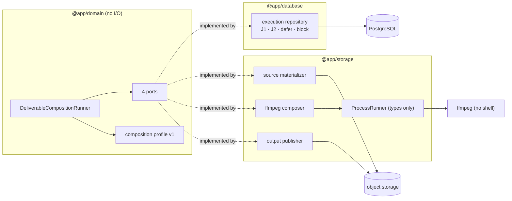
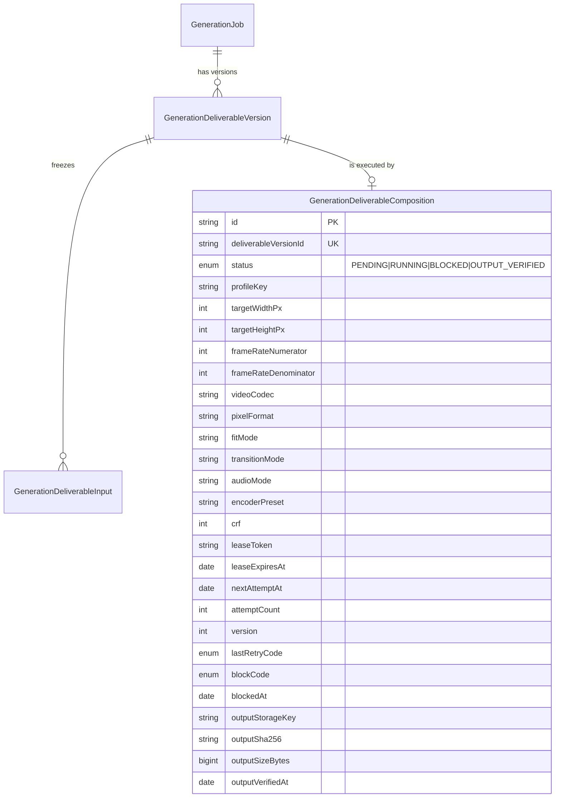
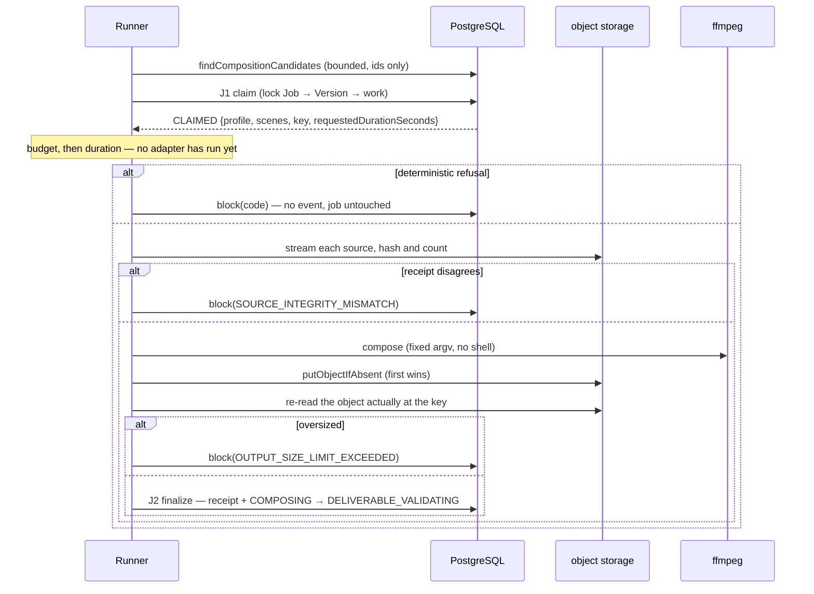

# Phase 5B completion — durable composition execution and the managed final output

Branch: `phase-5b-durable-composition-execution`
Base: `c6f5173f47ebc9bb8df31cd85acbc110d8af9b6b` (Phase 5A merge commit on `main`)
ADR: `docs/decisions/0050-durable-composition-execution-and-managed-output.md`

Commits, oldest first:

| Commit | What it carries |
| --- | --- |
| `54d432d` | composition profile v1, the durable work row, J1/J2 and the adapters |
| `e63e14b` | `BLOCKED`: deterministic refusals separated from transient ones |
| `0fdf583` | the subprocess seam extracted; the adapter's duplicate budget dropped |
| `c923936` | the execution test matrices, two defects they found, and ADR-0050 |

History was not rewritten: `54d432d` is the un-reviewed checkpoint and the three
that follow are corrections on top of it, as instructed.

## Gap analysis — what was missing before this phase

Phase 5A left a job in `COMPOSITION_PENDING` with a frozen, immutable plan and
nothing draining it. Five things did not exist:

1. **No encoder policy.** Nothing said how clips become one file. No codec,
   container, raster, frame rate, fit mode, transition or audio decision had
   been made or recorded, so any composition would have invented one.
2. **No durable execution record.** A composition that started and crashed left
   nothing behind: no lease, no attempt count, no retry instant, and no way for
   a second worker to learn that the first had died.
3. **No managed final object.** `ManagedGenerationOutputKey` addresses one
   *provider attempt's* bytes. A composed deliverable had no key, no receipt and
   no content type.
4. **No failure taxonomy.** Every earlier workflow's failures were transient —
   a provider call that may succeed next time. Composition's are mostly not, and
   nothing distinguished them.
5. **No actor for the reserved edges.** `COMPOSITION_PENDING -> COMPOSING` and
   `COMPOSING -> DELIVERABLE_VALIDATING` were reserved in Phase 5A with nothing
   able to take them.

## What this phase adds

- **Composition profile v1** (`vtavision-compose:v1`) — a closed table, not a
  computation: H.264/MP4, `yuv420p`, 30/1, CRF 18, `medium`, `+faststart`, hard
  cuts, no audio, contain-and-pad into one of six even-dimensioned rasters.
- **`GenerationDeliverableComposition`** (migration 15) — the durable work row,
  one per planned deliverable version. It *is* the queue (ADR-0024, unchanged).
- **Transactions J1 and J2**, plus `deferComposition` and `blockComposition` —
  four short, database-only transactions with every external byte between them.
- **`ManagedDeliverableOutputKey`** — a separate brand from the attempt key.
- **Four adapters behind four ports** — a streaming source materializer, an
  `ffmpeg` composer driven through a no-shell `ProcessRunner`, a first-wins
  publisher that reads its receipt back from the canonical object, and the SQL
  repository.
- **A bounded runner** — one pass, no loop, no timer, no production caller.

## The business fact

One frozen plan becomes one managed object, exactly once, and every way that
fails is either finite or visible.

The second half is the phase's real content. `PENDING` means *try again later*;
`BLOCKED` means *trying again cannot help*. Composition's failures are mostly
the second kind — a plan totalling three gigabytes will total three gigabytes
forever — and routing one of those to `PENDING` builds an automatic infinite
retry that fails identically every five minutes and tells nobody. That failure
is invisible until a scheduler exists, which is exactly why it had to be decided
now.

## Boundaries



The domain package imports neither `@app/storage` nor `@app/database`, and the
repository can reach no filesystem, subprocess, HTTP client or object store. A
dormancy suite asserts both by inspecting imports rather than filenames.

## Entity relationships added



One composition per deliverable version, `ON DELETE RESTRICT` — this row records
paid generated history composed into a customer deliverable, so a physical
deletion must resolve retention deliberately.

## The execution sequence



Every transient failure along that path takes the same shape: `deferComposition`
with one of three retry codes and a future instant, leaving the job untouched.

## Schema and migration notes

Migration 15, `00000000000015_phase5b_deliverable_composition_execution`, amended
in place rather than superseded by a migration 16 — it has not been reviewed or
merged, so the phase keeps exactly one migration. Migrations 1–14 are
byte-for-byte unchanged (`git diff` against the base names only migration 15).

Three enums and one table. No backfill, no `UPDATE`, no `DELETE`, no `DROP`, no
`ALTER COLUMN`: deliverable versions planned by Phase 5A carry no composition row
until a worker claims one, and an absent row is an eligible state rather than a
gap.

Five CHECK constraints:

| Constraint | What it refuses |
| --- | --- |
| `deliverable_composition_counters_check` | negative `attemptCount` or `version` |
| `deliverable_composition_raster_check` | non-positive or odd dimensions; a non-positive frame-rate rational |
| `deliverable_composition_crf_check` | any CRF but 18 (equality, not a range — v1 has one quality setting) |
| `deliverable_composition_receipt_check` | a non-canonical digest, or a byte count outside the domain's range |
| `deliverable_composition_status_shape_check` | every impossible arrangement of lease, retry, block and receipt columns |

The status shape, frozen:

| status | lease | `nextAttemptAt` | `lastRetryCode` | `blockCode` / `blockedAt` | receipt (4 cols) |
| --- | --- | --- | --- | --- | --- |
| `PENDING` | NULL | NOT NULL | unconstrained | NULL | NULL |
| `RUNNING` | NOT NULL | NULL | NULL | NULL | NULL |
| `BLOCKED` | NULL | NULL | NULL | NOT NULL | NULL |
| `OUTPUT_VERIFIED` | NULL | NULL | NULL | NULL | NOT NULL |

`lastRetryCode` is NULL in every arm but `PENDING`, and that is the whole meaning
of the column: *why this work is currently deferred for automatic retry*. Work
that is running is not deferred, work that is blocked will never be retried, and
work that is verified is finished — so a retry reason surviving into any of those
states would show an operator two competing explanations for one row.
`attemptCount` already records that the work was tried.

`prisma validate` is clean, migrations 0–15 apply to a fresh empty database with
the shadow database, and `prisma migrate diff` reports no difference.

## Locks

```text
GenerationJob → GenerationDeliverableVersion → composition work
```

The reservation is neither joined nor locked. Composition execution moves no
entitlement, so it has no reason to serialize against the workflows that do; the
system-wide `Reservation → Job` rule constrains transactions that lock *both*
rows, and adding a reservation lock here purely for symmetry would create
contention with settlement over a row this code never touches.

The work row cannot be locked in the same statement as the job and version: it
is the nullable side of an outer join and PostgreSQL refuses `FOR UPDATE` there.
It is locked by a second statement immediately afterwards, preserving the order.

## Concurrency

Proved against live PostgreSQL with a real row-lock barrier and
`pg_stat_activity`, never a sleep:

- two racing first claims → one `CLAIMED`, one `NOT_CLAIMABLE`, one work row,
  one job move, one pair of events;
- two racing reclaims of an expired lease → one increment of each counter;
- a stale worker's finalize and a stale worker's block → `LEASE_LOST`, and the
  row and the event count are byte-for-byte unchanged;
- a finalize racing a block → exactly one lands, the other is told it lost, and
  the row is never both verified and blocked;
- a defer racing a block → the two reasons never coexist.

## Idempotency

- A replayed finalize with the identical receipt answers `ALREADY_FINALIZED` and
  appends no second event; a different receipt is a defect, never an overwrite.
- A replayed block with the identical code answers `ALREADY_BLOCKED` and writes
  nothing at all — `blockedAt` keeps the instant automatic work actually stopped
  rather than moving to whenever the last duplicate arrived; a different code is
  a defect.
- A retry claim moves no job and appends no job event.

## What this phase deliberately does not do

- validate the composed media (Phase 5C);
- move `currentDeliverableVersionId`;
- consume a unit or touch a reservation in any way;
- terminalize a job;
- provide an operator path out of `BLOCKED`;
- introduce a scheduler, a timer, a loop, or any environment variable;
- require `ffmpeg` in CI — no test launches a subprocess.

## Freeze

Nothing constructs the execution repository, the runner, the materializer, the
composer or the publisher anywhere in production. Paid Provider Activation
remains BLOCKED. Production scheduler activation remains BLOCKED.

## Verification

All of the following on the tree at `c923936`, after the complete mutation
ledger and its restoration check.

| Check | Result |
| --- | --- |
| `tsc --noEmit`, root `tests/` project | clean |
| `tsc --noEmit`, all ten workspace targets | clean |
| ESLint | clean |
| Unit suite | **4537 passed**, 142 files |
| Database suite | **1105 passed**, 35 files |
| Phase 5B targeted unit | **158**, 7 files |
| Phase 5B targeted database | **52**, 2 files |
| `prisma validate` | clean |
| Migrations 0–15 on a fresh empty database, with shadow | applied cleanly |
| `prisma migrate diff` | no difference |
| Migrations 1–14 | byte-for-byte unchanged |

The Phase 5B targeted counts break down as: runner 30, profile 38, durable
vocabulary 17, dormancy 21, `ffmpeg` composer 21, composition IO 21, process-runner
seam 10; database execution matrix 46 and real-PostgreSQL concurrency 6.

No test in this phase launches a subprocess, so CI needs no `ffmpeg` binary.

## Mutation ledger

Complete run over **302 definitions** — every mutation from every prior phase
plus this phase's 30 — against the unit and database suites.

```text
pre-ledger commit  c923936108d0ac4e1eedc7aa53de084a78c90302
started            2026-09-25 10:38:33 UTC
finished           2026-09-25 16:26:02 UTC
elapsed            5h 47m
302 run, 302 killed, 0 survivors, 0 anchor-missing
```

Restoration was proved rather than assumed: a SHA-256 snapshot of all 678
tracked files taken before the run was re-checked afterwards with zero
mismatches, and `git status --short` and `git diff --check` were both empty with
`HEAD` still at the pre-ledger commit.

This phase's block, M272–M301:

```text
M272  KILLED           2  [tests]  a stale worker may block work another worker now holds
M273  KILLED          17  [tests]  a blocked row records no instant at which automatic work stopped
M274  KILLED          17  [tests]  a blocked row keeps an instant at which a sweep would retry it
M275  KILLED           2  [tests]  blocking moves the job as well as the work row
M276  KILLED           2  [tests]  blocking appends a transition event for a state change that did not happen
M277  KILLED           1  [tests]  a replayed block moves the instant automatic work stopped
M278  KILLED           1  [tests]  candidate discovery offers blocked work back to the sweep
M279  KILLED           1  [tests]  every guard that keeps blocked work unclaimable is removed at once
M280  KILLED           2  [tests]  a reclaimed row still states why it was waiting while it runs
M281  KILLED           4  [tests]  the duration invariant is never proved
M282  KILLED           3  [tests]  the source budget is never proved
M283  KILLED           1  [tests]  a plan violating both invariants records whichever code ran first
M284  KILLED           1  [tests]  a source integrity mismatch is retried forever instead of blocking
M285  KILLED           1  [tests]  an oversized deliverable is retried forever instead of blocking
M286  KILLED           2  [tests]  the deterministic refusals are proved only after the sources are downloaded
M287  KILLED           1  [tests]  a replayed block is reported to the sweep as a lost lease
M288  KILLED           2  [tests]  an unsupported delivery target is an internal defect rather than an outcome
M289  KILLED           1  [tests]  candidate discovery keeps offering targets no claim can accept
M300  KILLED           1  [tests]  an unknown resolution resolves through Object.prototype
M290  KILLED           1  [tests]  a second, different receipt silently replaces the durable one
M291  KILLED           1  [tests]  a second, different block reason silently replaces the durable one
M299  KILLED           1  [tests]  the claim reports an admitted duration the job never carried
M292  KILLED           3  [tests]  the composer crops the customer's frame instead of padding it
M293  KILLED           2  [tests]  the deliverable carries whatever audio the provider clips had
M294  KILLED           2  [tests]  a clip longer than its scene is never trimmed to length
M295  KILLED           2  [tests]  each segment keeps the previous one's timeline
M301  KILLED           2  [tests]  the composer reaches its process seam through the media inspector again
M296  KILLED           2  [tests]  the published receipt describes the local file rather than the canonical object
M297  KILLED           4  [tests]  a source is accepted without comparing it to the frozen receipt
M298  KILLED           1  [tests]  a failed materialization leaves its temporary directory behind
```

### Two survivors found before the ledger, and what was done about them

A targeted 30-mutation pass was run first, and two mutations survived it. Both
were structural rather than test gaps, and both are recorded here because the
reasoning matters more than the outcome.

**M272, as originally aimed** — "a blocked row keeps the transient retry reason
beside the terminal one" — removed `lastRetryCode: null` from the `BLOCKED`
write and survived. `blockComposition`'s CAS requires `status = RUNNING`, and the
status shape constraint's `RUNNING` arm already forbids a non-null
`lastRetryCode`, so the column is provably NULL before that write executes. The
assignment is correct defence in depth and has no observable behaviour, so no
single-edit mutation of it can be killed. The property's two *reachable* layers
are covered instead by M280 (the reclaim's clear, 2 database failures) and by the
database shape test that refuses a retry code on `RUNNING`. The assignment was
kept; the slot was re-aimed at the block CAS's `version` + `leaseToken` pair,
where each half dominates the other, so the mutation removes both.

**M279, as originally aimed** — removing the `BLOCKED` claim guard and inverting
the due-date test — also survived, dominated by a third guard it did not touch:
the reclaim CAS's own `status` predicate, which can never match a `BLOCKED` row.
The mutation now defeats all three guards at once, which is the only arrangement
under which the property is observable at all.

Both re-aimed mutations are killed, in the targeted pass and again in the
complete ledger.

## Carried forward

- **Phase 5C — deliverable media validation.** `OUTPUT_VERIFIED` claims only that
  an object exists at the canonical key with a digest and byte count read from
  the bytes actually there. Whether that object is playable, well formed, or fit
  to show a customer is not yet asked. It will not reuse
  `ManagedOutputMediaValidation`, which is one-to-one with a provider attempt.
- **Publication and settlement.** Moving `currentDeliverableVersionId`, consuming
  the unit, and settling the reservation remain unimplemented, as does the human
  review gate that must precede any of them.
- **An operator path out of `BLOCKED`.** Deliberately absent. A row states what
  happened and when; nothing re-queues it. An unblock operation that re-queued
  work without deciding *why* it was blocked would re-enter the loop this phase
  exists to end.
- **A settlement policy for permanently uncomposable deliverables.** A blocked
  recomposition leaves the customer holding their previous video and the platform
  holding a reserved unit. Who bears that cost is a separate, reviewed decision.
- **The scheduler.** The runner has no production caller, and activating it is
  its own decision. Paid Provider Activation remains BLOCKED.
