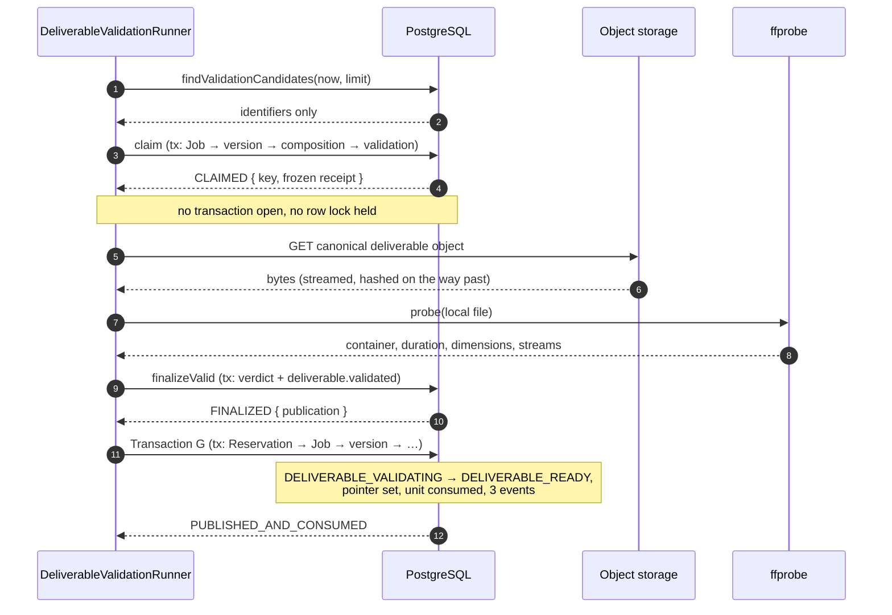

# Phase 5C completion — deliverable validation and the publication boundary

Branch: `phase-5c-deliverable-validation-and-publication`
Base: `74247282ecd30e4716a1102f3260267c14c745d0` (Phase 5B merge commit on `main`)
ADR: `docs/decisions/0051-deliverable-validation-and-the-publication-boundary.md`

Commits, oldest first:

| Commit | What it carries |
| --- | --- |
| `b13cd8a` | the durable verdict, Transaction G, migration 16, the domain and database suites, and ADR-0051 |
| `943ce8c` | the phase documentation, and the races suite's discriminated-union fix |
| `4f88a9f` | the exact-head review correction: the terminal-verdict receipt binding |
| *(this commit)* | this report, brought into line with the corrected tree |

The exact head SHA is reported with the pull request rather than written into a
file it would have to contain the hash of.

## Gap analysis — what was missing before this phase

Phase 5B leaves a job in `DELIVERABLE_VALIDATING` with an `OUTPUT_VERIFIED`
composition behind it and nothing draining it. Five things did not exist:

1. **No deliverable media verdict.** `OUTPUT_VERIFIED` claims only that an object
   exists at the canonical key and its digest and byte count were read from the
   bytes actually there. Whether it is a playable container with a real duration
   had never been asked, and `ManagedOutputMediaValidation` could not answer it —
   its `sceneGenerationId` is `@unique` with a required foreign key, so it is
   one-to-one with a *provider attempt* by construction.
2. **No actor for the publication edges.** `DELIVERABLE_VALIDATING ->
   DELIVERABLE_READY` and both edges into `CONSUMED` were reserved from the
   generic transition API with nothing able to take them.
3. **No unit settlement.** `consumedAt` had no writer anywhere in the system, and
   `GenerationReservation` could not leave `RESERVED` except by release.
4. **No deliverable pointer writer.** `GenerationJob.currentDeliverableVersionId`
   was constrained, documented and never assigned. Phase 5A and 5B each prove
   they leave it untouched; nobody moved it.
5. **No distinction between "not usable" and "not now".** A deliverable-level
   storage failure and a deliverable-level media failure had no vocabulary at
   all, so neither could be recorded without inventing one under pressure.

## What this phase adds

- **`GenerationDeliverableValidation`** (migration 16) — one durable verdict per
  deliverable *version*, unique on `deliverableVersionId`, with the composition's
  receipt frozen into it at creation.
- **The lifecycle** — `claimDeliverableValidation`, `finalizeValid`,
  `finalizeInvalidMedia`, `finalizeIntegrityMismatch` and `deferValidation`: five
  short, database-only transactions with every external byte between them.
- **Transaction G** (`publishDeliverable`) — the publication boundary. The job
  move, the deliverable pointer, the entitlement consume where one is owed, and
  every transition event, in one commit.
- **`DeliverableMediaValidationPort`** — a second port over the *same* adapter,
  so one implementation answers the media question for both an attempt's output
  and a composed deliverable without either key brand widening.
- **A bounded runner** — one pass, no loop, no timer, no production caller.

## The business fact

A composed deliverable is proved playable before anyone can be shown it, and a
customer's unit is spent in the same commit that makes the video theirs — once,
whatever crashes or races happen around it.

## The publication sequence



The three database boxes are three separate transactions. Nothing holds a row
lock across the object-store read or the inspector, and Transaction G — which
holds the entitlement lock — is last.

## Lock order

```text
validation lifecycle : GenerationJob → version → composition → validation
Transaction G        : GenerationReservation → GenerationJob → version
                       → composition → validation
```

`Reservation → Job` is the system-wide order Transaction H and Transaction I both
take. The lifecycle transactions never lock the reservation at all — validation
moves no entitlement — so they cannot form the inverse pair with Transaction G
either. Both directions are pinned behaviourally against the real publication
path in `tests/integration/deliverable-validation-races.db.test.ts`.

## Three receipt defects, and where each was caught

**The composition receipt was read and never compared.** `finalizeValid` proved
the caller's receipt against the validation row's frozen binding, then called
`provenCompositionReceipt` and discarded its result. A composition whose receipt
changed underneath a running validation was therefore finalized as a `VALID`
verdict about bytes nobody had measured. Found by
*"refuses to judge a deliverable whose composition receipt moved underneath it"*,
which resolved `FINALIZED` instead of rejecting. All three receipts — the
caller's, the row's frozen binding, and the composition's — are now proved to
agree in one function with one call site per transaction.

**The lock and the read were one statement.** `lockValidationChain` took
`FOR UPDATE OF j, v` in the same statement that outer-joined the composition and
validation rows. Under `READ COMMITTED` a blocked statement re-evaluates only the
*locked* row when released; every other table in it is still read from the
snapshot taken when the statement began. Two workers racing to create the first
validation record therefore both saw no row, both inserted, and the loser learned
it through a raw `P2002` rather than through the `NOT_CLAIMABLE` its caller is
written against. Found by *"gives the lease to exactly one of two simultaneous
claimers"*. The lock and the read are now separate statements, and the second one
takes a fresh snapshot.

**The terminal path made no binding proof at all.** Found by exact-head review of
PR #72, not by a suite, and corrected in `4f88a9f`. `finalizeValid` proved that
all three receipt identities still agreed — the caller's, the validation row's
frozen binding, and the composition's current durable receipt — while
`finalizeTerminalVerdict` proved only the row and its version. A worker could
claim against receipt A, the composition could move to receipt B, and an
`INVALID_MEDIA` or `INTEGRITY_MISMATCH` verdict about A was then written
permanently against a version whose composition named B; every later claim read
`ALREADY_TERMINAL` and stopped, so the inconsistency could be neither retried nor
surfaced.

The asymmetry was the wrong way round. A `VALID` verdict has a second gate —
Transaction G re-proves the same three receipts before anything reaches a
customer — while an unusable verdict is terminal and never reopened, so the
non-`VALID` path was the one where a stale receipt does permanent damage with
nothing downstream to catch it.

The correction reuses `assertBindingsAgree`, the function `finalizeValid` already
calls, rather than a second comparison that could drift from it. It executes
after `holdsClaim` and before the terminal write, so a worker whose row was
reclaimed still loses as an ordinary `LEASE_LOST` and only a caller that
genuinely still holds the row can raise `VALIDATION_RECEIPT_CONFLICT`. The lock
order and both CAS predicates were left exactly as they were, and **no migration
was required**: the check reads columns that already exist.

## Verification

| Check | Result |
| --- | --- |
| `pnpm lint` | clean, exit 0 |
| `pnpm typecheck` (root, all packages) | clean, exit 0 |
| Focused Phase 5C database suites | **47 passed / 47** (42 lifecycle and publication, 5 races) |
| `pnpm test` | **4638 passed / 4638**, 146 files |
| `pnpm test:db` | **1152 passed / 1152**, 37 files |
| `pnpm build` | Next.js production build succeeded |
| `prisma validate` | schema valid |
| `prisma migrate diff --from-migrations … --to-schema-datamodel` | **No difference detected** |
| `prisma migrate status` | **17 migrations, schema up to date**; the correction added none |
| Mutation ledger (impacted set) | **59 run, 59 killed, 0 survivors**, 0 anchor-missing |

Every figure above is measured on the corrected tree at `4f88a9f`. The
pre-correction run recorded 1151 database tests and a 58-definition ledger; both
are superseded, and the difference in each is the terminal-path correction — one
new regression test, one new mutation definition.

The root `pnpm typecheck` covers `tests/integration/`, and it caught a real defect
the per-package typechecks did not: the races suite destructured a `Promise.all`
over two differently-typed settled results, which widens into a union that has
lost its discriminant, so the assertions were reading `value` off an arm that has
none. The two promises are now awaited separately.

## Mutation ledger

**59 run, 59 killed, 0 survivors, 0 anchor-missing.** The harness holds 344
definitions (M01a–M343); the impacted set is every definition whose anchor lies
in a file this phase changed — the twenty-two Phase 5C definitions (M322–M343)
plus the thirty-seven pre-existing ones anchored in
`packages/storage/src/managed-output/media-validation.ts` and
`packages/database/src/orchestration-repositories.ts`.

Every one of the 344 anchors was verified to still match before the run, which is
the evidence that this phase's refactor of the media validator broke none of the
existing ledger.

**Restoration proved, not assumed.** A `sha256sum` manifest of all 694 tracked
files was taken before the run and re-checked after it: 694 of 694 identical, and
`git status` clean.

### M343 — the terminal-path binding proof

**M343 is a new definition, not a re-aimed slot.** It deletes the
`assertBindingsAgree` call the exact-head review correction added to
`finalizeTerminalVerdict`, and it is killed by exactly **1 database failure** —
the new regression test, and nothing else. That is the narrowest available
demonstration that the check is load-bearing: no other test in the repository
detects its absence, which is precisely why the defect reached review.

The impacted set grew from 58 to 59 for that one addition. Nothing was re-aimed to
reach the new total.

### Segmented execution, and why that is still sound evidence

The 59-definition ledger was completed in **two segments against the same
committed tree at `4f88a9f`**, not in one uninterrupted run:

1. **First segment: 25 completed, all killed.**
2. The container was restarted, terminating the harness during the next mutation
   **before its restore step could run**. The injected mutation it had written was
   therefore left in the working tree — a Phase 4 defect in
   `packages/database/src/orchestration-repositories.ts` removing the scene
   `REVISING -> READY` transition and its event from the regeneration rollback.
3. It was **detected against the pre-run SHA-256 manifest**, restored from `HEAD`,
   and **694 of 694 tracked files re-verified byte-for-byte** before anything
   else happened. `HEAD` never moved.
4. **Second segment: the remaining 34 completed, all killed.**
5. **Combined: 59 run, 59 killed, 0 survivors, 0 anchor-missing**, with
   restoration re-verified at the end.

The segmentation is acceptable evidence because both segments ran against the same
committed production tree and restoration was explicitly proved between them. It
is recorded here rather than presented as one clean run, because the distinction
is the difference between evidence and a claim about evidence.

### The survivor, and what was done about it

**M339, as originally aimed** — "a stale worker's late finalize overwrites the
reclaimer's row", removing only the `version` check from `holdsClaim` — SURVIVED.
The reason is structural domination rather than a missing test: the finalize CAS
that follows already names `version: claim.version` **and**
`leaseToken: claim.leaseToken`, so a stale worker that gets past the relaxed
guard still matches zero rows and still returns `LEASE_LOST`. The guard is
correct defence in depth with no observable behaviour of its own, so no
single-edit mutation of it can be killed.

The assignment was kept and the slot re-aimed at all three layers at once — the
`holdsClaim` version check and both CAS predicates — which is the only
arrangement under which the property is observable at all. Re-aimed, it is
killed by 2 database failures. The original aim and the reason it survived are
recorded inline in the harness beside the definition, not deleted.

### The three receipt defects, re-injected

M336 (*the lock and the read are collapsed back into one statement*), M338 (*the
composition's own receipt is read but never compared*) and M343 (*an unusable
verdict is recorded without proving the receipt still agrees*) are the three
defects described above, put back one at a time. All three are killed, which is
what makes the tests that catch them load-bearing rather than incidental.

## Review correction

The exact-head review of PR #72 raised one P2 finding — the terminal-verdict
receipt binding above. It was corrected in `4f88a9f`, the correction was pushed to
the branch, and the review thread was then replied to with the regression and
mutation evidence and resolved. **Unresolved review threads at that point: 0.**

That is the state of the review, not a merge approval: this report is
documentation, the phase is not merged, and approval is the CTO's to give.

## Required phase documentation

| Item | Where |
| --- | --- |
| Architecture diagram | `docs/architecture.md` — the validation and publication boundary added to the Phase 5 pipeline. The adjacent Phase 5B row still read **“Not implemented”** and was corrected in the same table: documentation must describe implemented behaviour, and leaving a shipped phase marked unimplemented directly above the new row would have been a worse deviation than the one-line fix |
| Entity-relationship diagram | `docs/er-diagram.md` — `GenerationDeliverableValidation` |
| Critical sequence diagram | above, and in ADR-0051 |
| OpenAPI / API change summary | **Not applicable.** No HTTP route, request, response or error was added, removed or changed. The whole phase is behind repository ports with no production caller. |
| Change log | `CHANGELOG.md` |
| Release notes | **Not applicable.** Nothing in this phase is reachable by a customer: no route, no UI, no scheduler and no production caller. There is nothing to announce until publication is activated. |
| Database migration notes | `docs/migration-notes.md` — migration 16 |
| Phase completion report | this file |

## Activation status

| Gate | State |
| --- | --- |
| Paid Provider Activation | **BLOCKED** — unchanged. No provider credential, no live call, no provider code touched. |
| Production scheduler | **Not activated.** No cron, timer, `setInterval` or production caller exists for this phase or any earlier dormant runner. |
| Payment integration | **Not started.** No Stripe, no invoice, no overage purchase. The unit consume is an entitlement-ledger fact, not a charge. |
| Production AWS | **Not activated.** No `S3Client` is constructed in production code. |
| Closed beta | **Not started.** |

## Carried forward

- **A settlement policy for a permanently unusable deliverable.** An
  `INVALID_MEDIA` or `INTEGRITY_MISMATCH` verdict strands its job in
  `DELIVERABLE_VALIDATING` with a reserved unit and, on a recomposition, a
  customer still holding their previous video. Who bears that cost is a separate,
  reviewed decision. Recorded in `docs/decisions/TODO.md`.
- **An operator path out of a terminal verdict**, and out of Phase 5B's
  `BLOCKED`. Deliberately absent for the same reason: re-queueing work without
  deciding *why* it failed re-enters the loop these states exist to end.
- **Human review before publication.** `CLAUDE.md` requires that AI output is
  never published automatically. Transaction G is the *technical* publication
  boundary and is dormant; the review gate that must precede it does not exist
  yet, and activating this runner without one would violate that rule.
- **The AI-generated disclosure.** The composition profile renders no overlay and
  no watermark, and validation does not check for one. The mandatory disclosure
  is still unimplemented.
- **The scheduler.** Every runner from Phase 4C-3B onward is dormant. Activating
  them is its own decision, and this phase does not make it.
