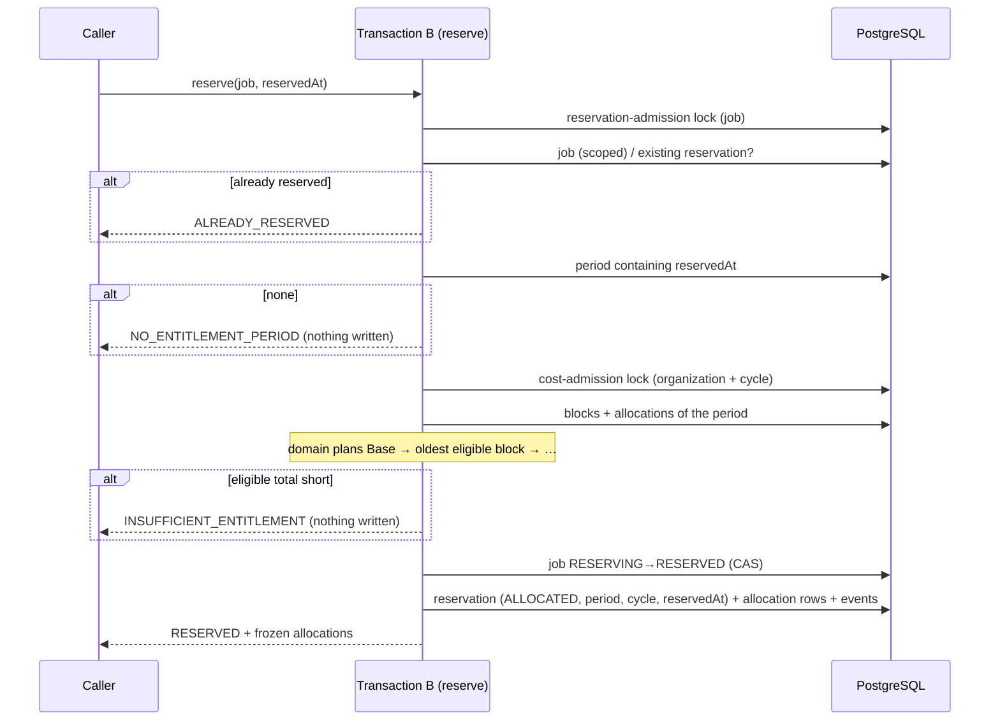

# Phase 6A completion — Unit entitlement / ledger foundation

Branch: `phase-6a-unit-entitlement-ledger`
Base: `9a4639256af9228d690b72d92b86e2ef79d9818a` (PR #73 merge commit on `main`)
Pull request: #74
ADR: `docs/decisions/0055-unit-entitlement-ledger.md`
Gap analysis: `docs/phase-6a-gap-analysis.md`

This is the completion record of the first Phase 6 milestone, not of Phase 6.
Later Phase 6 packages are listed under *Carried forward*.

Commits, oldest first:

| Commit | What it carries |
| --- | --- |
| `4218e1f` | the gap analysis and the multi-Unit funding gate (later closed by the CTO, Option A) |
| `c8750fe` | the ledger: migration 17, the domain allocator, the repositories, Transaction B funding, the Transaction G check, the fixtures, the suites, ADR-0055 |
| `81a49c7` | the phase documentation |
| `94f8f0b` | self-review: a replay is answered before the period lookup |
| `93326b3` | exact-head review: same-job attempts serialized across periods, `reservedAt` persisted, one-snapshot balance |
| `f9109d0` | exact-head review: cross-period grant collisions answered as replays, block quantity bounded to `INTEGER` |
| *(this commit)* | this record |

The exact head SHA is reported with the pull request rather than written into a
file that would have to contain its own hash.

## What this phase adds

- **Migration 17** — `unit_entitlement_periods`, `unit_add_on_blocks`,
  `generation_reservation_allocations`; `funding` and `entitlementPeriodId` on
  `generation_reservations`; composite foreign keys that keep an allocation on its
  reservation's period, inside its organization, and on a block of the same
  period and quality. No balance column.
- **The domain allocator** (`packages/domain/src/entitlement/allocation.ts`) —
  eligibility-first across the whole quantity, the HQ ceiling inside the Base
  pool, FIFO within the quality class, all-or-nothing, and settlement derived
  from the reservation's state.
- **Transaction B funds every reservation** — period selected by `reservedAt`,
  job-scoped reservation-admission lock, then the cost-admission lock, then the
  balance, then the frozen allocation rows in the same commit.
- **Transaction G** spends the frozen set and refuses one that does not fund the
  reserved Units (`RESERVATION_FUNDING_INCOMPLETE`).
- **The ledger's input surface** — `openPeriod`, `grantAddOnBlock`, `balance`,
  `allocationsForReservation`, each audited where it writes; no payment, no
  Stripe.
- **Commercial constants reconciled** — the 12-month / 5% annual-prepayment code
  is removed; the catalog carries the approved add-on package sizes.

## The funding sequence



## Lock order

```text
reservation-admission lock (job) -> cost-admission lock (organization + cycle) -> job, reservation rows
```

The established `cost-admission -> reservation -> everything else` order is
unchanged. The job-scoped lock is the only one taken before it, and cannot form a
cycle: only `reserve()` takes it, always first. Block grants take the
cost-admission lock; period opening takes its own organization lock and nothing
after it. All three formulas live in `cost-admission-lock.ts`. Transaction G's
order (`reservation -> job -> version -> composition -> validation`) is unchanged.

## Exact-head review findings, and where each was fixed

| Finding | Severity | Fixed in | Regression test fails without the fix |
| --- | --- | --- | --- |
| A replay arriving at an instant with no period returned `NO_ENTITLEMENT_PERIOD` | self-review | `94f8f0b` | yes |
| `reservedAt` defaulted to `now()` while the period was selected by the caller's instant | P2 | `93326b3` | yes (X49) |
| Balance read in two `READ COMMITTED` snapshots could read a consistent ledger as a defect | P2 | `93326b3` | yes, deterministically (X48) |
| Same-job attempts selecting different periods were not serialized | P2 | `93326b3` | yes, 3/3 (X47) |
| Same purchase reference granted into two periods surfaced a constraint error | P2 | `f9109d0` | yes, deterministically (X50) |
| Block quantity above PostgreSQL `INTEGER` failed inside the insert | P2 | `f9109d0` | yes (X51) |

The two torn-state findings are reproduced **deterministically**: a Prisma query
extension commits the competing writes from another connection exactly between
the two statements the finding names. A probabilistic stress test was tried
first for the balance read, could not reproduce the defect, and was replaced.

## Verification

| Check | Result |
| --- | --- |
| `pnpm lint` | clean |
| `pnpm typecheck` (root, all packages, `tests/integration`) | clean |
| `pnpm test` | **4690 / 4690**, 148 files (entitlement: 46 allocation + 9 shape/lock-order) |
| `pnpm test:db` | **1185 / 1185**, 38 files (the ledger suite: 33) |
| `pnpm build` | Next.js production build succeeded |
| `prisma migrate status` | 18 migrations, schema up to date |
| `prisma migrate diff --from-migrations … --to-schema-datamodel --exit-code` | no difference |
| CI on `f9109d0` | push #485 and pull_request #486: `verify` and `database` success |

## Mutation ledger

Definitions live in the session harness, one textual edit at an anchor that must
occur exactly once, run against the unit suite and/or the ledger database suite;
every mutated file is restored and re-hashed, and a SHA-256 manifest of all 708
tracked files is compared before and after each pass.

**Authoritative: 51 run, 51 killed, 0 survivors, 0 anchor-missing**, in one
uninterrupted pass against commit `f9109d0` (tree `1f65a49`), the reviewed
runtime tree. The only later commit is this record, which changes no runtime,
test, schema or migration file. All 708 tracked files were byte-identical after
the pass.

| ID | Category | Mutation | File | Killed by |
| --- | --- | --- | --- | --- |
| X01 | base-first | Base is never drawn | `allocation.ts` | unit: 12 failing |
| X02 | base-first | Base is under-drawn by one Unit, pushing it to add-ons | `allocation.ts` | unit: 4 failing |
| X03 | partial-base | partial Base capacity is skipped | `allocation.ts` | unit: 11 failing |
| X04 | quality | blocks of either quality are eligible | `allocation.ts` | unit: 6 failing |
| X05 | quality | only blocks of the other quality are eligible | `allocation.ts` | unit: 15 failing |
| X06 | quality | reservation funds every job as Normal | `orchestration-repositories.ts` | db: 4 failing |
| X07 | quality | an HQ block is granted on a plan that sells none | `unit-entitlement-repository.ts` | db: 1 failing |
| X08 | hq-ceiling | HQ ignores the included ceiling | `allocation.ts` | unit: 9 failing |
| X09 | hq-ceiling | HQ takes the larger of Base and ceiling | `allocation.ts` | unit: 10 failing |
| X10 | hq-ceiling | HQ Base draws do not count against the ceiling | `allocation.ts` | unit: 7 failing |
| X11 | hq-ceiling | Normal Base draws also count against the ceiling | `allocation.ts` | unit: 3 failing |
| X12 | fifo | newest block first | `allocation.ts` | unit: 2 failing |
| X13 | fifo | tie-break by id reversed | `allocation.ts` | unit: 1 failing |
| X14 | fifo | purchase time ignored (FIFO by id only) | `unit-entitlement-repository.ts` | db: 2 failing |
| X15 | continuation | stops after the first eligible block | `allocation.ts` | unit: 2 failing |
| X16 | continuation | overdraws a block beyond its remaining Units | `allocation.ts` | unit: 3 failing |
| X17 | continuation | spent blocks stay eligible | `allocation.ts` | unit: 1 failing |
| X18 | aggregate | a one-Unit shortfall is accepted | `allocation.ts` | unit: 10 failing |
| X19 | aggregate | shortfall never refused | `allocation.ts` | unit: 11 failing |
| X20 | aggregate | the reservation funds one Unit whatever the job needs | `orchestration-repositories.ts` | db: 15 failing |
| X21 | aggregate | a zero quantity is accepted | `allocation.ts` | unit: 1 failing |
| X22 | all-or-nothing | the balance is checked after the job moves | `orchestration-repositories.ts` | unit: 1 failing |
| X23 | all-or-nothing | the cost-admission lock is not taken | `orchestration-repositories.ts` | unit: 2 failing |
| X24 | all-or-nothing | an existing hold is not detected | `orchestration-repositories.ts` | db: 4 failing |
| X25 | frozen | every allocation gets ordinal 1 | `orchestration-repositories.ts` | db: 9 failing |
| X26 | frozen | every allocation records one Unit | `orchestration-repositories.ts` | db: 14 failing |
| X27 | period | the period end is inclusive | `unit-entitlement-repository.ts` | db: 1 failing |
| X28 | period | blocks of other periods are eligible (carry-over) | `unit-entitlement-repository.ts` | db: 19 failing |
| X29 | period | allocations of other periods count against this one | `unit-entitlement-repository.ts` | db: 2 failing |
| X30 | period | a new period may overlap an existing one | `unit-entitlement-repository.ts` | db: 1 failing |
| X31 | period | the plan snapshot is not the plan's | `unit-entitlement-repository.ts` | db: 13 failing |
| X32 | consume | Transaction G spends without checking the frozen funding | `deliverable-validation-repository.ts` | db: 1 failing |
| X33 | consume | a funding set covering more than reserved is accepted | `allocation.ts` | unit: 1 failing |
| X34 | consume | a funding set of the other quality is accepted | `allocation.ts` | unit: 1 failing |
| X35 | consume | a replacement publication spends the hold again | `deliverable-validation-repository.ts` | db: 1 failing |
| X36 | consume | a consumed hold returns its Units | `allocation.ts` | unit: 2 failing |
| X37 | release | a released hold keeps its Units | `allocation.ts` | unit: 1 failing |
| X38 | release | every allocation reads as held, whatever its reservation | `unit-entitlement-repository.ts` | db: 2 failing |
| X39 | release | released is reported as held | `allocation.ts` | unit: 2 failing |
| X40 | release | block Units are counted per allocation, not per quantity | `allocation.ts` | unit: 2 failing |
| X41 | release | Base Units are counted per allocation, not per quantity | `allocation.ts` | unit: 16 failing |
| X42 | replay | a replayed generic release is not compare-and-set | `orchestration-repositories.ts` | db: 2 failing |
| X43 | replay | a conflicting replayed purchase is credited as the same one | `unit-entitlement-repository.ts` | db: 1 failing |
| X44 | replay | a conflicting replayed period is accepted as the same one | `unit-entitlement-repository.ts` | db: 1 failing |
| X47 | replay | attempts on one job are not serialized across periods | `orchestration-repositories.ts` | unit: 1 failing |
| X48 | replay | the public balance is read under READ COMMITTED | `unit-entitlement-repository.ts` | db: 1 failing |
| X49 | period | the reservation records the insert time, not the instant that selected its period | `orchestration-repositories.ts` | db: 1 failing |
| X50 | replay | a cross-period grant collision surfaces as a constraint error | `unit-entitlement-repository.ts` | db: 1 failing |
| X51 | aggregate | a block quantity beyond INTEGER is accepted | `unit-entitlement-repository.ts` | db: 1 failing |
| X45 | tenant | a block may be granted into another organization's period | `unit-entitlement-repository.ts` | db: 1 failing |
| X46 | tenant | a balance is readable across organizations | `unit-entitlement-repository.ts` | db: 1 failing |

"Killed by" names the first suite that failed and how many of its tests did.
X22, X23 and X47 are killed first by the static lock-order tripwire in the unit
suite; X22 and X23 were also re-run against the database suite alone on
`c8750fe` and killed behaviourally 3/3, and X47 is killed behaviourally by the
cross-period race test (3/3 with the lock removed).

Earlier passes, kept as history:

| Tree | Definitions | Killed | Survivors | Anchor-missing |
| --- | --- | --- | --- | --- |
| `c8750fe` | 46 | 46 | 0 | 0 |
| `94f8f0b` | 47 | 47 | 0 | 0 |
| `93326b3` | 49 | 49 | 0 | 0 (a first pass hit 1 anchor-missing, X46, after the code it named moved; re-aimed and killed on the same tree, then a clean full pass) |
| `f9109d0` (first pass) | 51 | 49 | 0 | 2 (X43, X45 — the grant body moved into a helper; re-aimed and killed on the same tree) |

Categories covered: Base-first selection, partial Base use, quality eligibility,
HQ ceiling, add-on FIFO and tie-break, continuation across blocks,
aggregate-capacity comparison, all-or-nothing ordering, the cost-admission and
reservation-admission locks, frozen allocation rows, period binding and
boundaries, consume, release, replay/idempotency, and tenancy.

## Required phase documentation

| Item | Where |
| --- | --- |
| Architecture diagram | `docs/architecture.md` status table (Phase 6A row); lock order in ADR-0055 |
| Entity-relationship diagram | `docs/er-diagram.md`, *Phase 6A — the Unit entitlement ledger* |
| Critical sequence diagram | this record, *The funding sequence* |
| OpenAPI / API change summary | **Not applicable** to HTTP: no route changed. Internal repository API: `ReserveGenerationJobInput` takes `reservedAt` instead of a caller-supplied cycle; `reserve()` adds `NO_ENTITLEMENT_PERIOD` and `INSUFFICIENT_ENTITLEMENT` and returns the frozen allocations; `GenerationReservation` gains `funding` and `entitlementPeriodId`; new `UnitEntitlementRepository` |
| Change log / release notes | the commit list above and the pull request description |
| Database migration notes | `docs/migration-notes.md`, *Phase 6A — Unit entitlement ledger* |
| Phase completion report | this file |

## Activation status

**Dormant.** No production caller opens a period, grants a block or reserves a
job, so nothing in this phase changes what any customer is charged. Paid Provider
Activation, production Provider credentials, production paid AI calls,
production scheduler activation and live Stripe charges all remain **BLOCKED**.

## Carried forward

- **Open decision gate:** what a customer regeneration costs in Units. Today one
  job entitlement still covers an initial generation and up to two per-scene
  regenerations; that is not adopted as policy, and no regeneration pricing is
  built.
- Later Phase 6 packages: the customer-approved purchase flow that grants a
  block; renewal scheduling that opens periods; Stripe self-service and
  sales-assisted billing; seats and storage blocks; upgrade (Base ceiling
  replacement) and downgrade; charged disclosure recomposition; the internal
  recovery budget; the Cost Safety Guard threshold; reconciliation and admin
  controls.
- Callers of `reserve()` must now handle `NO_ENTITLEMENT_PERIOD` and
  `INSUFFICIENT_ENTITLEMENT`; the job stays `RESERVING`, untouched.
