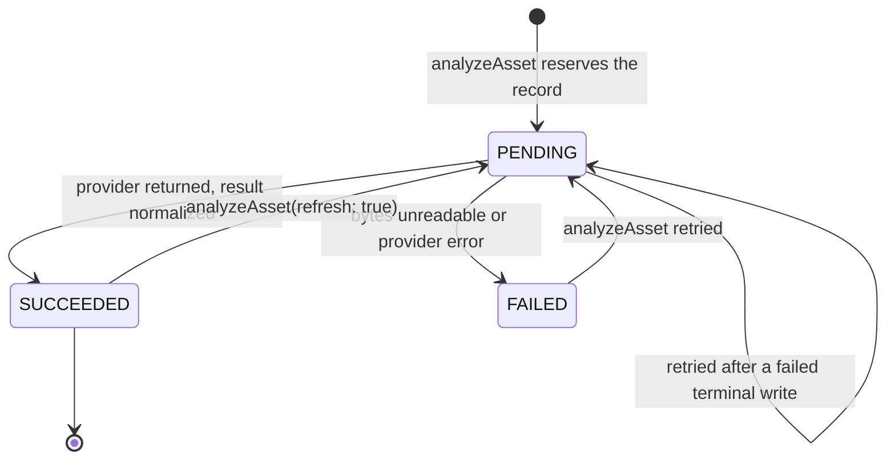

# Analysis Lifecycle — Sequence Diagram

Version: 1.2
Status: describes **implemented** behaviour through Phase 3A-2c. The contract
and provider layer shipped in 3A-1, persistence in 3A-2a, the orchestrating
`AnalysisService` in 3A-2b, and refresh, duplicate grouping, suggested order and
the read methods in 3A-2c. Steps marked **3A-3** (HTTP endpoints) and **3B**
(review UI) are labelled so the diagram is not read as describing more than
currently ships.

## Analysis of one asset

```mermaid
sequenceDiagram
  autonumber
  actor U as Creator
  participant AS as AnalysisService<br/>(3A-2b)
  participant AZ as authorizeOrganization
  participant AR as MediaAsset repository
  participant NR as AssetAnalysis repository<br/>(3A-2a)
  participant S as ObjectStorage
  participant P as ImageAnalysisProvider<br/>(3A-1, deterministic offline)
  participant N as Normalization + rules<br/>(3A-1)
  participant AL as AuditLog

  U->>AS: analyzeAsset(org, assetId, {refresh?})
  AS->>AZ: require membership + property:write
  AZ-->>AS: AuthContext (else FORBIDDEN)
  AS->>AR: findById(org, assetId)
  Note over AS,AR: Only READY assets are eligible;<br/>anything else → VALIDATION_FAILED,<br/>missing/DELETED → NOT_FOUND
  AS->>NR: findByAssetId(org, assetId)

  alt SUCCEEDED record exists and refresh not requested
    NR-->>AS: existing record
    AS-->>U: existing record (idempotent — provider NOT called)
  else no record, PENDING/FAILED record, or refresh requested
    AS->>NR: create, or reset an existing row, as PENDING
    Note over AS,NR: Reserved before the provider call, so a crash<br/>leaves a visible PENDING row. If a concurrent<br/>insert wins the unique index on assetId, this<br/>request adopts that row instead of creating<br/>a second one.
    Note over AS,NR: On reset, every stale result field is cleared<br/>(room type, scores, duplicate group, objects,<br/>flags, suggested order, failure reason), so a<br/>refresh that fails cannot leave last run's<br/>values behind.
    AS->>AL: analysis.requested | analysis.refreshed
    AS->>S: getObject(asset.storageKey)

    alt bytes missing
      AS->>NR: status = FAILED (sanitized reason)
      AS->>AL: analysis.failed
      AS-->>U: FAILED record
    else bytes available
      AS->>P: analyze({assetId, bytes, mime, w, h, perceptualHash})

      alt provider throws
        P-->>AS: throws
        AS->>P: normalizeError(error)
        AS->>NR: status = FAILED (messageSanitized)
        AS->>AL: analysis.failed
        AS-->>U: FAILED record
      else provider returns
        P->>N: normalizeAnalysisResult(raw)
        Note over N: unknown room → OTHER/0 confidence;<br/>scores clamped 0..1; non-finite → 0;<br/>objects ≤50, flags ≤20
        N-->>AS: AnalysisResult
        AS->>N: deriveQualityFlags(w, h, blur, brightness)
        N-->>AS: LOW_RESOLUTION / BLURRY / EXPOSURE_PROBLEM warnings
        AS->>AS: merge flags, keeping the most severe per code
        AS->>AR: listWithPerceptualHash(org)
        Note over AS,AR: Candidates are same-organization, hash-bearing,<br/>and exclude the subject asset, so a cross-tenant<br/>photo can never influence a group.
        AS->>N: resolveDuplicateGroup(hash, assetId, siblings)
        N-->>AS: existing group or new dup_<assetId>
        AS->>N: roomOrderRank(roomType) → suggestedOrder
        AS->>NR: status = SUCCEEDED (+ scores, flags, group, order)
        Note over AS,AL: The row is persisted BEFORE its audit entry. An<br/>audit failure therefore returns an error while the<br/>analysis stays SUCCEEDED — an intentional<br/>consistency boundary, not atomicity.
        AS->>AL: analysis.succeeded
        AS-->>U: SUCCEEDED record
      end
    end
  end
```

## Status machine



## What is implemented, by milestone

| Element | Milestone |
| --- | --- |
| `ImageAnalysisProvider` interface and normalized request/result types | 3A-1 |
| `normalizeAnalysisResult`, `deriveQualityFlags`, `analysisProviderError` | 3A-1 |
| `roomOrderRank`, `resolveDuplicateGroup` (defined in 3A-1, wired in 3A-2c) | 3A-1 / 3A-2c |
| `DeterministicImageAnalysisProvider` (offline, no network I/O) | 3A-1 |
| `ANALYSIS_PROVIDER` selection with fail-fast on anything else | 3A-1 |
| Audit action vocabulary (`analysis.requested` etc.) | 3A-1 |
| `AssetAnalysis` table, migration, tenant-scoped repository | 3A-2a |
| `AnalysisService` orchestration, authorization, idempotency, READY-only check | 3A-2b |
| Audit **emission** | 3A-2b |
| Failure consistency and retry safety: PENDING reservation, no completed row on provider failure, persist-before-audit, unique-index concurrency reconciliation | 3A-2b |
| `refresh` re-run with stale-state clearing | 3A-2c |
| Duplicate grouping and `suggestedOrder` persisted | 3A-2c |
| Read methods `listForProperty` / `getForAsset` (read-level authorization) | 3A-2c |
| Analysis HTTP endpoints | ⏭ 3A-3 |
| Review UI, storyboard, prompt compilation | ⏭ 3B / 3C |

## Low confidence and blocking findings

`isLowConfidence` (≤ 0.6, or null) and `hasBlockingFlag` are available from
3A-1, and `AnalysisService` *records* the signals it computes. Nothing enforces
them yet.
Enforcement (a low-confidence classification cannot silently proceed, and
blocking findings must be resolved) is delivered with the review UI in Phase 3B.
