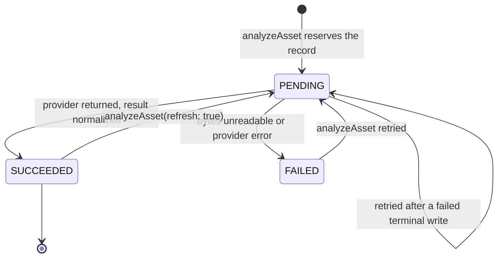

# Analysis Lifecycle — Sequence Diagram

Version: 1.5
Status: describes **implemented** behaviour through Phase 3B-2. The contract
and provider layer shipped in 3A-1, persistence in 3A-2a, the orchestrating
`AnalysisService` in 3A-2b, and refresh, duplicate grouping, suggested order and
the read methods in 3A-2c, the HTTP endpoints in 3A-3, and the review decisions
in 3B-1b, and its HTTP endpoints in 3B-2. The review **UI** is 3B-3 and does not
exist yet, labelled so the diagram is not read as describing more than currently
ships.

## Analysis of one asset

```mermaid
sequenceDiagram
  autonumber
  actor U as Creator
  participant R as Route handler<br/>(3A-3, thin adapter)
  participant AS as AnalysisService<br/>(3A-2b)
  participant AZ as authorizeOrganization
  participant AR as MediaAsset repository
  participant NR as AssetAnalysis repository<br/>(3A-2a)
  participant S as ObjectStorage
  participant P as ImageAnalysisProvider<br/>(3A-1, deterministic offline)
  participant N as Normalization + rules<br/>(3A-1)
  participant AL as AuditLog

  U->>R: POST /analysis or /analysis/refresh
  Note over R: Authenticate (session), validate the shape of<br/>organizationId, delegate. No business decision<br/>is taken in the web layer.
  R->>AS: analyzeAsset(org, assetId, {refresh?})
  AS->>AZ: require membership + property:write
  AZ-->>AS: AuthContext (else FORBIDDEN)
  AS->>AR: findById(org, assetId)
  Note over AS,AR: Only READY assets are eligible;<br/>anything else → VALIDATION_FAILED,<br/>missing/DELETED → NOT_FOUND
  AS->>NR: findByAssetId(org, assetId)

  alt SUCCEEDED record exists and refresh not requested
    NR-->>AS: existing record
    AS-->>R: existing record (idempotent — provider NOT called)
    R-->>U: 200 + AnalysisDto
  else no record, PENDING/FAILED record, or refresh requested
    AS->>NR: create, or reset an existing row, as PENDING
    Note over AS,NR: Reserved before the provider call, so a crash<br/>leaves a visible PENDING row. If a concurrent<br/>insert wins the unique index on assetId, this<br/>request adopts that row instead of creating<br/>a second one.
    Note over AS,NR: On reset, every stale result field AND the review<br/>state are cleared, so a refresh that fails cannot<br/>leave last run's values behind, nor a decision<br/>attached to a result that no longer exists.<br/>The revision is not touched here.
    AS->>AL: analysis.requested | analysis.refreshed
    AS->>S: getObject(asset.storageKey)

    alt bytes missing
      AS->>NR: status = FAILED (sanitized reason)
      AS->>AL: analysis.failed
      AS-->>R: FAILED record
      R-->>U: 200 + AnalysisDto (status FAILED)
    else bytes available
      AS->>P: analyze({assetId, bytes, mime, w, h, perceptualHash})

      alt provider throws
        P-->>AS: throws
        AS->>P: normalizeError(error)
        AS->>NR: status = FAILED (messageSanitized)
        AS->>AL: analysis.failed
        AS-->>R: FAILED record
        R-->>U: 200 + AnalysisDto (status FAILED)
      else provider returns
        P->>N: normalizeAnalysisResult(raw)
        Note over N: unknown room → OTHER/0 confidence;<br/>scores clamped 0..1; non-finite → 0;<br/>objects ≤50, flags ≤20
        N-->>AS: AnalysisResult
        AS->>N: deriveQualityFlags(w, h, blur, brightness)
        N-->>AS: LOW_RESOLUTION / BLURRY / EXPOSURE_PROBLEM warnings
        AS->>AS: merge flags, keeping the most severe per code
        AS->>AR: listWithPerceptualHash(org)
        Note over AS,AR: Candidates are same-organization, hash-bearing,<br/>and exclude the subject asset, so a cross-tenant<br/>photo can never influence a group.
        AS->>N: resolveDuplicateGroup(hash, assetId, siblings)
        N-->>AS: existing group or new dup_<assetId>
        AS->>N: roomOrderRank(roomType) → suggestedOrder
        AS->>NR: status = SUCCEEDED (+ scores, flags, group, order)
        Note over AS,NR: analysisRevision advances here and only here,<br/>keyed on whether this run was a refresh:<br/>initial → 1, successful refresh → previous + 1,<br/>failed refresh → unchanged.
        Note over AS,AL: The row is persisted BEFORE its audit entry. An<br/>audit failure therefore returns an error while the<br/>analysis stays SUCCEEDED — an intentional<br/>consistency boundary, not atomicity.
        AS->>AL: analysis.succeeded
        AS-->>R: SUCCEEDED record
        R-->>U: 200 + AnalysisDto
        Note over R,U: The DTO omits organizationId, the provider<br/>name and the review columns; failureReason is<br/>the normalized message, never vendor text.
      end
    end
  end
```

## Review decision (3B-1b)

```mermaid
sequenceDiagram
  autonumber
  actor R as Reviewer
  participant RT as Route handler<br/>(3B-2, thin adapter)
  participant AS as AnalysisService<br/>(3B-1b)
  participant AZ as authorizeOrganization
  participant NR as AssetAnalysis repository
  participant TX as ReviewTransaction
  participant AR as MediaAsset repository
  participant AL as AuditLog

  R->>RT: POST /analysis/approve or /analysis/reject
  Note over RT: Authenticate, validate body shape, delegate.<br/>Whether a reason is required, whether<br/>primaryAssetId is needed or matches, and whether<br/>the revision was reviewed are NOT decided here.
  RT->>AS: approve(org, assetId, {primaryAssetId?, reason?})<br/>or reject(org, assetId, {reason})
  AS->>AZ: require membership + video:review
  Note over AS,AZ: CREATOR is denied: whoever runs an analysis<br/>is not whoever approves it.
  AS->>NR: findByAssetId(org, assetId)
  Note over AS,NR: Must be SUCCEEDED and UNREVIEWED —<br/>decisions are immutable per revision.

  alt approve
    Note over AS: A BLOCKING safety flag refuses approval;<br/>rejection stays available.
    AS->>NR: list duplicate-group members
    Note over AS,NR: ≥2 members → primaryAssetId required and<br/>must equal this asset. Whether another member<br/>is ALREADY approved is NOT read here.
    AS->>NR: reviewStatus = APPROVED
    Note over NR: The partial unique index refuses a second<br/>APPROVED in the group. The violation maps to<br/>VALIDATION_FAILED — never retried or reconciled.
    AS->>AL: analysis.approved
  else reject
    Note over AS: Reason required and non-blank.
    AS->>TX: run(...)
    TX->>NR: reviewStatus = REJECTED (+ note, reviewer, time)
    TX->>AR: MediaAsset.status = REJECTED
    Note over TX: Both writes commit together or not at all.
    AS->>AL: analysis.rejected
  end

  Note over AS,AL: The audit entry is emitted AFTER the commit and is<br/>outside the transaction — see docs/decisions/TODO.md.
  AS-->>RT: decided analysis
  RT-->>R: 200 + AnalysisDto with nested review<br/>{status, note, reviewedAt, reviewedBy, analysisRevision}
  Note over RT,R: reviewedBy is the reviewer's USER ID only.<br/>A duplicate-group conflict surfaces as 422, not 409.
```

## Status machine



## What is implemented, by milestone

| Element | Milestone |
| --- | --- |
| `ImageAnalysisProvider` interface and normalized request/result types | 3A-1 |
| `normalizeAnalysisResult`, `deriveQualityFlags`, `analysisProviderError` | 3A-1 |
| `roomOrderRank`, `resolveDuplicateGroup` (defined in 3A-1, wired in 3A-2c) | 3A-1 / 3A-2c |
| `DeterministicImageAnalysisProvider` (offline, no network I/O) | 3A-1 |
| `ANALYSIS_PROVIDER` selection with fail-fast on anything else | 3A-1 |
| Audit action vocabulary (`analysis.requested` etc.) | 3A-1 |
| `AssetAnalysis` table, migration, tenant-scoped repository | 3A-2a |
| `AnalysisService` orchestration, authorization, idempotency, READY-only check | 3A-2b |
| Audit **emission** | 3A-2b |
| Failure consistency and retry safety: PENDING reservation, no completed row on provider failure, persist-before-audit, unique-index concurrency reconciliation | 3A-2b |
| `refresh` re-run with stale-state clearing | 3A-2c |
| Duplicate grouping and `suggestedOrder` persisted | 3A-2c |
| Read methods `listForProperty` / `getForAsset` (read-level authorization) | 3A-2c |
| Review columns, partial unique index, `ReviewTransaction` | 3B-1a |
| `approve` / `reject`, immutability per revision, duplicate primary rule, transactional rejection, review audit | 3B-1b |
| Review HTTP endpoints (thin adapters, nested review DTO) | 3B-2 |
| Review UI | ⏭ 3B-3 |
| Analysis HTTP endpoints (thin adapters) | 3A-3 |
| Rate limiting on the analysis endpoints | ⏭ cross-cutting, see TODO |
| Review UI, storyboard, prompt compilation | ⏭ 3B / 3C |

## Low confidence and blocking findings

`isLowConfidence` (≤ 0.6, or null) and `hasBlockingFlag` are available from
3A-1, and `AnalysisService` *records* the signals it computes. Nothing enforces
them yet.
Enforcement (a low-confidence classification cannot silently proceed, and
blocking findings must be resolved) is delivered with the review UI in Phase 3B.
