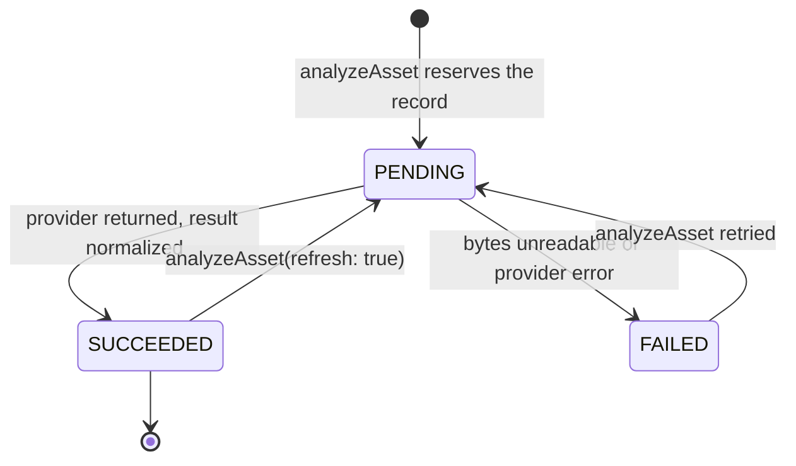

# Analysis Lifecycle — Sequence Diagram

Version: 1.0
Status: Phase 3A-1 implements the **contract and provider layer** shown in
green-path steps 1–6 below. Persistence and the orchestrating `AnalysisService`
(steps marked **3A-2**) are implemented but held for the next milestone; the
review UI is Phase 3B. Steps are labelled so the diagram is not read as
describing more than currently ships.

## Analysis of one asset

```mermaid
sequenceDiagram
  autonumber
  actor U as Creator
  participant AS as AnalysisService<br/>(3A-2)
  participant AZ as authorizeOrganization
  participant AR as MediaAsset repository
  participant NR as AssetAnalysis repository<br/>(3A-2)
  participant S as ObjectStorage
  participant P as ImageAnalysisProvider<br/>(3A-1, deterministic offline)
  participant N as Normalization + rules<br/>(3A-1)
  participant AL as AuditLog

  U->>AS: analyzeAsset(org, assetId, {refresh?})
  AS->>AZ: require membership + property:write
  AZ-->>AS: AuthContext (else FORBIDDEN)
  AS->>AR: findById(org, assetId)
  Note over AS,AR: Only READY assets are eligible;<br/>anything else → VALIDATION_FAILED,<br/>missing/DELETED → NOT_FOUND
  AS->>NR: findByAssetId(org, assetId)

  alt SUCCEEDED record exists and refresh not requested
    NR-->>AS: existing record
    AS-->>U: existing record (idempotent — provider NOT called)
  else no record, or refresh requested
    AS->>NR: create/reset record as PENDING
    Note over AS,NR: Reserved before the provider call, so a<br/>crash leaves a visible PENDING row
    AS->>AL: analysis.requested | analysis.refreshed
    AS->>S: getObject(asset.storageKey)

    alt bytes missing
      AS->>NR: status = FAILED (sanitized reason)
      AS->>AL: analysis.failed
      AS-->>U: FAILED record
    else bytes available
      AS->>P: analyze({assetId, bytes, mime, w, h, perceptualHash})

      alt provider throws
        P-->>AS: throws
        AS->>P: normalizeError(error)
        AS->>NR: status = FAILED (messageSanitized)
        AS->>AL: analysis.failed
        AS-->>U: FAILED record
      else provider returns
        P->>N: normalizeAnalysisResult(raw)
        Note over N: unknown room → OTHER/0 confidence;<br/>scores clamped 0..1; non-finite → 0;<br/>objects ≤50, flags ≤20
        N-->>AS: AnalysisResult
        AS->>N: deriveQualityFlags(w, h, blur, brightness)
        N-->>AS: LOW_RESOLUTION / BLURRY / EXPOSURE_PROBLEM warnings
        AS->>AS: merge flags, keeping the most severe per code
        AS->>AR: listWithPerceptualHash(org)
        AS->>N: resolveDuplicateGroup(hash, assetId, siblings)
        N-->>AS: existing group or new dup_<assetId>
        AS->>N: roomOrderRank(roomType) → suggestedOrder
        AS->>NR: status = SUCCEEDED (+ scores, flags, group, order)
        AS->>AL: analysis.succeeded
        AS-->>U: SUCCEEDED record
      end
    end
  end
```

## Status machine



## What Phase 3A-1 contains

| Element | In 3A-1? |
| --- | --- |
| `ImageAnalysisProvider` interface and normalized request/result types | ✅ |
| `normalizeAnalysisResult`, `deriveQualityFlags`, `analysisProviderError` | ✅ |
| `roomOrderRank`, `resolveDuplicateGroup` | ✅ |
| `DeterministicImageAnalysisProvider` (offline, no network I/O) | ✅ |
| `ANALYSIS_PROVIDER` selection with fail-fast on anything else | ✅ |
| Audit action vocabulary (`analysis.requested` etc.) | ✅ constants only |
| `AnalysisService` orchestration, authorization, idempotency, READY-only check | ⏭ 3A-2 |
| `AssetAnalysis` table, migration, tenant-scoped repository | ⏭ 3A-2 |
| Audit **emission** | ⏭ 3A-2 |
| Review UI, storyboard, prompt compilation | ⏭ 3B / 3C |

## Low confidence and blocking findings

`isLowConfidence` (≤ 0.6, or null) and `hasBlockingFlag` are available from
3A-1. Phase 3A-1 only *records* these signals — nothing enforces them yet.
Enforcement (a low-confidence classification cannot silently proceed, and
blocking findings must be resolved) is delivered with the review UI in Phase 3B.
