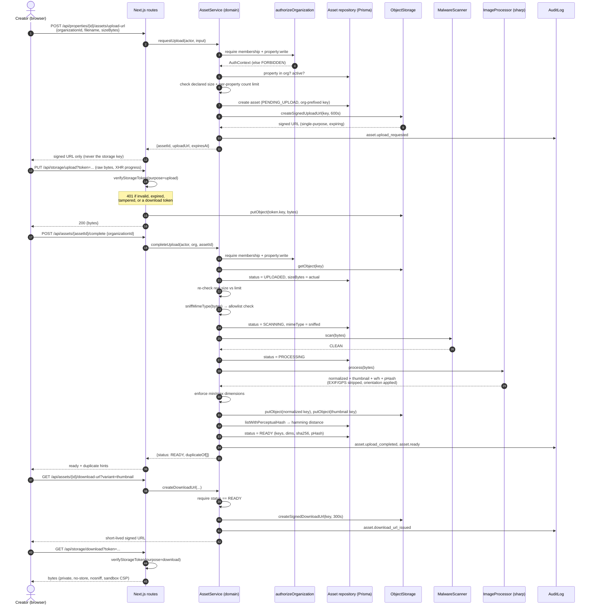
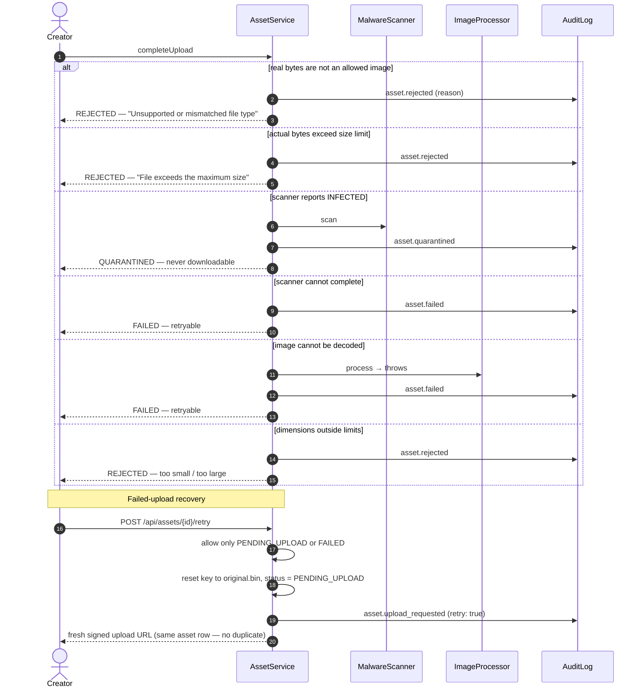
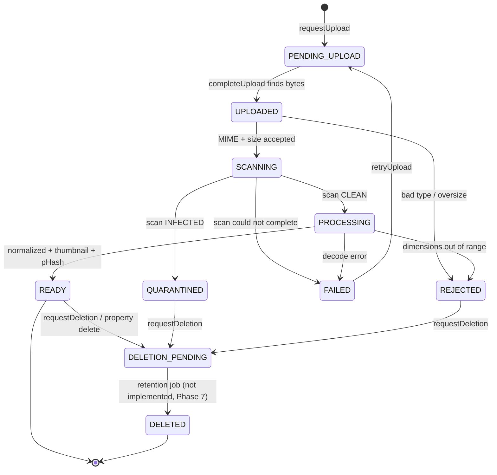

# Upload Lifecycle — Sequence Diagram

Version: 1.0 (as implemented in Phase 2)
Status: Describes **implemented** behavior.

## Happy path: request → upload → process → READY → preview

## Rejection, quarantine, failure, and recovery

## State machine

`READY`, `QUARANTINED`, `REJECTED`, `FAILED`, and `DELETED` are treated as
terminal by `isTerminalAssetStatus`. `PENDING_UPLOAD`, `UPLOADED`, `SCANNING`,
`PROCESSING`, and `READY` occupy a slot against the per-property file count.

> **Implementation note.** Steps 3–5 (scan, normalize, hash) currently run
> inline inside the `complete` request. Moving them onto the async worker is a
> tracked follow-up for Phase 4 (`docs/decisions/TODO.md`).
